# JediSOS 시스템 아키텍처

> 이 문서는 JediSOS의 전체 시스템 아키텍처를 정의합니다.
> 모든 다이어그램은 Mermaid 형식입니다.

## 1. 전체 시스템 개요

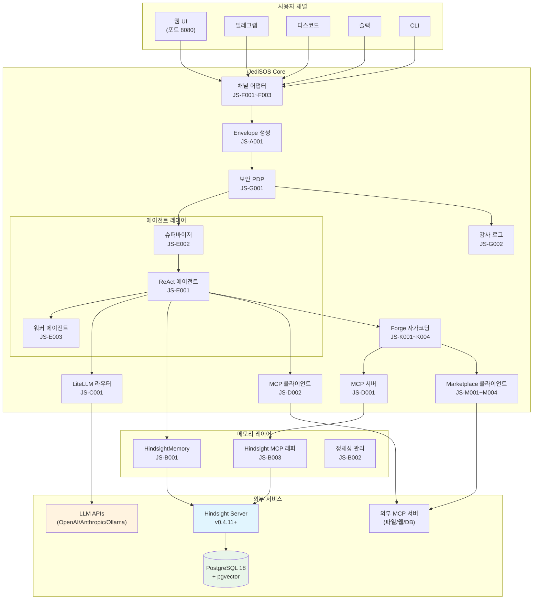
```mermaid
graph TB
    subgraph "사용자 채널"
        WEB_UI["웹 UI<br/>(포트 8080)"]
        TG[텔레그램]
        DC[디스코드]
        SL[슬랙]
        CLI[CLI]
    end

    subgraph "JediSOS Core"
        ADAPTER[채널 어댑터<br/>JS-F001~F003]
        ENV[Envelope 생성<br/>JS-A001]
        PDP[보안 PDP<br/>JS-G001]
        AUDIT[감사 로그<br/>JS-G002]

        subgraph "에이전트 레이어"
            SUP[슈퍼바이저<br/>JS-E002]
            REACT[ReAct 에이전트<br/>JS-E001]
            WORKER[워커 에이전트<br/>JS-E003]
        end

        ROUTER[LiteLLM 라우터<br/>JS-C001]
        MCP_S[MCP 서버<br/>JS-D001]
        MCP_C[MCP 클라이언트<br/>JS-D002]

        FORGE[Forge 자가코딩<br/>JS-K001~K004]
        MARKET[Marketplace 클라이언트<br/>JS-M001~M004]
    end

    subgraph "메모리 레이어"
        HS_WRAP[HindsightMemory<br/>JS-B001]
        HS_MCP[Hindsight MCP 래퍼<br/>JS-B003]
        IDENTITY[정체성 관리<br/>JS-B002]
    end

    subgraph "외부 서비스"
        HS[Hindsight Server<br/>v0.4.11+]
        PG[(PostgreSQL 18<br/>+ pgvector)]
        LLM_API["LLM APIs<br/>(OpenAI/Anthropic/Ollama)"]
        EXT_MCP["외부 MCP 서버<br/>(파일/웹/DB)"]
    end

    WEB_UI & TG & DC & SL & CLI --> ADAPTER
    ADAPTER --> ENV
    ENV --> PDP
    PDP --> SUP
    SUP --> REACT
    REACT --> WORKER
    REACT --> ROUTER
    REACT --> HS_WRAP
    REACT --> MCP_C
    ROUTER --> LLM_API
    HS_WRAP --> HS
    HS_MCP --> HS
    HS --> PG
    MCP_S --> HS_MCP
    MCP_C --> EXT_MCP
    REACT --> FORGE
    FORGE --> MCP_S
    FORGE --> MARKET
    MARKET --> EXT_MCP
    PDP --> AUDIT

    style HS fill:#e1f5fe
    style PG fill:#e8f5e9
    style LLM_API fill:#fff3e0
```

## 2. 메시지 처리 흐름

사용자 메시지가 시스템을 통과하는 전체 흐름입니다.

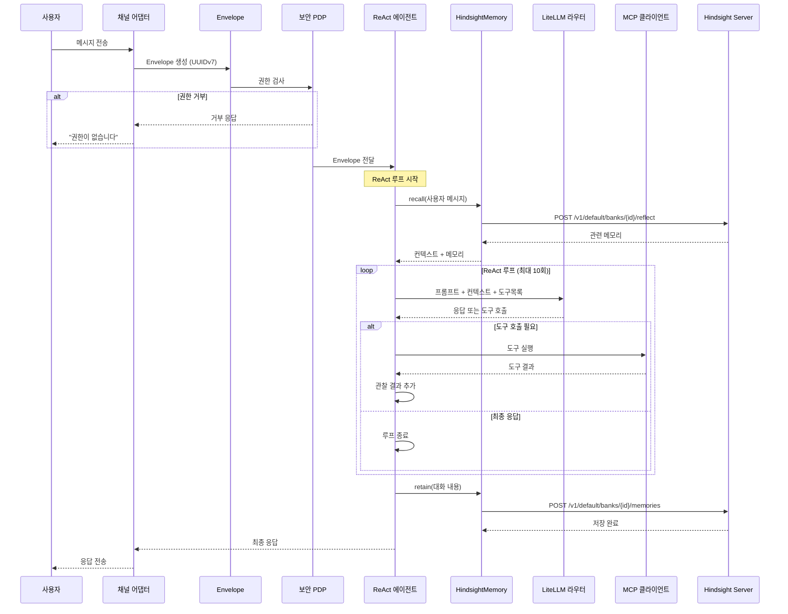
```mermaid
sequenceDiagram
    participant U as 사용자
    participant CH as 채널 어댑터
    participant ENV as Envelope
    participant PDP as 보안 PDP
    participant AG as ReAct 에이전트
    participant MEM as HindsightMemory
    participant LLM as LiteLLM 라우터
    participant MCP as MCP 클라이언트
    participant HS as Hindsight Server

    U->>CH: 메시지 전송
    CH->>ENV: Envelope 생성 (UUIDv7)
    ENV->>PDP: 권한 검사

    alt 권한 거부
        PDP-->>CH: 거부 응답
        CH-->>U: "권한이 없습니다"
    end

    PDP->>AG: Envelope 전달

    Note over AG: ReAct 루프 시작

    AG->>MEM: recall(사용자 메시지)
    MEM->>HS: POST /v1/default/banks/{id}/reflect
    HS-->>MEM: 관련 메모리
    MEM-->>AG: 컨텍스트 + 메모리

    loop ReAct 루프 (최대 10회)
        AG->>LLM: 프롬프트 + 컨텍스트 + 도구목록
        LLM-->>AG: 응답 또는 도구 호출

        alt 도구 호출 필요
            AG->>MCP: 도구 실행
            MCP-->>AG: 도구 결과
            AG->>AG: 관찰 결과 추가
        else 최종 응답
            AG->>AG: 루프 종료
        end
    end

    AG->>MEM: retain(대화 내용)
    MEM->>HS: POST /v1/default/banks/{id}/memories
    HS-->>MEM: 저장 완료

    AG-->>CH: 최종 응답
    CH-->>U: 응답 전송
```

## 3. Hindsight 4-네트워크 메모리 모델

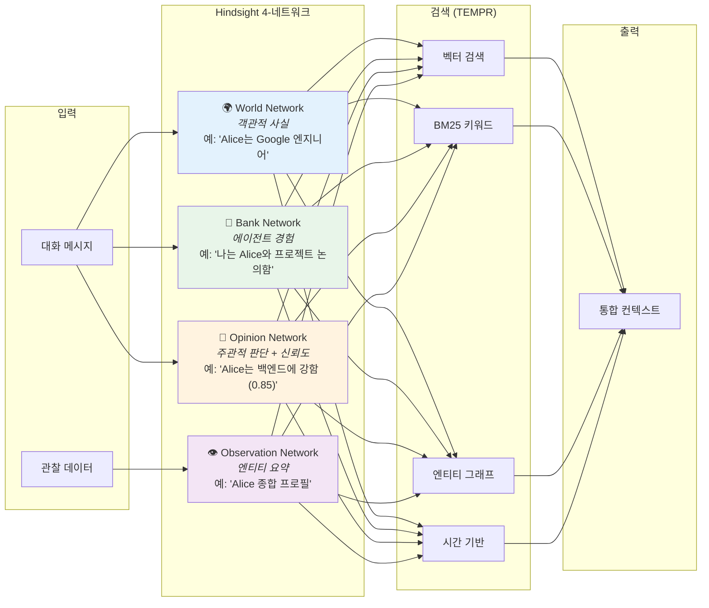
```mermaid
graph LR
    subgraph "입력"
        MSG[대화 메시지]
        OBS[관찰 데이터]
    end

    subgraph "Hindsight 4-네트워크"
        W["🌍 World Network<br/><i>객관적 사실</i><br/>예: 'Alice는 Google 엔지니어'"]
        B["🏦 Bank Network<br/><i>에이전트 경험</i><br/>예: '나는 Alice와 프로젝트 논의함'"]
        O["💭 Opinion Network<br/><i>주관적 판단 + 신뢰도</i><br/>예: 'Alice는 백엔드에 강함 (0.85)'"]
        OB["👁️ Observation Network<br/><i>엔티티 요약</i><br/>예: 'Alice 종합 프로필'"]
    end

    subgraph "검색 (TEMPR)"
        VEC[벡터 검색]
        BM25[BM25 키워드]
        ENT[엔티티 그래프]
        TIME[시간 기반]
    end

    subgraph "출력"
        CTX[통합 컨텍스트]
    end

    MSG --> W & B & O
    OBS --> OB
    W & B & O & OB --> VEC & BM25 & ENT & TIME
    VEC & BM25 & ENT & TIME --> CTX

    style W fill:#e3f2fd
    style B fill:#e8f5e9
    style O fill:#fff3e0
    style OB fill:#f3e5f5
```

## 4. LangGraph ReAct 에이전트 그래프

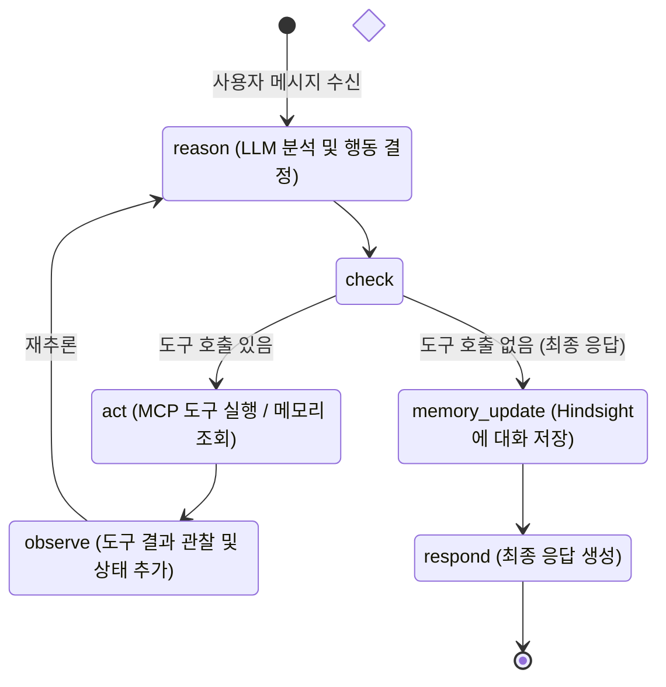
```mermaid
stateDiagram-v2
    [*] --> reason: 사용자 메시지 수신

    state "reason (LLM 분석 및 행동 결정)" as reason
    state "도구 호출 필요?" as check <<choice>>
    state "act (MCP 도구 실행 / 메모리 조회)" as act
    state "observe (도구 결과 관찰 및 상태 추가)" as observe
    state "memory_update (Hindsight에 대화 저장)" as memory
    state "respond (최종 응답 생성)" as respond

    reason --> check
    check --> act: 도구 호출 있음
    check --> memory: 도구 호출 없음 (최종 응답)
    act --> observe
    observe --> reason: 재추론
    memory --> respond
    respond --> [*]
```

## 5. LangGraph StateGraph 구조

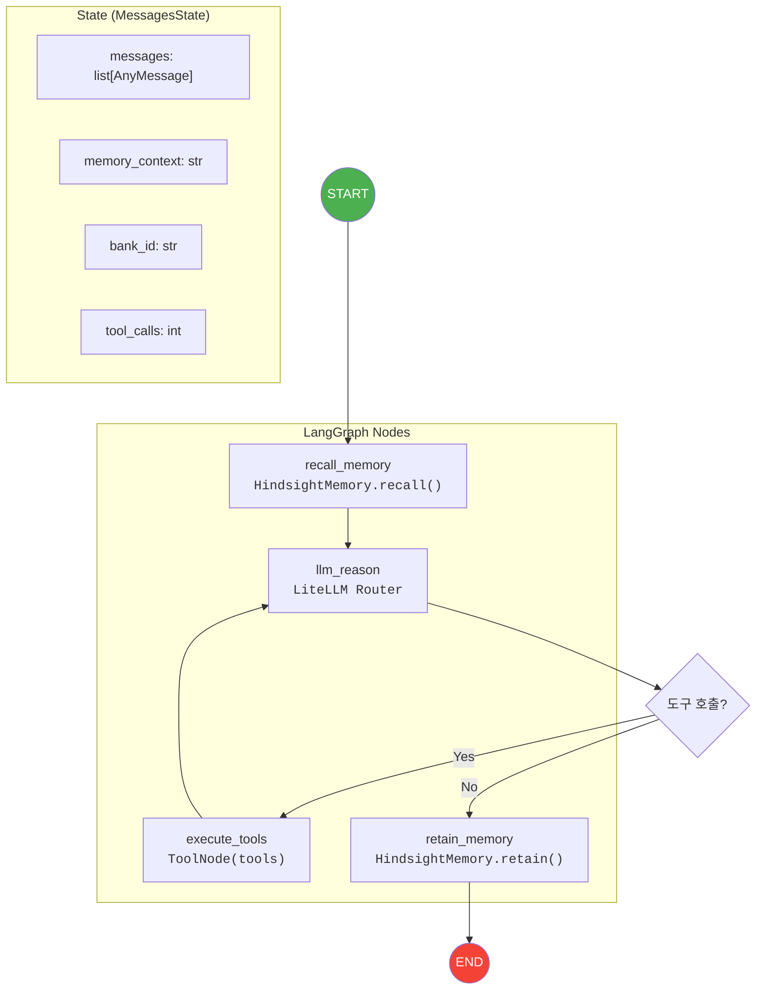
```mermaid
graph TD
    START((START)) --> recall_memory
    recall_memory --> llm_reason
    llm_reason --> should_continue{도구 호출?}
    should_continue -->|Yes| execute_tools
    should_continue -->|No| retain_memory
    execute_tools --> llm_reason
    retain_memory --> END((END))

    subgraph "LangGraph Nodes"
        recall_memory["recall_memory<br/><code>HindsightMemory.recall()</code>"]
        llm_reason["llm_reason<br/><code>LiteLLM Router</code>"]
        execute_tools["execute_tools<br/><code>ToolNode(tools)</code>"]
        retain_memory["retain_memory<br/><code>HindsightMemory.retain()</code>"]
    end

    subgraph "State (MessagesState)"
        direction LR
        S1["messages: list[AnyMessage]"]
        S2["memory_context: str"]
        S3["bank_id: str"]
        S4["tool_calls: int"]
    end

    style START fill:#4caf50,color:#fff
    style END fill:#f44336,color:#fff
```

## 6. LiteLLM 라우터 폴백 체인 (설정 기반)

> 모든 모델은 `.env` 또는 `llm_config.yaml`로 설정합니다. 하드코딩 금지.

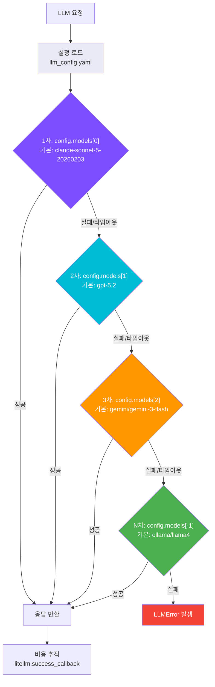
```mermaid
flowchart TD
    REQ[LLM 요청] --> CONFIG["설정 로드<br/>llm_config.yaml"]
    CONFIG --> PRIMARY

    PRIMARY{"1차: config.models[0]<br/>기본: claude-sonnet-5-20260203"}
    PRIMARY -->|성공| DONE[응답 반환]
    PRIMARY -->|실패/타임아웃| SECONDARY

    SECONDARY{"2차: config.models[1]<br/>기본: gpt-5.2"}
    SECONDARY -->|성공| DONE
    SECONDARY -->|실패/타임아웃| TERTIARY

    TERTIARY{"3차: config.models[2]<br/>기본: gemini/gemini-3-flash"}
    TERTIARY -->|성공| DONE
    TERTIARY -->|실패/타임아웃| LOCAL

    LOCAL{"N차: config.models[-1]<br/>기본: ollama/llama4"}
    LOCAL -->|성공| DONE
    LOCAL -->|실패| ERROR[LLMError 발생]

    COST[비용 추적<br/>litellm.success_callback]
    DONE --> COST

    style CONFIG fill:#e8eaf6
    style PRIMARY fill:#7c4dff,color:#fff
    style SECONDARY fill:#00bcd4,color:#fff
    style TERTIARY fill:#ff9800,color:#fff
    style LOCAL fill:#4caf50,color:#fff
    style ERROR fill:#f44336,color:#fff
```

**설정 예시 (`llm_config.yaml`):**

```yaml
# 사용자가 자유롭게 모델 추가/삭제/순서 변경 가능
models:
  - model: claude-sonnet-5-20260203    # Anthropic
    timeout: 60
    max_tokens: 8192
  - model: gpt-5.2                       # OpenAI
    timeout: 60
  - model: gemini/gemini-3-flash              # Google
    timeout: 45
  - model: ollama/llama4                  # 로컬 (비용 $0)
    timeout: 120

default_temperature: 0.7
cost_tracking: true
```

## 7. MCP 도구 아키텍처

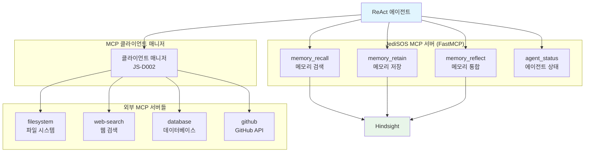
```mermaid
graph TB
    subgraph "JediSOS MCP 서버 (FastMCP)"
        TOOL1["memory_recall<br/>메모리 검색"]
        TOOL2["memory_retain<br/>메모리 저장"]
        TOOL3["memory_reflect<br/>메모리 통합"]
        TOOL4["agent_status<br/>에이전트 상태"]
    end

    subgraph "MCP 클라이언트 매니저"
        MGR[클라이언트 매니저<br/>JS-D002]
    end

    subgraph "외부 MCP 서버들"
        FS["filesystem<br/>파일 시스템"]
        WEB["web-search<br/>웹 검색"]
        DB["database<br/>데이터베이스"]
        GH["github<br/>GitHub API"]
    end

    AGENT[ReAct 에이전트] --> MGR
    MGR --> FS & WEB & DB & GH
    AGENT --> TOOL1 & TOOL2 & TOOL3 & TOOL4
    TOOL1 & TOOL2 & TOOL3 --> HS[Hindsight]

    style AGENT fill:#e1f5fe
    style HS fill:#e8f5e9
```

## 8. 보안 PDP 흐름

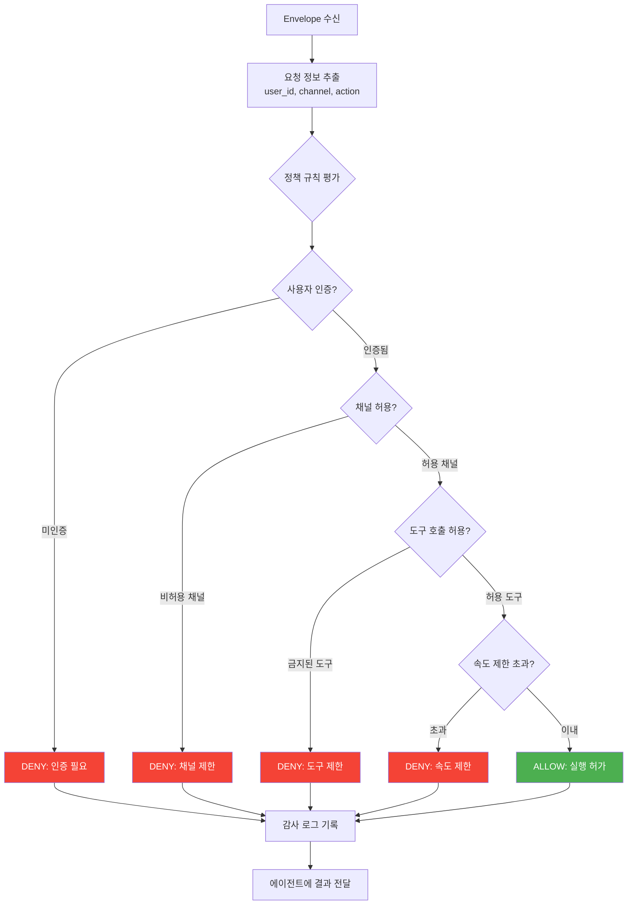
```mermaid
flowchart TD
    ENV[Envelope 수신] --> EXTRACT[요청 정보 추출<br/>user_id, channel, action]

    EXTRACT --> RULES{정책 규칙 평가}

    RULES --> R1{사용자 인증?}
    R1 -->|미인증| DENY1[DENY: 인증 필요]
    R1 -->|인증됨| R2

    R2{채널 허용?}
    R2 -->|비허용 채널| DENY2[DENY: 채널 제한]
    R2 -->|허용 채널| R3

    R3{도구 호출 허용?}
    R3 -->|금지된 도구| DENY3[DENY: 도구 제한]
    R3 -->|허용 도구| R4

    R4{속도 제한 초과?}
    R4 -->|초과| DENY4[DENY: 속도 제한]
    R4 -->|이내| ALLOW[ALLOW: 실행 허가]

    DENY1 & DENY2 & DENY3 & DENY4 --> AUDIT[감사 로그 기록]
    ALLOW --> AUDIT
    AUDIT --> AGENT[에이전트에 결과 전달]

    style ALLOW fill:#4caf50,color:#fff
    style DENY1 fill:#f44336,color:#fff
    style DENY2 fill:#f44336,color:#fff
    style DENY3 fill:#f44336,color:#fff
    style DENY4 fill:#f44336,color:#fff
```

## 9. Docker 컨테이너 구성

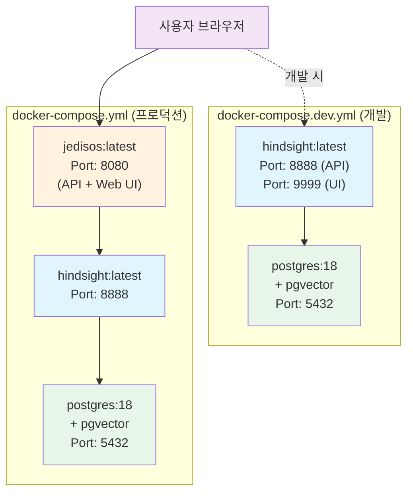
```mermaid
graph TB
    subgraph "docker-compose.dev.yml (개발)"
        direction TB
        PG["postgres:18<br/>+ pgvector<br/>Port: 5432"]
        HS["hindsight:latest<br/>Port: 8888 (API)<br/>Port: 9999 (UI)"]
    end

    subgraph "docker-compose.yml (프로덕션)"
        direction TB
        PG2["postgres:18<br/>+ pgvector<br/>Port: 5432"]
        HS2["hindsight:latest<br/>Port: 8888"]
        MC["jedisos:latest<br/>Port: 8080<br/>(API + Web UI)"]
    end

    HS --> PG
    HS2 --> PG2
    MC --> HS2

    USER["사용자 브라우저"] --> MC
    USER -.->|개발 시| HS

    style PG fill:#e8f5e9
    style PG2 fill:#e8f5e9
    style HS fill:#e1f5fe
    style HS2 fill:#e1f5fe
    style MC fill:#fff3e0
    style USER fill:#f3e5f5
```

## 10. 데이터 흐름 요약

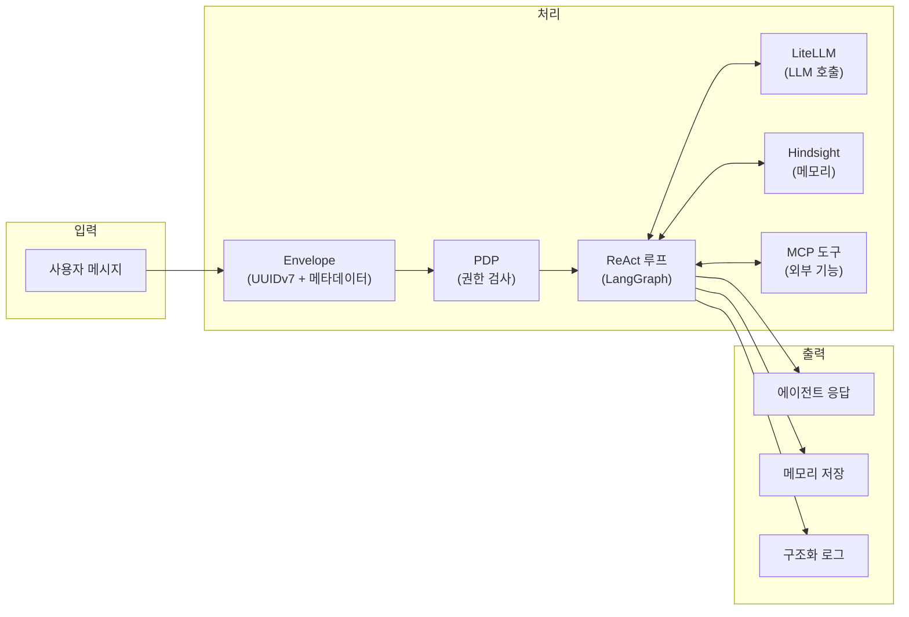
```mermaid
flowchart LR
    subgraph "입력"
        USER["사용자 메시지"]
    end

    subgraph "처리"
        direction TB
        E["Envelope<br/>(UUIDv7 + 메타데이터)"]
        P["PDP<br/>(권한 검사)"]
        R["ReAct 루프<br/>(LangGraph)"]
        L["LiteLLM<br/>(LLM 호출)"]
        M["Hindsight<br/>(메모리)"]
        T["MCP 도구<br/>(외부 기능)"]
    end

    subgraph "출력"
        RESP["에이전트 응답"]
        MEM_STORE["메모리 저장"]
        LOG["구조화 로그"]
    end

    USER --> E --> P --> R
    R <--> L
    R <--> M
    R <--> T
    R --> RESP
    R --> MEM_STORE
    R --> LOG
```

## 11. 멀티에이전트 슈퍼바이저 패턴

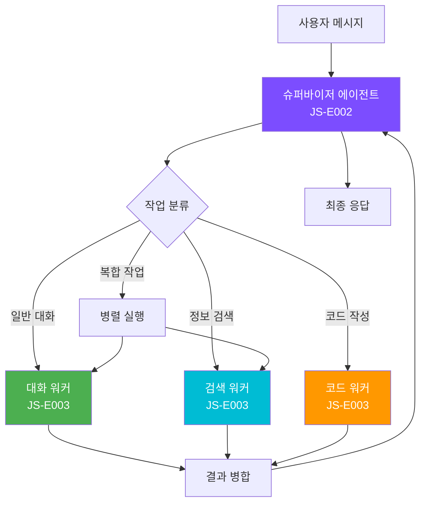
```mermaid
graph TD
    MSG[사용자 메시지] --> SUP[슈퍼바이저 에이전트<br/>JS-E002]

    SUP --> CLASSIFY{작업 분류}

    CLASSIFY -->|일반 대화| CHAT[대화 워커<br/>JS-E003]
    CLASSIFY -->|정보 검색| SEARCH[검색 워커<br/>JS-E003]
    CLASSIFY -->|코드 작성| CODE[코드 워커<br/>JS-E003]
    CLASSIFY -->|복합 작업| MULTI[병렬 실행]

    MULTI --> CHAT & SEARCH

    CHAT --> MERGE[결과 병합]
    SEARCH --> MERGE
    CODE --> MERGE

    MERGE --> SUP
    SUP --> RESP[최종 응답]

    style SUP fill:#7c4dff,color:#fff
    style CHAT fill:#4caf50,color:#fff
    style SEARCH fill:#00bcd4,color:#fff
    style CODE fill:#ff9800,color:#fff
```

## 12. CI/CD 파이프라인

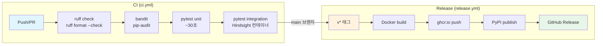
```mermaid
flowchart LR
    subgraph "CI (ci.yml)"
        direction TB
        PUSH[Push/PR] --> LINT[ruff check<br/>ruff format --check]
        LINT --> SEC[bandit<br/>pip-audit]
        SEC --> TEST_U[pytest unit<br/>~30초]
        TEST_U --> TEST_I[pytest integration<br/>Hindsight 컨테이너]
    end

    subgraph "Release (release.yml)"
        direction TB
        TAG[v* 태그] --> BUILD[Docker build]
        BUILD --> PUSH_IMG[ghcr.io push]
        PUSH_IMG --> PYPI[PyPI publish]
        PYPI --> GH_REL[GitHub Release]
    end

    TEST_I -->|main 브랜치| TAG

    style PUSH fill:#e1f5fe
    style TAG fill:#fff3e0
    style GH_REL fill:#e8f5e9
```

## 13. 핵심 모듈 의존성

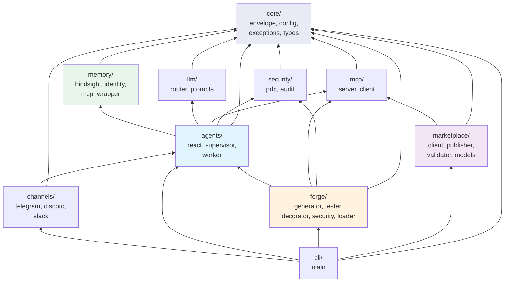
```mermaid
graph BT
    CORE["core/<br/>envelope, config,<br/>exceptions, types"]
    MEM["memory/<br/>hindsight, identity,<br/>mcp_wrapper"]
    LLM["llm/<br/>router, prompts"]
    MCP["mcp/<br/>server, client"]
    AGENTS["agents/<br/>react, supervisor,<br/>worker"]
    SEC["security/<br/>pdp, audit"]
    CH["channels/<br/>telegram, discord,<br/>slack"]
    CLI_M["cli/<br/>main"]
    FORGE_M["forge/<br/>generator, tester,<br/>decorator, security, loader"]
    MARKET_M["marketplace/<br/>client, publisher,<br/>validator, models"]

    MEM --> CORE
    LLM --> CORE
    MCP --> CORE
    SEC --> CORE
    AGENTS --> MEM & LLM & MCP & SEC & CORE
    FORGE_M --> AGENTS & MCP & SEC & CORE
    MARKET_M --> MCP & CORE
    CH --> AGENTS & CORE
    CLI_M --> CH & AGENTS & FORGE_M & MARKET_M & CORE

    style CORE fill:#e8eaf6
    style AGENTS fill:#e1f5fe
    style MEM fill:#e8f5e9
    style FORGE_M fill:#fff3e0
    style MARKET_M fill:#f3e5f5
```

> **의존성 규칙:** 하위 모듈은 상위 모듈을 import할 수 없습니다.
> `core` → `memory/llm/mcp/security` → `agents` → `forge/marketplace` → `channels/cli`
> 이 방향을 역행하는 import는 순환 참조를 유발합니다.

## 14. MCP 확장 아키텍처 (앱스토어)

JediSOS의 기능 확장 = MCP 서버 추가. 마켓플레이스에서 검색 → Docker로 설치 → OAuth 프록시가 인증 처리.

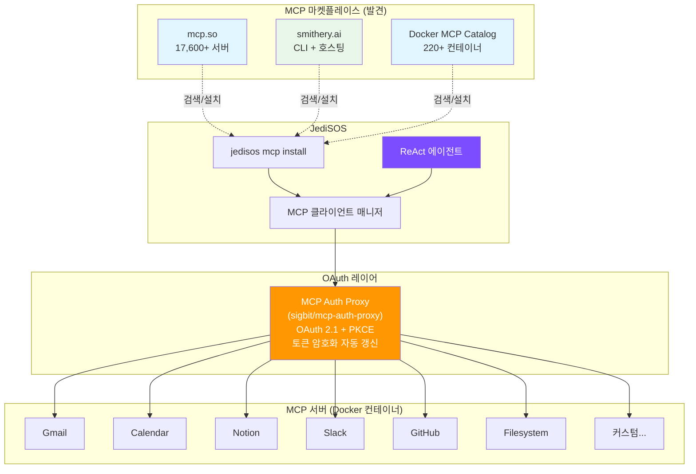
```mermaid
graph TB
    subgraph "MCP 마켓플레이스 (발견)"
        MCPSO["mcp.so<br/>17,600+ 서버"]
        SMITHERY["smithery.ai<br/>CLI + 호스팅"]
        DOCKER_CAT["Docker MCP Catalog<br/>220+ 컨테이너"]
    end

    subgraph "JediSOS"
        CLI["jedisos mcp install"]
        CLIENT["MCP 클라이언트 매니저"]
        AGENT["ReAct 에이전트"]
    end

    subgraph "OAuth 레이어"
        PROXY["MCP Auth Proxy<br/>(sigbit/mcp-auth-proxy)<br/>OAuth 2.1 + PKCE<br/>토큰 암호화 자동 갱신"]
    end

    subgraph "MCP 서버 (Docker 컨테이너)"
        GMAIL["Gmail"]
        CAL["Calendar"]
        NOTION["Notion"]
        SLACK["Slack"]
        GH["GitHub"]
        FS["Filesystem"]
        CUSTOM["커스텀..."]
    end

    MCPSO & SMITHERY & DOCKER_CAT -.->|검색/설치| CLI
    CLI --> CLIENT
    AGENT --> CLIENT
    CLIENT --> PROXY
    PROXY --> GMAIL & CAL & NOTION & SLACK & GH & FS & CUSTOM

    style PROXY fill:#ff9800,color:#fff
    style AGENT fill:#7c4dff,color:#fff
    style MCPSO fill:#e1f5fe
    style SMITHERY fill:#e8f5e9
    style DOCKER_CAT fill:#e1f5fe
```

> **상세:** `docs/MCP_EXTENSIONS.md`

## 15. 웹 UI 아키텍처

JediSOS 웹 UI는 FastAPI 백엔드 + React 프론트엔드로 구성됩니다.
포트 8080 하나에서 API와 정적 파일을 모두 서빙합니다.

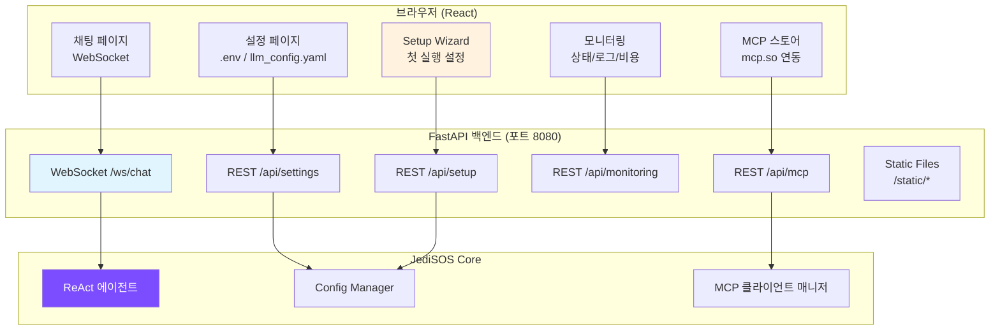
```mermaid
graph TB
    subgraph "브라우저 (React)"
        CHAT["채팅 페이지<br/>WebSocket"]
        SETTINGS["설정 페이지<br/>.env / llm_config.yaml"]
        MCP_STORE["MCP 스토어<br/>mcp.so 연동"]
        MONITOR["모니터링<br/>상태/로그/비용"]
        WIZARD["Setup Wizard<br/>첫 실행 설정"]
    end

    subgraph "FastAPI 백엔드 (포트 8080)"
        WS_API["WebSocket /ws/chat"]
        REST_SETTINGS["REST /api/settings"]
        REST_MCP["REST /api/mcp"]
        REST_MONITOR["REST /api/monitoring"]
        REST_SETUP["REST /api/setup"]
        STATIC["Static Files<br/>/static/*"]
    end

    subgraph "JediSOS Core"
        AGENT["ReAct 에이전트"]
        CONFIG["Config Manager"]
        MCP_MGR["MCP 클라이언트 매니저"]
    end

    CHAT --> WS_API
    SETTINGS --> REST_SETTINGS
    MCP_STORE --> REST_MCP
    MONITOR --> REST_MONITOR
    WIZARD --> REST_SETUP

    WS_API --> AGENT
    REST_SETTINGS --> CONFIG
    REST_MCP --> MCP_MGR
    REST_SETUP --> CONFIG

    style WIZARD fill:#fff3e0
    style WS_API fill:#e1f5fe
    style AGENT fill:#7c4dff,color:#fff
```

## 16. 배포 아키텍처 (오픈소스)

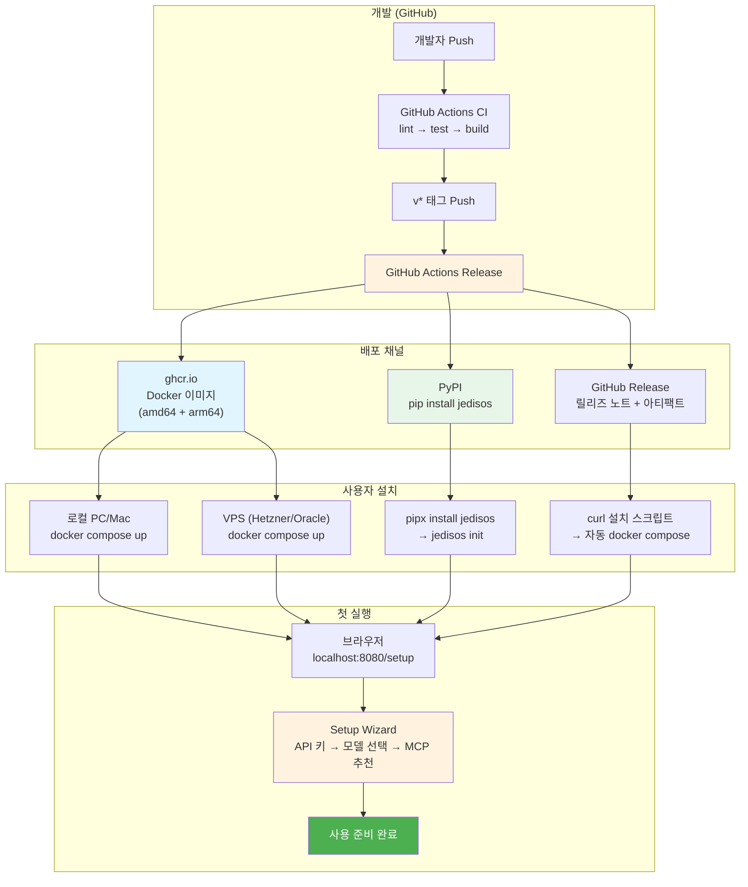
```mermaid
flowchart TB
    subgraph "개발 (GitHub)"
        DEV["개발자 Push"] --> CI["GitHub Actions CI<br/>lint → test → build"]
        CI --> TAG["v* 태그 Push"]
        TAG --> RELEASE["GitHub Actions Release"]
    end

    subgraph "배포 채널"
        RELEASE --> GHCR["ghcr.io<br/>Docker 이미지<br/>(amd64 + arm64)"]
        RELEASE --> PYPI["PyPI<br/>pip install jedisos"]
        RELEASE --> GH_REL["GitHub Release<br/>릴리즈 노트 + 아티팩트"]
    end

    subgraph "사용자 설치"
        GHCR --> LOCAL["로컬 PC/Mac<br/>docker compose up"]
        GHCR --> VPS["VPS (Hetzner/Oracle)<br/>docker compose up"]
        PYPI --> PIPX["pipx install jedisos<br/>→ jedisos init"]
        GH_REL --> SCRIPT["curl 설치 스크립트<br/>→ 자동 docker compose"]
    end

    subgraph "첫 실행"
        LOCAL & VPS & PIPX & SCRIPT --> BROWSER["브라우저<br/>localhost:8080/setup"]
        BROWSER --> SETUP_WIZ["Setup Wizard<br/>API 키 → 모델 선택 → MCP 추천"]
        SETUP_WIZ --> READY["사용 준비 완료"]
    end

    style RELEASE fill:#fff3e0
    style GHCR fill:#e1f5fe
    style PYPI fill:#e8f5e9
    style SETUP_WIZ fill:#fff3e0
    style READY fill:#4caf50,color:#fff
```

## 17. Setup Wizard 플로우

첫 실행 시 (`JEDISOS_FIRST_RUN=true`) 자동으로 Setup Wizard가 표시됩니다.

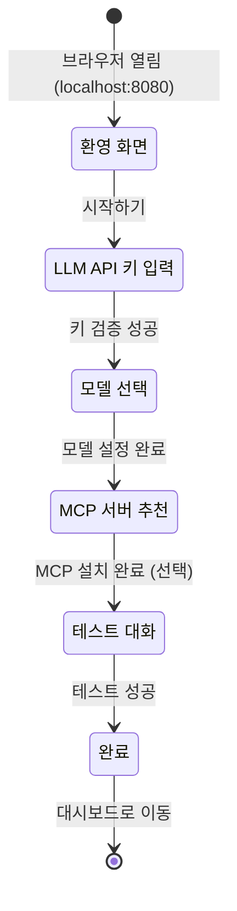
```mermaid
stateDiagram-v2
    [*] --> welcome: 브라우저 열림 (localhost:8080)

    state "환영 화면" as welcome
    state "LLM API 키 입력" as api_keys
    state "모델 선택" as model_select
    state "MCP 서버 추천" as mcp_recommend
    state "테스트 대화" as test_chat
    state "완료" as complete

    welcome --> api_keys: 시작하기
    api_keys --> model_select: 키 검증 성공
    model_select --> mcp_recommend: 모델 설정 완료
    mcp_recommend --> test_chat: MCP 설치 완료 (선택)
    test_chat --> complete: 테스트 성공
    complete --> [*]: 대시보드로 이동
```

> **상세:** `docs/RELEASE.md` (설치 방법), `docs/MCP_EXTENSIONS.md` (MCP 마켓플레이스)

## 18. 자가 진화 아키텍처 (Forge)

에이전트가 필요한 도구를 스스로 코딩하고, 정적분석으로 검증하고, 핫로드로 등록하는 **2-Tier 자가 진화 시스템**입니다.

### Tier 1: 경량 Skill 생성 (기본)

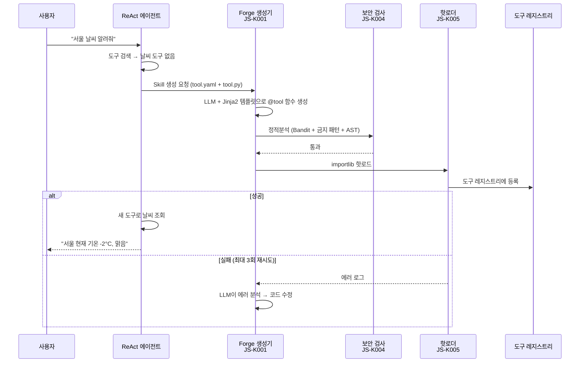
```mermaid
sequenceDiagram
    participant U as 사용자
    participant AG as ReAct 에이전트
    participant FG as Forge 생성기<br/>JS-K001
    participant SC as 보안 검사<br/>JS-K004
    participant LD as 핫로더<br/>JS-K005
    participant REG as 도구 레지스트리

    U->>AG: "서울 날씨 알려줘"
    AG->>AG: 도구 검색 → 날씨 도구 없음

    AG->>FG: Skill 생성 요청 (tool.yaml + tool.py)
    FG->>FG: LLM + Jinja2 템플릿으로 @tool 함수 생성

    FG->>SC: 정적분석 (Bandit + 금지 패턴 + AST)
    SC-->>FG: 통과

    FG->>LD: importlib 핫로드
    LD->>REG: 도구 레지스트리에 등록

    alt 성공
        AG->>AG: 새 도구로 날씨 조회
        AG-->>U: "서울 현재 기온 -2°C, 맑음"
    else 실패 (최대 3회 재시도)
        LD-->>FG: 에러 로그
        FG->>FG: LLM이 에러 분석 → 코드 수정
    end
```

### 2-Tier 선택 기준

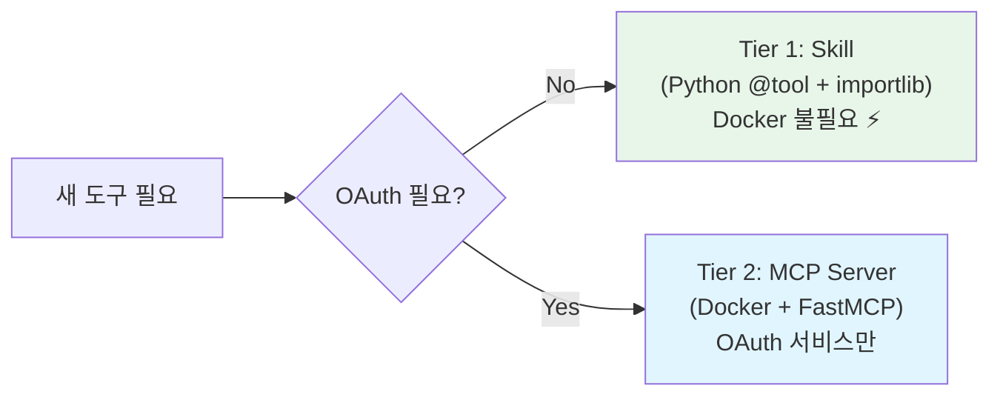
```mermaid
graph LR
    NEW_TOOL["새 도구 필요"] --> CHECK{"OAuth 필요?"}
    CHECK -->|No| TIER1["Tier 1: Skill<br/>(Python @tool + importlib)<br/>Docker 불필요 ⚡"]
    CHECK -->|Yes| TIER2["Tier 2: MCP Server<br/>(Docker + FastMCP)<br/>OAuth 서비스만"]

    style TIER1 fill:#e8f5e9
    style TIER2 fill:#e1f5fe
```

> **상세:** `docs/SELF_EVOLVING.md` (섹션 2)

## 19. 마켓플레이스 아키텍처

커뮤니티 기반 패키지 레지스트리 — Skill + MCP 서버 + 프롬프트 + 워크플로우 + 정체성 팩 + 번들을 공유합니다.

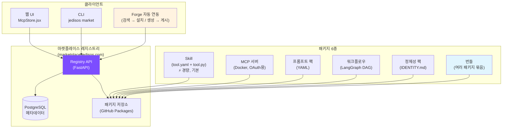
```mermaid
graph TB
    subgraph "마켓플레이스 레지스트리<br/>(marketplace.jedisos.com)"
        API["Registry API<br/>(FastAPI)"]
        DB[(PostgreSQL<br/>메타데이터)]
        STORE["패키지 저장소<br/>(GitHub Packages)"]
    end

    subgraph "패키지 6종"
        P0["Skill<br/>(tool.yaml + tool.py)<br/>⚡ 경량, 기본"]
        P1["MCP 서버<br/>(Docker, OAuth용)"]
        P2["프롬프트 팩<br/>(YAML)"]
        P3["워크플로우<br/>(LangGraph DAG)"]
        P4["정체성 팩<br/>(IDENTITY.md)"]
        P5["번들<br/>(여러 패키지 묶음)"]
    end

    subgraph "클라이언트"
        WEB["웹 UI<br/>McpStore.jsx"]
        CLI["CLI<br/>jedisos market"]
        FORGE["Forge 자동 연동<br/>(검색 → 설치 / 생성 → 게시)"]
    end

    WEB & CLI & FORGE --> API
    API --> DB
    API --> STORE
    P0 & P1 & P2 & P3 & P4 & P5 --> STORE

    style API fill:#7c4dff,color:#fff
    style FORGE fill:#fff3e0
    style P5 fill:#e1f5fe
```

### 게시 + 검증 플로우

```mermaid
flowchart LR
    DEV["패키지 작성"] --> VALIDATE["jedisos market validate<br/>메타데이터+보안+정적분석"]
    VALIDATE --> PUBLISH["jedisos market publish"]
    PUBLISH --> REVIEW["자동 리뷰<br/>Bandit+라이선스+테스트"]
    REVIEW --> LIVE["게시 (unverified)"]
    LIVE --> COMMUNITY["커뮤니티 사용+리뷰"]
    COMMUNITY --> BADGE["배지 부여<br/>🤖 agent-made<br/>✅ verified (100+ DL, 4.0+)<br/>⭐ official"]

    style REVIEW fill:#fff3e0
    style BADGE fill:#4caf50,color:#fff
```

> **상세:** `docs/SELF_EVOLVING.md` (섹션 3-4)
