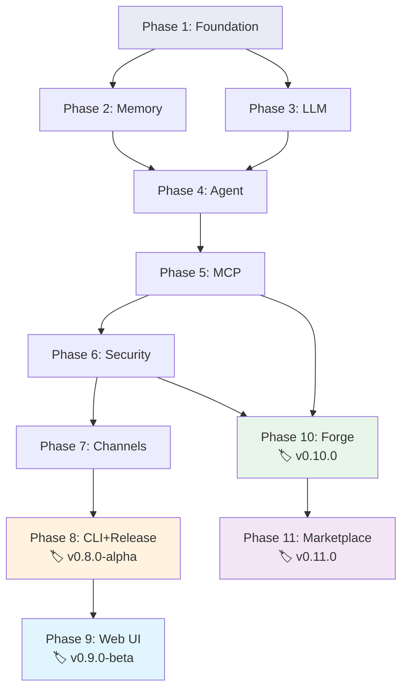

# JediSOS 빌드 플레이북

> **이 문서는 AI(Claude Code)가 기계적으로 따라가는 실행 가이드입니다.**
> 각 스텝은 "무엇을 만들고 → 어떻게 검증하고 → 통과하면 다음으로"의 구조입니다.
> 스텝을 건너뛰지 마세요. 이전 스텝의 검증이 통과해야 다음 스텝으로 넘어갑니다.

## 실행 규칙

```
1. 스텝을 순서대로 진행한다
2. 각 스텝의 [검증] 명령을 실행한다
3. 검증이 통과하면 → 다음 스텝으로
4. 검증이 실패하면 → 에러를 수정하고 → 같은 검증을 재실행
5. Phase 내 스텝은 순서대로. Phase 간도 순서대로
6. 코드 작성 시 반드시 CLAUDE.md의 규칙(해시, 타입힌트, structlog)을 따른다
7. 상세 코드 패턴은 docs/DEVELOPMENT_GUIDE.md의 해당 Phase를 참고한다
```

## 참조 문서 매핑

| 무엇을 알고 싶을 때 | 읽을 문서 |
|---------------------|----------|
| 코드 규칙, 해시 형식, 프로젝트 구조 | `CLAUDE.md` |
| 각 Phase의 상세 코드 패턴 + 예시 | `docs/DEVELOPMENT_GUIDE.md` |
| 시스템 전체 구조, 다이어그램 | `docs/ARCHITECTURE.md` |
| Forge + 마켓플레이스 상세 설계 | `docs/SELF_EVOLVING.md` |
| 릴리즈 방법, Docker, PyPI, 설치 스크립트 | `docs/RELEASE.md` |
| 핵심 라이브러리 API 사용법 | `docs/LIBRARY_REFERENCE.md` |
| 테스트 전략, 픽스처 패턴 | `docs/TESTING_STRATEGY.md` |
| MCP 확장, OAuth | `docs/MCP_EXTENSIONS.md` |
| 해시 추적 시스템 상세 | `docs/TRACKING.md` |
| **⚠️ 위험 요소 + 사람 개입 필요 사항** | `docs/RISKS_AND_DECISIONS.md` |
| 데이터베이스 스키마 | `docs/DATABASE_SCHEMA.md` |
| **Hindsight 사용법** | `docs/HINDSIGHT_USAGE.md` |
| **LangGraph 사용법** | `docs/LANGGRAPH_USAGE.md` |
| **LiteLLM 사용법** | `docs/LITELLM_USAGE.md` |
| **FastMCP 사용법** | `docs/FASTMCP_USAGE.md` |
| **MCP Auth Proxy 사용법** | `docs/MCP_AUTH_PROXY_USAGE.md` |
| **🔍 Phase별 검증 가이드** | `docs/PHASE_VERIFICATION.md` |

---

## Phase 1: Foundation (기반)

> **목표:** `make check` (lint + test)가 통과하는 빈 프로젝트 뼈대

### Step 1.1 — 프로젝트 뼈대 생성

```
생성할 파일:
  - pyproject.toml
  - src/jedisos/__init__.py          (__version__ = "0.1.0")
  - src/jedisos/core/__init__.py
  - Makefile
  - .env.example
  - .gitignore

참고: DEVELOPMENT_GUIDE.md > Phase 1 > 1-1 (pyproject.toml 전체 내용)
참고: CLAUDE.md > Makefile 명령어
```

**[검증]**
```bash
cd jedisos
python -c "import jedisos; print(jedisos.__version__)"
# 기대: "0.1.0"
```

### Step 1.2 — Core 타입 + 예외 + 설정

```
생성할 파일:
  - src/jedisos/core/exceptions.py   [JS-A003]
  - src/jedisos/core/types.py        [JS-A004]
  - src/jedisos/core/config.py       [JS-A002]  (pydantic-settings 기반)

참고: DEVELOPMENT_GUIDE.md > Phase 1 > 1-3, 1-4, 1-5
```

**[검증]**
```bash
python -c "from jedisos.core.config import JedisosConfig; print(JedisosConfig())"
# 기대: 설정 객체 출력 (에러 없음)
```

### Step 1.3 — Envelope 메시지 계약

```
생성할 파일:
  - src/jedisos/core/envelope.py     [JS-A001]

참고: DEVELOPMENT_GUIDE.md > Phase 1 > 1-6 (상세 구현 포함)
의존: Step 1.2 (types.py, exceptions.py)
```

**[검증]**
```bash
python -c "
from jedisos.core.envelope import Envelope
from jedisos.core.types import ChannelType
e = Envelope(channel=ChannelType.CLI, user_id='test', content='hello')
print(f'ID: {e.id}, State: {e.state}')
"
# 기대: UUIDv7 ID + CREATED 상태
```

### Step 1.4 — 단위 테스트 + CI

```
생성할 파일:
  - tests/__init__.py
  - tests/conftest.py                (공통 픽스처)
  - tests/unit/__init__.py
  - tests/unit/test_envelope.py      [JS-T001]
  - docker-compose.dev.yml           (Hindsight + PostgreSQL)
  - .github/workflows/ci.yml

참고: DEVELOPMENT_GUIDE.md > Phase 1 > 1-7, 1-8, 1-10
```

**[검증]**
```bash
make lint     # ruff check 에러 0
make test     # pytest tests/unit/ 전체 통과
```

**Phase 1 완료 조건:** `make check` (lint + security + test) 전체 통과

---

## Phase 2: Memory (메모리)

> **목표:** Hindsight retain/recall이 실제로 동작
> **의존:** Phase 1 완료

### Step 2.1 — Hindsight 클라이언트 래퍼

```
생성할 파일:
  - src/jedisos/memory/__init__.py
  - src/jedisos/memory/hindsight.py  [JS-B001]
    메서드: retain(), recall(), reflect(), get_entities(), health_check(), close()

참고: DEVELOPMENT_GUIDE.md > Phase 2 > 2-1 (전체 구현 코드)
의존: core/config.py (HindsightConfig), core/exceptions.py (MemoryError)
```

**[검증]**
```bash
pytest tests/unit/test_memory_mock.py -v
# 기대: mock 기반 retain/recall 테스트 통과
```

### Step 2.2 — 정체성 시스템

```
생성할 파일:
  - src/jedisos/memory/identity.py   [JS-B002]

참고: DEVELOPMENT_GUIDE.md > Phase 2 > 2-2
```

**[검증]**
```bash
python -c "
from jedisos.memory.identity import AgentIdentity
ai = AgentIdentity()
print(ai.to_system_prompt()[:50])
"
# 기대: "당신의 정체성:" 으로 시작하는 문자열
```

### Step 2.3 — Hindsight 통합 테스트

```
생성할 파일:
  - tests/unit/test_memory_mock.py       [JS-T002]
  - tests/integration/__init__.py
  - tests/integration/test_hindsight_live.py  [JS-T003]
  - src/jedisos/memory/mcp_wrapper.py    [JS-B003]

사전조건: docker compose -f docker-compose.dev.yml up -d
참고: DEVELOPMENT_GUIDE.md > Phase 2 > 2-3, 2-4
```

**[검증]**
```bash
docker compose -f docker-compose.dev.yml up -d
# Hindsight 준비 대기 (30초)
pytest tests/integration/test_hindsight_live.py -v -m integration
# 기대: health_check + retain_and_recall 통과
```

**Phase 2 완료 조건:** 단위 + 통합 테스트 모두 통과

---

## Phase 3: LLM (LLM 통합)

> **목표:** LiteLLM 폴백 체인이 설정 파일로 동작
> **의존:** Phase 2 완료

### Step 3.1 — LiteLLM 라우터

```
생성할 파일:
  - src/jedisos/llm/__init__.py
  - src/jedisos/llm/router.py        [JS-C001]
  - llm_config.yaml                   (모델 폴백 설정)
    모델: claude-sonnet-5-20260203 → gpt-5.2 → gemini/gemini-3-flash → ollama/llama4

참고: DEVELOPMENT_GUIDE.md > Phase 3 > 3-1
참고: CLAUDE.md > 핵심 라이브러리 버전 (litellm >=1.81.12)
```

### Step 3.2 — 프롬프트 + 테스트

```
생성할 파일:
  - src/jedisos/llm/prompts.py       [JS-C002]
  - tests/unit/test_llm_router.py    [JS-T004]
```

**[검증]**
```bash
pytest tests/unit/test_llm_router.py -v
# 기대: mock LLM 폴백 체인 테스트 통과
# 기대: llm_config.yaml 변경만으로 모델 순서 변경 확인
```

**Phase 3 완료 조건:** 폴백 체인 단위 테스트 통과

---

## Phase 4: Agent (에이전트 루프)

> **목표:** LangGraph ReAct 에이전트가 메모리를 활용해 대화
> **의존:** Phase 2 (Memory) + Phase 3 (LLM)

### Step 4.1 — ReAct 에이전트

```
생성할 파일:
  - src/jedisos/agents/__init__.py
  - src/jedisos/agents/react.py      [JS-E001]
    그래프: recall_memory → llm_reason → (execute_tools ↔ llm_reason) → retain_memory

참고: DEVELOPMENT_GUIDE.md > Phase 4 > 4-1 (전체 구현 코드)
참고: ARCHITECTURE.md > Section 5 (에이전트 루프 다이어그램)
의존: memory/hindsight.py, llm/router.py
```

### Step 4.2 — 슈퍼바이저 + 워커

```
생성할 파일:
  - src/jedisos/agents/supervisor.py [JS-E002]
  - src/jedisos/agents/worker.py     [JS-E003]
```

### Step 4.3 — 에이전트 테스트

```
생성할 파일:
  - tests/unit/test_react_agent.py        [JS-T005]  (mock LLM + mock Memory)
  - tests/integration/test_agent_memory.py [JS-T006] (실제 Hindsight + mock LLM)
```

**[검증]**
```bash
pytest tests/unit/test_react_agent.py -v
pytest tests/integration/test_agent_memory.py -v -m integration
# 기대: 에이전트가 메모리를 저장하고 이전 대화를 recall하는 플로우 통과
```

**Phase 4 완료 조건:** 에이전트 메모리 통합 테스트 통과

---

## Phase 5: MCP (도구 연동)

> **목표:** FastMCP 도구 서버 + 에이전트 도구 호출 동작
> **의존:** Phase 4 (Agent)

### Step 5.1 — MCP 서버 + 클라이언트

```
생성할 파일:
  - src/jedisos/mcp/__init__.py
  - src/jedisos/mcp/server.py        [JS-D001]  FastMCP 도구 서버
  - src/jedisos/mcp/client.py        [JS-D002]  MCP 클라이언트 매니저

참고: CLAUDE.md > 핵심 라이브러리 (fastmcp >=2.14.5,<3.0)
참고: ARCHITECTURE.md > Section 7 (MCP 도구 실행 다이어그램)
```

### Step 5.2 — 에이전트 도구 연결 + 테스트

```
수정할 파일:
  - src/jedisos/agents/react.py  → _execute_tools() 에 실제 MCP 호출 연결

생성할 파일:
  - tests/unit/test_mcp_tools.py     [JS-T007]
```

**[검증]**
```bash
pytest tests/unit/test_mcp_tools.py -v
# 기대: MCP 도구 호출 → 에이전트 응답 플로우 통과
```

**Phase 5 완료 조건:** 에이전트가 MCP 도구를 호출하고 결과를 활용하는 단위 테스트 통과

---

## Phase 6: Security (보안)

> **목표:** 도구 호출 정책 + 감사 로그
> **의존:** Phase 5 (MCP)

### Step 6.1 — PDP + 감사

```
생성할 파일:
  - src/jedisos/security/__init__.py
  - src/jedisos/security/pdp.py      [JS-G001]  Policy Decision Point
  - src/jedisos/security/audit.py    [JS-G002]  감사 로그

수정할 파일:
  - src/jedisos/agents/react.py  → 도구 호출 전 PDP 검사 연결

생성할 파일:
  - tests/unit/test_pdp.py           [JS-T008]
```

**[검증]**
```bash
pytest tests/unit/test_pdp.py -v
# 기대: 금지된 도구 호출이 차단되고, 허용된 호출은 통과
# 기대: 감사 로그에 도구 호출 기록이 남음
```

**Phase 6 완료 조건:** PDP 정책 테스트 통과

---

## Phase 7: Channels (채널)

> **목표:** 텔레그램/디스코드/슬랙 봇이 에이전트와 연결
> **의존:** Phase 6 (Security — Envelope이 보안 파이프라인을 통과)

### Step 7.1 — 채널 어댑터

```
생성할 파일:
  - src/jedisos/channels/__init__.py
  - src/jedisos/channels/telegram.py [JS-F001]
  - src/jedisos/channels/discord.py  [JS-F002]
  - src/jedisos/channels/slack.py    [JS-F003]
  - tests/unit/test_channels.py      [JS-T009]

참고: CLAUDE.md > 핵심 라이브러리 (python-telegram-bot, discord.py, slack-bolt)
```

**[검증]**
```bash
pytest tests/unit/test_channels.py -v
# 기대: 각 채널에서 메시지 수신 → Envelope 변환 → 에이전트 → 응답 발송 mock 테스트 통과
```

**Phase 7 완료 조건:** 3개 채널 mock 테스트 통과

---

## Phase 8: CLI + Release (릴리즈)

> **목표:** `jedisos chat "안녕"`이 실제 동작 + Docker/PyPI 배포 파이프라인
> **의존:** Phase 7 (전체 기능 통합)
> **마일스톤:** v0.8.0-alpha — **첫 오픈소스 공개**

### Step 8.1 — CLI

```
생성할 파일:
  - src/jedisos/cli/__init__.py
  - src/jedisos/cli/main.py          [JS-H001]  Typer CLI
    명령어: chat, serve, health, init, update

참고: CLAUDE.md > 핵심 라이브러리 (typer >=0.23.1, rich >=14.3.2)
```

### Step 8.2 — Docker + CI/CD

```
생성할 파일:
  - docker/Dockerfile                프로덕션 3-stage 빌드
  - docker-compose.yml               프로덕션 서비스 구성
  - .github/workflows/release.yml    v* 태그 → ghcr.io + PyPI + GitHub Release
  - scripts/install.sh               curl | bash 설치 스크립트

참고: RELEASE.md > Section 3 (빌드), Section 4 (Docker), Section 5 (설치 스크립트)
```

### Step 8.3 — E2E 테스트

```
생성할 파일:
  - tests/e2e/__init__.py
  - tests/e2e/test_full_flow.py      [JS-T010]
```

**[검증]**
```bash
# CLI 동작 확인
jedisos --help
jedisos health

# Docker 빌드 확인
docker build -f docker/Dockerfile -t jedisos:test .
docker run --rm jedisos:test jedisos --version

# E2E 테스트
pytest tests/e2e/test_full_flow.py -v -m e2e
```

**Phase 8 완료 조건:** CLI 동작 + Docker 빌드 성공 + E2E 통과 → **v0.8.0-alpha 태그**

---

## Phase 9: Web UI (웹 대시보드)

> **목표:** 브라우저에서 채팅 + 설정 + MCP 관리
> **의존:** Phase 8
> **마일스톤:** v0.9.0-beta — **일반 사용자 공개**

### Step 9.1 — FastAPI 백엔드

```
생성할 파일:
  - src/jedisos/web/__init__.py
  - src/jedisos/web/app.py           [JS-W001]  FastAPI 앱 (포트 8080)
  - src/jedisos/web/api/chat.py      [JS-W002]  WebSocket 채팅
  - src/jedisos/web/api/settings.py  [JS-W003]  설정 관리 API
  - src/jedisos/web/api/mcp.py       [JS-W004]  MCP 서버 관리
  - src/jedisos/web/api/monitoring.py [JS-W005]  상태/로그
  - src/jedisos/web/setup_wizard.py  [JS-W006]  Setup Wizard

참고: ARCHITECTURE.md > Section 10-12 (웹 UI 다이어그램)
```

**[검증]**
```bash
# FastAPI 서버 시작
python -m jedisos.web.app &
curl -s http://localhost:8080/health | python -m json.tool
# 기대: {"status": "ok"}
```

### Step 9.2 — React 프론트엔드

```
생성할 디렉토리:
  - web-ui/
    ├── package.json
    ├── src/
    │   ├── App.jsx
    │   ├── pages/Chat.jsx
    │   ├── pages/Settings.jsx
    │   ├── pages/McpStore.jsx
    │   ├── pages/Monitoring.jsx
    │   └── pages/SetupWizard.jsx
    └── public/
```

### Step 9.3 — E2E 테스트

```
생성할 파일:
  - tests/e2e/test_web_ui.py         [JS-T011]  Playwright
```

**[검증]**
```bash
# 전체 스택 시작
docker compose up -d
# 브라우저 테스트
pytest tests/e2e/test_web_ui.py -v -m e2e
# 기대: Setup Wizard → 채팅 → MCP 설치 플로우 통과
```

**Phase 9 완료 조건:** 웹 UI E2E 통과 → **v0.9.0-beta 태그**

---

## Phase 10: Forge (자가 코딩)

> **목표:** 에이전트가 "날씨 도구 만들어줘" → Skill 자동 생성 → 사용
> **의존:** Phase 5 (MCP — 도구 레지스트리) + Phase 6 (Security — 코드 검사)
> **아키텍처:** 2-Tier (Tier 1: 경량 Skill 기본, Tier 2: MCP OAuth만)
> **마일스톤:** v0.10.0 — **자가 진화**

### Step 10.1 — @tool 데코레이터 + 도구 디렉토리

```
생성할 파일:
  - src/jedisos/forge/__init__.py
  - src/jedisos/forge/decorator.py   [JS-K003]  @tool 데코레이터 정의
  - tools/README.md                  (Skill 디렉토리 설명)
  - tools/generated/.gitkeep         (에이전트 자동 생성 디렉토리)

참고: SELF_EVOLVING.md > Section 2-2 (Tier 1 Skill 포맷)
```

**[검증]**
```bash
python -c "
from jedisos.forge.decorator import tool

@tool(name='test_tool', description='테스트')
async def my_func(x: int) -> int:
    return x * 2

print(f'is_tool: {my_func._is_jedisos_tool}')
print(f'name: {my_func._tool_name}')
"
# 기대: is_tool: True, name: test_tool
```

### Step 10.2 — 핫로더

```
생성할 파일:
  - src/jedisos/forge/loader.py      [JS-K005]  importlib 핫로더

참고: SELF_EVOLVING.md > Section 2-2 (ToolLoader 코드)
의존: Step 10.1 (decorator.py)
```

**[검증]**
```bash
# 테스트용 Skill 생성
mkdir -p /tmp/test_skill
cat > /tmp/test_skill/tool.yaml << 'EOF'
name: test_calc
version: "1.0.0"
description: "테스트 계산기"
author: test
EOF

cat > /tmp/test_skill/tool.py << 'EOF'
from jedisos.forge.decorator import tool

@tool(name="add", description="더하기")
async def add(a: int, b: int) -> int:
    return a + b
EOF

python -c "
from pathlib import Path
from jedisos.forge.loader import ToolLoader
loader = ToolLoader()
tools = loader.load_tool(Path('/tmp/test_skill'))
print(f'로드된 도구 수: {len(tools)}')
print(f'도구 이름: {tools[0]._tool_name}')
"
# 기대: 로드된 도구 수: 1, 도구 이름: add
```

### Step 10.3 — 보안 정적분석

```
생성할 파일:
  - src/jedisos/forge/security.py    [JS-K004]  Bandit + 금지 패턴 + import 화이트리스트

참고: SELF_EVOLVING.md > Section 2-6 (FORBIDDEN_PATTERNS, ALLOWED_IMPORTS)
```

**[검증]**
```bash
python -c "
import asyncio
from jedisos.forge.security import CodeSecurityChecker
checker = CodeSecurityChecker()

# 안전한 코드
safe = 'async def add(a: int, b: int) -> int: return a + b'
result = asyncio.run(checker.check(safe, 'test'))
print(f'safe code: {result.passed}')  # True

# 위험한 코드
danger = 'import subprocess; subprocess.run([\"ls\"])'
result = asyncio.run(checker.check(danger, 'test'))
print(f'danger code: {result.passed}')  # False
"
```

### Step 10.4 — Skill 코드 생성기

```
생성할 파일:
  - src/jedisos/forge/generator.py   [JS-K001]  LLM + Jinja2로 tool.yaml + tool.py 생성
  - src/jedisos/forge/templates/basic_tool.py.j2
  - src/jedisos/forge/templates/api_wrapper.py.j2
  - src/jedisos/forge/templates/data_processor.py.j2

참고: SELF_EVOLVING.md > Section 2-5 (TOOL_YAML_TEMPLATE, TOOL_PY_TEMPLATE)
의존: Step 10.3 (security.py), Step 10.2 (loader.py), llm/router.py
```

### Step 10.5 — 자동 테스트 실행기

```
생성할 파일:
  - src/jedisos/forge/tester.py      [JS-K002]  생성 코드 자동 검증
    검증: AST 파싱 → Bandit → 금지 패턴 → import 화이트리스트 → 타입 힌트 → @tool 확인
```

### Step 10.6 — 에이전트 통합 + 단위 테스트

```
수정할 파일:
  - src/jedisos/agents/react.py  → "도구 부족" 감지 시 Forge 자가 코딩 모드 트리거

생성할 파일:
  - tests/unit/test_forge.py         [JS-T012]
  - tests/unit/test_tool_loader.py   [JS-T013]
```

**[검증]**
```bash
pytest tests/unit/test_forge.py tests/unit/test_tool_loader.py -v
# 기대:
#   - @tool 데코레이터 정상 동작
#   - 핫로더가 tool.py에서 도구 함수 로드
#   - 보안 검사가 안전/위험 코드 정확히 분류
#   - 생성기가 유효한 tool.yaml + tool.py 생성
#   - 전체 플로우: 생성 → 검사 → 로드 → 등록
```

**Phase 10 완료 조건:** 자가 코딩 전체 파이프라인 단위 테스트 통과 → **v0.10.0 태그**

---

## Phase 11: Marketplace (마켓플레이스)

> **목표:** 패키지 게시/검색/설치가 동작
> **의존:** Phase 10 (Forge)
> **마일스톤:** v0.11.0 — **마켓플레이스**

### Step 11.1 — 패키지 모델

```
생성할 파일:
  - src/jedisos/marketplace/__init__.py
  - src/jedisos/marketplace/models.py    [JS-M004]
    6종: Skill, MCP 서버, 프롬프트 팩, 워크플로우, 정체성 팩, 번들

참고: SELF_EVOLVING.md > Section 3-3 (패키지 유형 + YAML 예시)
```

### Step 11.2 — Registry 클라이언트 + 검증기

```
생성할 파일:
  - src/jedisos/marketplace/client.py    [JS-M001]  marketplace.jedisos.com API
  - src/jedisos/marketplace/validator.py [JS-M003]  jedisos market validate

참고: SELF_EVOLVING.md > Section 3-8 (API 엔드포인트)
```

### Step 11.3 — 게시기 + CLI 확장

```
생성할 파일:
  - src/jedisos/marketplace/publisher.py [JS-M002]

수정할 파일:
  - src/jedisos/cli/main.py → jedisos market 서브커맨드 추가
    (search, info, install, publish, review, list, update, remove)
```

### Step 11.4 — 웹 UI 마켓플레이스 강화

```
수정할 파일:
  - web-ui/src/pages/McpStore.jsx → 카테고리 필터 + 검색 + 상세 + 리뷰 + 원클릭 설치
```

### Step 11.5 — 테스트

```
생성할 파일:
  - tests/unit/test_marketplace.py       [JS-T014]
```

**[검증]**
```bash
pytest tests/unit/test_marketplace.py -v
# 기대: 패키지 검증 → 게시 → 검색 → 설치 플로우 mock 테스트 통과
```

**Phase 11 완료 조건:** 마켓플레이스 단위 테스트 통과 → **v0.11.0 태그**

---

## v1.0.0 체크리스트

Phase 1~11 완료 후, 정식 릴리즈 전 확인사항:

```
[ ] 전체 테스트 스위트 통과: pytest tests/ -v --timeout=300
[ ] 커버리지 70% 이상: make test-cov
[ ] 보안 감사: make security (bandit + pip-audit)
[ ] 문서 완성: README.md, CONTRIBUTING.md, 튜토리얼
[ ] Docker Compose 풀스택 동작 확인 (로컬 + VPS)
[ ] Setup Wizard E2E 동작 확인
[ ] 3채널 배포 파이프라인 동작 확인 (ghcr.io + PyPI + install script)
```

---

## 빠른 참조: Phase 의존성 그래프



> **참고:** Phase 10 (Forge)는 Phase 5+6 이후에 시작 가능하므로, Phase 7-9와 **병렬 진행**도 가능합니다.
> 단, Phase 11은 Phase 10 완료 후에만 시작합니다.

---

## AI 실행 프로토콜

```
Claude Code에게 개발을 지시할 때:

1. "CLAUDE.md와 BUILD_PLAYBOOK.md를 읽어"
2. "현재 Phase {N}, Step {N.M}부터 시작해"
3. Claude Code는:
   a. PLAYBOOK의 해당 Step을 읽고
   b. "참고:" 에 명시된 문서의 해당 섹션을 읽고
   c. 코드를 작성하고
   d. [검증] 명령을 실행하고
   e. 통과하면 다음 Step으로
   f. 실패하면 에러 수정 후 재검증
4. Phase 완료 시 "Phase {N} 완료" 보고
5. 다음 Phase로 진행
```
