# JediSOS 개발 가이드

> Phase별 상세 개발 순서와 각 단계에서 생성해야 할 파일, 코드 패턴, 검증 방법을 정의합니다.
> 기간은 정하지 않습니다. 이전 Phase 검증이 통과해야 다음으로 넘어갑니다.

## Phase 개요

```mermaid
flowchart LR
    P1["Phase 1<br/>Foundation"] --> P2["Phase 2<br/>Memory"]
    P2 --> P3["Phase 3<br/>LLM"]
    P3 --> P4["Phase 4<br/>Agent"]
    P4 --> P5["Phase 5<br/>MCP"]
    P5 --> P6["Phase 6<br/>Security"]
    P6 --> P7["Phase 7<br/>Channels"]
    P7 --> P8["Phase 8<br/>CLI + Release"]
    P8 --> P9["Phase 9<br/>Web UI"]
    P9 --> P10["Phase 10<br/>Forge"]
    P10 --> P11["Phase 11<br/>Marketplace"]

    style P1 fill:#e8eaf6
    style P2 fill:#e8f5e9
    style P3 fill:#fff3e0
    style P4 fill:#e1f5fe
    style P5 fill:#f3e5f5
    style P6 fill:#ffebee
    style P7 fill:#e0f7fa
    style P8 fill:#fce4ec
    style P9 fill:#e8eaf6
    style P10 fill:#fff3e0
    style P11 fill:#e1f5fe
```



---

## Phase 1: Foundation (기반)

### 목표
프로젝트 스캐폴딩 완성. `make check`이 통과하는 상태.

### 생성 파일 목록

#### 1-1. `pyproject.toml`

```toml
[project]
name = "jedisos"
version = "0.1.0"
description = "AI Agent System with Hindsight Memory + LangGraph + LiteLLM"
readme = "README.md"
license = { text = "MIT" }
requires-python = ">=3.12"
authors = [{ name = "JediSOS Team" }]

dependencies = [
    "pydantic>=2.12.5",
    "pydantic-settings>=2.13.0",
    "litellm>=1.81.12",
    "langgraph>=1.0.8",
    "langgraph-checkpoint-postgres>=3.0.4",
    "hindsight-client>=0.4.11",
    "fastmcp>=2.14.5,<3.0",
    "mcp>=1.26.0,<2.0",  # v2 Q1 2026 예정, transport 브레이킹 체인지
    "httpx>=0.28.1",
    "structlog>=25.5.0",
    "typer[all]>=0.23.1",
    "rich>=14.3.2",
    "uuid6>=2025.0.1",
    "croniter>=6.0.0",
    "cryptography>=46.0.5",
    "keyring>=25.7.0",
    "nest-asyncio>=1.6.0",
]

[project.optional-dependencies]
channels = [
    "python-telegram-bot>=22.6",
    "discord.py>=2.6.4",
    "slack-bolt>=1.27.0",
]
dev = [
    "pytest>=9.0.2",
    "pytest-asyncio>=1.3.0",
    "pytest-cov>=7.0.0",
    "pytest-timeout>=2.4.0",
    "pytest-xdist>=3.5",
    "hypothesis>=6.151.8",
    "ruff>=0.15.1",
    "bandit[toml]>=1.9.3",
    "pip-audit>=2.10.0",
    "pre-commit>=4.5.1",
]

[project.scripts]
jedisos = "jedisos.cli.main:app"

[build-system]
requires = ["hatchling"]
build-backend = "hatchling.build"

[tool.hatch.build.targets.wheel]
packages = ["src/jedisos"]

[tool.ruff]
target-version = "py312"
line-length = 100
src = ["src", "tests"]

[tool.ruff.lint]
select = ["E", "F", "W", "I", "N", "UP", "B", "A", "SIM", "TCH", "RUF"]
ignore = ["E501"]

[tool.ruff.lint.isort]
known-first-party = ["jedisos"]

[tool.pytest.ini_options]
testpaths = ["tests"]
asyncio_mode = "auto"
markers = [
    "integration: 통합 테스트 (실제 Hindsight 필요)",
    "e2e: E2E 테스트 (전체 스택 필요)",
]
timeout = 30

[tool.bandit]
exclude_dirs = ["tests"]
skips = ["B101"]

[tool.coverage.run]
source = ["jedisos"]
omit = ["tests/*"]

[tool.coverage.report]
fail_under = 70
show_missing = true
```

#### 1-2. `src/jedisos/__init__.py`

```python
"""
[JS-A000] jedisos - AI Agent System
Hindsight Memory + LangGraph + LiteLLM 기반 AI 에이전트

version: 0.1.0
created: 2026-02-16
modified: 2026-02-16
"""
__version__ = "0.1.0"
```

#### 1-3. `src/jedisos/core/exceptions.py` [JS-A003]

```python
"""
[JS-A003] jedisos.core.exceptions
커스텀 예외 계층 구조

version: 1.0.0
created: 2026-02-16
modified: 2026-02-16
"""


class JedisosError(Exception):  # [JS-A003.1]
    """JediSOS 기본 예외. 모든 커스텀 예외의 부모."""


class ConfigError(JedisosError):  # [JS-A003.2]
    """설정 관련 에러."""


class MemoryError(JedisosError):  # [JS-A003.3]
    """Hindsight 메모리 관련 에러."""


class LLMError(JedisosError):  # [JS-A003.4]
    """LLM 호출 관련 에러."""


class MCPError(JedisosError):  # [JS-A003.5]
    """MCP 도구 관련 에러."""


class ChannelError(JedisosError):  # [JS-A003.6]
    """채널 어댑터 관련 에러."""


class SecurityError(JedisosError):  # [JS-A003.7]
    """보안/권한 관련 에러."""


class AgentError(JedisosError):  # [JS-A003.8]
    """에이전트 실행 관련 에러."""
```

#### 1-4. `src/jedisos/core/types.py` [JS-A004]

```python
"""
[JS-A004] jedisos.core.types
공통 타입 정의

version: 1.0.0
created: 2026-02-16
modified: 2026-02-16
dependencies: pydantic>=2.12, uuid6>=2025.0
"""
from __future__ import annotations

from enum import StrEnum
from typing import Any


class ChannelType(StrEnum):  # [JS-A004.1]
    """지원 채널 타입."""
    TELEGRAM = "telegram"
    DISCORD = "discord"
    SLACK = "slack"
    CLI = "cli"
    API = "api"


class EnvelopeState(StrEnum):  # [JS-A004.2]
    """Envelope 상태 머신."""
    CREATED = "created"
    AUTHORIZED = "authorized"
    DENIED = "denied"
    PROCESSING = "processing"
    TOOL_CALLING = "tool_calling"
    COMPLETED = "completed"
    FAILED = "failed"


class AgentRole(StrEnum):  # [JS-A004.3]
    """에이전트 역할."""
    SUPERVISOR = "supervisor"
    WORKER = "worker"
    REVIEWER = "reviewer"


# 공통 타입 별칭
ToolResult = dict[str, Any]
MemoryContext = list[dict[str, Any]]
PolicyDecision = tuple[bool, str]  # (allowed, reason)
```

#### 1-5. `src/jedisos/core/config.py` [JS-A002]

```python
"""
[JS-A002] jedisos.core.config
pydantic-settings 기반 환경변수 설정 관리

version: 1.0.0
created: 2026-02-16
modified: 2026-02-16
dependencies: pydantic-settings>=2.13
"""
from __future__ import annotations

from pydantic import Field
from pydantic_settings import BaseSettings, SettingsConfigDict


class HindsightConfig(BaseSettings):  # [JS-A002.1]
    """Hindsight 메모리 서버 설정."""
    model_config = SettingsConfigDict(env_prefix="HINDSIGHT_")

    api_url: str = Field(default="http://localhost:8888", description="Hindsight API URL")
    bank_id: str = Field(default="jedisos-default", description="기본 메모리 뱅크 ID")
    api_llm_provider: str = Field(default="openai", description="Hindsight LLM 프로바이더")
    api_llm_api_key: str = Field(default="", description="Hindsight LLM API 키")


class LLMConfig(BaseSettings):  # [JS-A002.2]
    """LiteLLM 라우터 설정.

    모델 폴백 체인은 models 리스트로 자유롭게 설정 가능.
    llm_config.yaml 파일로도 설정 가능 (환경변수보다 우선).
    """
    model_config = SettingsConfigDict(env_prefix="LLM_")

    models: list[str] = Field(
        default=[
            "claude-sonnet-5-20260203",  # Anthropic Sonnet 5
            "gpt-5.2",                      # OpenAI GPT-5.2
            "gemini/gemini-3-flash",             # Google Gemini 3 Flash
            "ollama/llama4",                # 로컬 Llama 4 (비용 $0)
        ],
        description="폴백 순서대로 나열. 첫 번째가 1차 모델",
    )
    config_file: str = Field(default="llm_config.yaml", description="YAML 설정 파일 경로")
    temperature: float = Field(default=0.7, ge=0.0, le=2.0)
    max_tokens: int = Field(default=8192, ge=1)
    timeout: int = Field(default=60, description="초 단위")


class SecurityConfig(BaseSettings):  # [JS-A002.3]
    """보안 설정."""
    model_config = SettingsConfigDict(env_prefix="SECURITY_")

    max_requests_per_minute: int = Field(default=30)
    allowed_tools: list[str] = Field(default_factory=list, description="빈 리스트 = 모두 허용")
    blocked_tools: list[str] = Field(default_factory=lambda: ["shell_exec", "file_delete"])


class JedisosConfig(BaseSettings):  # [JS-A002.4]
    """JediSOS 메인 설정. 모든 하위 설정을 포함."""
    model_config = SettingsConfigDict(
        env_file=".env",
        env_file_encoding="utf-8",
        env_nested_delimiter="__",
    )

    debug: bool = Field(default=False)
    log_level: str = Field(default="INFO")

    hindsight: HindsightConfig = Field(default_factory=HindsightConfig)
    llm: LLMConfig = Field(default_factory=LLMConfig)
    security: SecurityConfig = Field(default_factory=SecurityConfig)
```

#### 1-6. `src/jedisos/core/envelope.py` [JS-A001]

```python
"""
[JS-A001] jedisos.core.envelope
Envelope 메시지 계약 - 에이전트 간 통신의 기본 단위

version: 1.0.0
created: 2026-02-16
modified: 2026-02-16
dependencies: pydantic>=2.12, uuid6>=2025.0
"""
from __future__ import annotations

from datetime import datetime, timezone
from typing import Any

from pydantic import BaseModel, Field
from uuid6 import uuid7

from jedisos.core.types import ChannelType, EnvelopeState


class Envelope(BaseModel):  # [JS-A001.1]
    """에이전트 간 메시지 표준 계약.

    UUIDv7 기반 ID로 시간순 정렬 가능.
    상태 머신으로 메시지 수명주기 추적.
    """

    id: str = Field(default_factory=lambda: str(uuid7()))
    created_at: datetime = Field(default_factory=lambda: datetime.now(timezone.utc))
    channel: ChannelType
    user_id: str
    user_name: str = ""
    content: str
    state: EnvelopeState = EnvelopeState.CREATED
    metadata: dict[str, Any] = Field(default_factory=dict)
    response: str = ""
    error: str = ""
    tool_calls: list[dict[str, Any]] = Field(default_factory=list)
    memory_context: list[dict[str, Any]] = Field(default_factory=list)

    def transition(self, new_state: EnvelopeState) -> None:  # [JS-A001.2]
        """상태 전환. 유효하지 않은 전환은 ValueError."""
        valid = {
            EnvelopeState.CREATED: {EnvelopeState.AUTHORIZED, EnvelopeState.DENIED},
            EnvelopeState.AUTHORIZED: {EnvelopeState.PROCESSING},
            EnvelopeState.PROCESSING: {
                EnvelopeState.TOOL_CALLING,
                EnvelopeState.COMPLETED,
                EnvelopeState.FAILED,
            },
            EnvelopeState.TOOL_CALLING: {
                EnvelopeState.PROCESSING,
                EnvelopeState.COMPLETED,
                EnvelopeState.FAILED,
            },
        }
        allowed = valid.get(self.state, set())
        if new_state not in allowed:
            raise ValueError(
                f"[JS-A001.2] 잘못된 상태 전환: {self.state} → {new_state}. "
                f"허용: {allowed}"
            )
        self.state = new_state
```

#### 1-7. `tests/conftest.py`

```python
"""
[JS-T000] tests.conftest
공통 테스트 픽스처

version: 1.0.0
created: 2026-02-16
"""
import pytest

from jedisos.core.config import JedisosConfig
from jedisos.core.envelope import Envelope
from jedisos.core.types import ChannelType


@pytest.fixture
def config() -> JedisosConfig:
    """테스트용 설정."""
    return JedisosConfig(debug=True, log_level="DEBUG")


@pytest.fixture
def sample_envelope() -> Envelope:
    """테스트용 Envelope."""
    return Envelope(
        channel=ChannelType.CLI,
        user_id="test_user_001",
        user_name="테스터",
        content="안녕하세요, 테스트 메시지입니다.",
    )
```

#### 1-8. `tests/unit/test_envelope.py` [JS-T001]

```python
"""
[JS-T001] tests.unit.test_envelope
Envelope 단위 테스트

version: 1.0.0
created: 2026-02-16
"""
import pytest

from jedisos.core.envelope import Envelope
from jedisos.core.types import ChannelType, EnvelopeState


class TestEnvelopeCreation:  # [JS-T001.1]
    """Envelope 생성 테스트."""

    def test_create_with_defaults(self):
        env = Envelope(
            channel=ChannelType.CLI,
            user_id="user1",
            content="hello",
        )
        assert env.state == EnvelopeState.CREATED
        assert env.id  # UUIDv7이 생성되어야 함
        assert env.content == "hello"

    def test_uuid7_is_unique(self):
        env1 = Envelope(channel=ChannelType.CLI, user_id="u", content="a")
        env2 = Envelope(channel=ChannelType.CLI, user_id="u", content="b")
        assert env1.id != env2.id

    def test_uuid7_is_time_sortable(self):
        env1 = Envelope(channel=ChannelType.CLI, user_id="u", content="a")
        env2 = Envelope(channel=ChannelType.CLI, user_id="u", content="b")
        assert env1.id < env2.id  # UUIDv7은 시간순 정렬


class TestEnvelopeStateMachine:  # [JS-T001.2]
    """상태 전환 테스트."""

    def test_valid_transition_created_to_authorized(self, sample_envelope):
        sample_envelope.transition(EnvelopeState.AUTHORIZED)
        assert sample_envelope.state == EnvelopeState.AUTHORIZED

    def test_valid_transition_created_to_denied(self, sample_envelope):
        sample_envelope.transition(EnvelopeState.DENIED)
        assert sample_envelope.state == EnvelopeState.DENIED

    def test_invalid_transition_raises(self, sample_envelope):
        with pytest.raises(ValueError, match="잘못된 상태 전환"):
            sample_envelope.transition(EnvelopeState.COMPLETED)

    def test_full_happy_path(self, sample_envelope):
        sample_envelope.transition(EnvelopeState.AUTHORIZED)
        sample_envelope.transition(EnvelopeState.PROCESSING)
        sample_envelope.transition(EnvelopeState.TOOL_CALLING)
        sample_envelope.transition(EnvelopeState.PROCESSING)
        sample_envelope.transition(EnvelopeState.COMPLETED)
        assert sample_envelope.state == EnvelopeState.COMPLETED
```

#### 1-9. `.env.example`

```bash
# JediSOS 환경 설정
# 이 파일을 .env로 복사하고 값을 설정하세요

# Hindsight 메모리
HINDSIGHT_API_URL=http://localhost:8888
HINDSIGHT_BANK_ID=jedisos-default
HINDSIGHT_API_LLM_PROVIDER=openai
HINDSIGHT_API_LLM_API_KEY=sk-your-openai-key

# LLM 설정 (폴백 체인은 llm_config.yaml로 관리 권장)
# 또는 환경변수로 JSON 배열 설정:
LLM_MODELS=["claude-sonnet-5-20260203","gpt-5.2","gemini/gemini-3-flash","ollama/llama4"]
LLM_CONFIG_FILE=llm_config.yaml
LLM_TEMPERATURE=0.7
LLM_MAX_TOKENS=8192

# API 키 (사용하는 프로바이더만 설정)
OPENAI_API_KEY=sk-your-openai-key
ANTHROPIC_API_KEY=sk-ant-your-anthropic-key
GOOGLE_API_KEY=your-google-api-key

# 보안
SECURITY_MAX_REQUESTS_PER_MINUTE=30

# 일반
DEBUG=false
LOG_LEVEL=INFO
```

#### 1-10. `docker-compose.dev.yml`

```yaml
# JediSOS 개발 환경
# 사용법: docker compose -f docker-compose.dev.yml up -d
version: "3.9"

services:
  postgres:
    image: pgvector/pgvector:pg18
    container_name: jedisos-postgres
    environment:
      POSTGRES_USER: hindsight
      POSTGRES_PASSWORD: ${HINDSIGHT_DB_PASSWORD:-hindsight_dev}
      POSTGRES_DB: hindsight
    ports:
      - "5432:5432"
    volumes:
      - pgdata:/var/lib/postgresql/data
    healthcheck:
      test: ["CMD-SHELL", "pg_isready -U hindsight"]
      interval: 5s
      timeout: 5s
      retries: 5

  hindsight:
    image: ghcr.io/vectorize-io/hindsight:latest
    container_name: jedisos-hindsight
    depends_on:
      postgres:
        condition: service_healthy
    environment:
      HINDSIGHT_API_LLM_API_KEY: ${HINDSIGHT_API_LLM_API_KEY:-${OPENAI_API_KEY}}
      HINDSIGHT_API_LLM_PROVIDER: ${HINDSIGHT_API_LLM_PROVIDER:-openai}
      HINDSIGHT_API_DATABASE_URL: postgresql://hindsight:${HINDSIGHT_DB_PASSWORD:-hindsight_dev}@postgres:5432/hindsight
    ports:
      - "8888:8888"  # API
      - "9999:9999"  # UI
    healthcheck:
      test: ["CMD", "curl", "-f", "http://localhost:8888/health"]
      interval: 10s
      timeout: 5s
      retries: 10
      start_period: 30s

volumes:
  pgdata:
```

### Phase 1 검증

```bash
# 모든 것이 설정되었는지 확인
make lint     # ruff check 통과
make test     # pytest tests/unit/ 통과
```

**통과 기준:**
- `ruff check src/ tests/` → 에러 0
- `pytest tests/unit/test_envelope.py` → 전체 통과
- `python -c "from jedisos.core.config import JedisosConfig; print(JedisosConfig())"` → 설정 출력

---

## Phase 2: Memory (메모리)

### 목표
Hindsight 메모리 시스템 연동. 실제 Hindsight 서버와 통합 테스트 통과.

### 생성 파일

#### 2-1. `src/jedisos/memory/hindsight.py` [JS-B001]

핵심 구현 패턴:

```python
"""
[JS-B001] jedisos.memory.hindsight
Hindsight 메모리 클라이언트 래퍼

version: 1.0.0
created: 2026-02-16
modified: 2026-02-16
dependencies: hindsight-client>=0.4.11, httpx>=0.28.1, nest-asyncio>=1.6.0
"""
from __future__ import annotations

from typing import Any

import httpx
import nest_asyncio
import structlog

from jedisos.core.config import HindsightConfig
from jedisos.core.exceptions import MemoryError

nest_asyncio.apply()
logger = structlog.get_logger()


class HindsightMemory:  # [JS-B001.1]
    """Hindsight 메모리 래퍼.

    retain/recall/reflect 세 가지 핵심 연산을 제공합니다.
    Hindsight REST API를 직접 호출하여 더 세밀한 제어를 합니다.
    """

    def __init__(self, config: HindsightConfig | None = None) -> None:
        self.config = config or HindsightConfig()
        self.base_url = self.config.api_url.rstrip("/")
        self._client = httpx.AsyncClient(
            base_url=self.base_url,
            timeout=httpx.Timeout(30.0),
        )
        logger.info("hindsight_memory_init", base_url=self.base_url, bank_id=self.config.bank_id)

    async def retain(  # [JS-B001.2]
        self,
        content: str,
        context: str = "",
        bank_id: str | None = None,
    ) -> dict[str, Any]:
        """대화 내용을 메모리에 저장 (Retain).

        Args:
            content: 저장할 대화 내용
            context: 추가 컨텍스트 (선택)
            bank_id: 메모리 뱅크 ID (None이면 기본값 사용)

        Returns:
            Hindsight API 응답
        """
        bid = bank_id or self.config.bank_id
        payload: dict[str, Any] = {"content": content}
        if context:
            payload["context"] = context

        try:
            resp = await self._client.post(
                f"/v1/default/banks/{bid}/memories",
                json=payload,
            )
            resp.raise_for_status()
            result = resp.json()
            logger.info("memory_retained", bank_id=bid, content_len=len(content))
            return result
        except httpx.HTTPStatusError as e:
            logger.error("memory_retain_failed", status=e.response.status_code, bank_id=bid)
            raise MemoryError(f"Retain 실패: {e.response.status_code}") from e

    async def recall(  # [JS-B001.3]
        self,
        query: str,
        bank_id: str | None = None,
    ) -> dict[str, Any]:
        """쿼리로 관련 메모리 검색 (Recall via Reflect endpoint).

        Args:
            query: 검색 쿼리
            bank_id: 메모리 뱅크 ID

        Returns:
            관련 메모리 컨텍스트
        """
        bid = bank_id or self.config.bank_id
        try:
            resp = await self._client.post(
                f"/v1/default/banks/{bid}/reflect",
                json={"query": query},
            )
            resp.raise_for_status()
            result = resp.json()
            logger.info("memory_recalled", bank_id=bid, query_len=len(query))
            return result
        except httpx.HTTPStatusError as e:
            logger.error("memory_recall_failed", status=e.response.status_code, bank_id=bid)
            raise MemoryError(f"Recall 실패: {e.response.status_code}") from e

    async def reflect(  # [JS-B001.4]
        self,
        bank_id: str | None = None,
    ) -> dict[str, Any]:
        """메모리 통합/정리 트리거 (Reflect).

        4개 네트워크(World/Bank/Opinion/Observation)의 메모리를 정리합니다.
        """
        bid = bank_id or self.config.bank_id
        try:
            resp = await self._client.post(
                f"/v1/default/banks/{bid}/reflect",
                json={"query": "Consolidate and organize all recent memories."},
            )
            resp.raise_for_status()
            logger.info("memory_reflected", bank_id=bid)
            return resp.json()
        except httpx.HTTPStatusError as e:
            logger.error("memory_reflect_failed", status=e.response.status_code)
            raise MemoryError(f"Reflect 실패: {e.response.status_code}") from e

    async def get_entities(  # [JS-B001.5]
        self,
        bank_id: str | None = None,
    ) -> list[dict[str, Any]]:
        """알려진 엔티티(인물, 조직 등) 목록 조회."""
        bid = bank_id or self.config.bank_id
        resp = await self._client.get(f"/v1/default/banks/{bid}/entities")
        resp.raise_for_status()
        return resp.json()

    async def health_check(self) -> bool:  # [JS-B001.6]
        """Hindsight 서버 헬스체크."""
        try:
            resp = await self._client.get("/health")
            return resp.status_code == 200
        except httpx.ConnectError:
            return False

    async def close(self) -> None:
        """HTTP 클라이언트 종료."""
        await self._client.aclose()
```

#### 2-2. `src/jedisos/memory/identity.py` [JS-B002]

```python
"""
[JS-B002] jedisos.memory.identity
에이전트 정체성 관리 - IDENTITY.md 기반

version: 1.0.0
"""
from __future__ import annotations

from pathlib import Path
from typing import Any

import structlog

logger = structlog.get_logger()

DEFAULT_IDENTITY = """
# JediSOS Agent Identity

## 이름
JediSOS

## 역할
사용자를 돕는 AI 어시스턴트

## 성격
정확하고, 친절하며, 한국어와 영어를 모두 지원합니다.

## 규칙
1. 사실만 말합니다. 모르면 모른다고 합니다.
2. 도구를 활용하여 정확한 정보를 제공합니다.
3. 이전 대화를 기억하고 활용합니다.
""".strip()


class AgentIdentity:  # [JS-B002.1]
    """에이전트 정체성 로더."""

    def __init__(self, identity_path: str | Path | None = None) -> None:
        self.path = Path(identity_path) if identity_path else None
        self._content: str | None = None

    def load(self) -> str:  # [JS-B002.2]
        """정체성 문서를 로드합니다."""
        if self._content:
            return self._content

        if self.path and self.path.exists():
            self._content = self.path.read_text(encoding="utf-8")
            logger.info("identity_loaded", path=str(self.path))
        else:
            self._content = DEFAULT_IDENTITY
            logger.info("identity_default_used")

        return self._content

    def to_system_prompt(self) -> str:  # [JS-B002.3]
        """시스템 프롬프트용으로 포맷합니다."""
        content = self.load()
        return f"당신의 정체성:\n\n{content}"
```

#### 2-3. `tests/unit/test_memory_mock.py` [JS-T002]

```python
"""
[JS-T002] tests.unit.test_memory_mock
HindsightMemory 단위 테스트 (mock 기반)
"""
from unittest.mock import AsyncMock, patch

import pytest

from jedisos.core.config import HindsightConfig
from jedisos.memory.hindsight import HindsightMemory


@pytest.fixture
def memory():
    config = HindsightConfig(api_url="http://fake:8888", bank_id="test-bank")
    return HindsightMemory(config=config)


class TestRetain:
    @pytest.mark.asyncio
    async def test_retain_success(self, memory):
        mock_response = AsyncMock()
        mock_response.status_code = 200
        mock_response.json.return_value = {"id": "mem_001"}
        mock_response.raise_for_status = AsyncMock()

        with patch.object(memory._client, "post", return_value=mock_response):
            result = await memory.retain("Alice는 엔지니어입니다")
            assert result["id"] == "mem_001"

    @pytest.mark.asyncio
    async def test_retain_failure_raises(self, memory):
        import httpx
        mock_response = AsyncMock()
        mock_response.status_code = 500
        mock_response.raise_for_status.side_effect = httpx.HTTPStatusError(
            "Server Error", request=AsyncMock(), response=mock_response
        )

        with patch.object(memory._client, "post", return_value=mock_response):
            with pytest.raises(Exception, match="Retain 실패"):
                await memory.retain("test")
```

#### 2-4. `tests/integration/test_hindsight_live.py` [JS-T003]

```python
"""
[JS-T003] tests.integration.test_hindsight_live
Hindsight 실제 연동 테스트
docker compose -f docker-compose.dev.yml up -d 상태에서 실행
"""
import pytest

from jedisos.core.config import HindsightConfig
from jedisos.memory.hindsight import HindsightMemory


@pytest.fixture
async def live_memory():
    config = HindsightConfig()  # .env에서 로드
    mem = HindsightMemory(config=config)
    yield mem
    await mem.close()


@pytest.mark.integration
class TestHindsightLive:

    @pytest.mark.asyncio
    async def test_health_check(self, live_memory):
        """Hindsight 서버가 살아있는지 확인."""
        assert await live_memory.health_check() is True

    @pytest.mark.asyncio
    async def test_retain_and_recall(self, live_memory):
        """저장 후 검색이 되는지 확인."""
        await live_memory.retain(
            "JediSOS 테스트: Alice는 Google에서 일하는 엔지니어입니다.",
            context="통합 테스트",
        )
        result = await live_memory.recall("Alice는 어디서 일하나요?")
        assert result is not None
```

### Phase 2 검증

```bash
# mock 기반 테스트
pytest tests/unit/test_memory_mock.py -v

# 실제 Hindsight 연동 (docker-compose.dev.yml 실행 상태)
docker compose -f docker-compose.dev.yml up -d
pytest tests/integration/test_hindsight_live.py -v -m integration
```

---

## Phase 3: LLM (LLM 통합)

### 목표
LiteLLM Router 래퍼 완성. 폴백 체인 동작 확인.

### 생성 파일

#### 3-1. `src/jedisos/llm/router.py` [JS-C001]

핵심 구현 패턴:

```python
"""
[JS-C001] jedisos.llm.router
LiteLLM 라우터 래퍼 - 멀티 LLM 프로바이더 폴백

version: 1.0.0
dependencies: litellm>=1.81.12
"""
from __future__ import annotations

from typing import Any

import litellm
import structlog

from jedisos.core.config import LLMConfig
from jedisos.core.exceptions import LLMError

logger = structlog.get_logger()


class LLMRouter:  # [JS-C001.1]
    """LiteLLM 기반 LLM 라우터.

    폴백 체인: primary → fallback → local
    비용 추적, 속도 제한 처리 포함.
    """

    def __init__(self, config: LLMConfig | None = None) -> None:
        self.config = config or LLMConfig()
        self._models = [
            self.config.primary_model,
            self.config.fallback_model,
            self.config.local_model,
        ]
        # litellm 설정
        litellm.set_verbose = False
        logger.info("llm_router_init", models=self._models)

    async def complete(  # [JS-C001.2]
        self,
        messages: list[dict[str, str]],
        tools: list[dict[str, Any]] | None = None,
        model: str | None = None,
        **kwargs: Any,
    ) -> dict[str, Any]:
        """LLM 호출 (폴백 체인 포함).

        Args:
            messages: 대화 메시지 리스트
            tools: 사용 가능한 도구 정의 (선택)
            model: 특정 모델 지정 (None이면 폴백 체인 사용)

        Returns:
            LLM 응답 딕셔너리
        """
        models = [model] if model else self._models
        last_error: Exception | None = None

        for m in models:
            try:
                response = await litellm.acompletion(
                    model=m,
                    messages=messages,
                    tools=tools,
                    temperature=kwargs.get("temperature", self.config.temperature),
                    max_tokens=kwargs.get("max_tokens", self.config.max_tokens),
                    timeout=self.config.timeout,
                )
                logger.info("llm_call_success", model=m)
                return response.model_dump()
            except Exception as e:
                last_error = e
                logger.warning("llm_call_failed", model=m, error=str(e))
                continue

        raise LLMError(f"모든 LLM 호출 실패. 마지막 에러: {last_error}") from last_error

    async def complete_text(  # [JS-C001.3]
        self,
        prompt: str,
        system: str = "",
        **kwargs: Any,
    ) -> str:
        """단순 텍스트 응답 (편의 메서드)."""
        messages = []
        if system:
            messages.append({"role": "system", "content": system})
        messages.append({"role": "user", "content": prompt})

        result = await self.complete(messages, **kwargs)
        return result["choices"][0]["message"]["content"]
```

### Phase 3 검증

```bash
pytest tests/unit/test_llm_router.py -v
```

---

## Phase 4: Agent (에이전트 루프)

### 목표
LangGraph StateGraph 기반 ReAct 에이전트. 메모리 + LLM + 도구 통합.

### 핵심 구현 패턴

#### 4-1. `src/jedisos/agents/react.py` [JS-E001]

```python
"""
[JS-E001] jedisos.agents.react
LangGraph 기반 ReAct 에이전트

version: 1.0.0
dependencies: langgraph>=1.0.8, litellm>=1.81.12
"""
from __future__ import annotations

from typing import Annotated, Any, TypedDict

import structlog
from langgraph.graph import END, START, StateGraph
from langgraph.graph.message import add_messages

from jedisos.llm.router import LLMRouter
from jedisos.memory.hindsight import HindsightMemory

logger = structlog.get_logger()

MAX_TOOL_CALLS = 10


class AgentState(TypedDict):  # [JS-E001.1]
    """ReAct 에이전트 상태."""
    messages: Annotated[list, add_messages]
    memory_context: str
    bank_id: str
    tool_call_count: int


class ReActAgent:  # [JS-E001.2]
    """LangGraph StateGraph 기반 ReAct 에이전트.

    recall → reason → act → observe → retain 루프를 실행합니다.
    """

    def __init__(
        self,
        memory: HindsightMemory,
        llm: LLMRouter,
        tools: list[Any] | None = None,
        identity_prompt: str = "",
    ) -> None:
        self.memory = memory
        self.llm = llm
        self.tools = tools or []
        self.identity_prompt = identity_prompt
        self.graph = self._build_graph()

    def _build_graph(self) -> Any:  # [JS-E001.3]
        """LangGraph StateGraph 구성."""
        builder = StateGraph(AgentState)

        builder.add_node("recall_memory", self._recall_memory)
        builder.add_node("llm_reason", self._llm_reason)
        builder.add_node("execute_tools", self._execute_tools)
        builder.add_node("retain_memory", self._retain_memory)

        builder.add_edge(START, "recall_memory")
        builder.add_edge("recall_memory", "llm_reason")
        builder.add_conditional_edges(
            "llm_reason",
            self._should_continue,
            {"execute_tools": "execute_tools", "retain_memory": "retain_memory"},
        )
        builder.add_edge("execute_tools", "llm_reason")
        builder.add_edge("retain_memory", END)

        return builder.compile()

    async def _recall_memory(self, state: AgentState) -> dict:  # [JS-E001.4]
        """관련 메모리 검색."""
        last_msg = state["messages"][-1]
        query = last_msg.content if hasattr(last_msg, "content") else str(last_msg)

        try:
            result = await self.memory.recall(query, bank_id=state.get("bank_id"))
            context = str(result) if result else ""
        except Exception as e:
            logger.warning("recall_failed_continuing", error=str(e))
            context = ""

        return {"memory_context": context}

    async def _llm_reason(self, state: AgentState) -> dict:  # [JS-E001.5]
        """LLM으로 추론."""
        system_parts = []
        if self.identity_prompt:
            system_parts.append(self.identity_prompt)
        if state.get("memory_context"):
            system_parts.append(f"관련 기억:\n{state['memory_context']}")

        messages = []
        if system_parts:
            messages.append({"role": "system", "content": "\n\n".join(system_parts)})

        for msg in state["messages"]:
            if hasattr(msg, "type"):
                messages.append({"role": msg.type, "content": msg.content})
            else:
                messages.append(msg)

        tool_defs = [t.to_dict() for t in self.tools] if self.tools else None
        response = await self.llm.complete(messages, tools=tool_defs)

        choice = response["choices"][0]["message"]
        return {"messages": [choice]}

    def _should_continue(self, state: AgentState) -> str:  # [JS-E001.6]
        """도구 호출 여부 판단."""
        last = state["messages"][-1]
        tool_calls = getattr(last, "tool_calls", None) or (
            last.get("tool_calls") if isinstance(last, dict) else None
        )

        count = state.get("tool_call_count", 0)
        if tool_calls and count < MAX_TOOL_CALLS:
            return "execute_tools"
        return "retain_memory"

    async def _execute_tools(self, state: AgentState) -> dict:  # [JS-E001.7]
        """도구 실행."""
        # 실제 구현은 Phase 5에서 MCP 연동 후 완성
        count = state.get("tool_call_count", 0)
        return {"tool_call_count": count + 1}

    async def _retain_memory(self, state: AgentState) -> dict:  # [JS-E001.8]
        """대화 내용을 메모리에 저장."""
        conversation = "\n".join(
            f"{m.type if hasattr(m, 'type') else 'unknown'}: "
            f"{m.content if hasattr(m, 'content') else str(m)}"
            for m in state["messages"]
        )
        try:
            await self.memory.retain(conversation, bank_id=state.get("bank_id"))
        except Exception as e:
            logger.warning("retain_failed_continuing", error=str(e))
        return {}

    async def run(self, user_message: str, bank_id: str = "") -> str:  # [JS-E001.9]
        """에이전트 실행 (편의 메서드)."""
        initial_state: AgentState = {
            "messages": [{"role": "user", "content": user_message}],
            "memory_context": "",
            "bank_id": bank_id or "jedisos-default",
            "tool_call_count": 0,
        }
        result = await self.graph.ainvoke(initial_state)
        last = result["messages"][-1]
        return last.content if hasattr(last, "content") else str(last)
```

### Phase 4 검증

```bash
# 단위 테스트 (mock LLM + mock memory)
pytest tests/unit/test_react_agent.py -v

# 통합 테스트 (실제 Hindsight + mock LLM)
pytest tests/integration/test_agent_memory.py -v -m integration
```

---

## Phase 5-8: 요약

### Phase 5: MCP
- FastMCP 2.14 기반 도구 서버 구현
- MCP 클라이언트 매니저 (외부 MCP 서버 연결)
- ReAct 에이전트의 `_execute_tools`에 실제 MCP 호출 연결

### Phase 6: Security
- PDP 정책 엔진 (사용자/채널/도구 허용/차단)
- 감사 로그 (structlog + 파일/DB 저장)
- Envelope 상태 머신에 DENIED 경로 연결

### Phase 7: Channels
- 텔레그램 봇 (`python-telegram-bot>=22.6`)
- 디스코드 봇 (`discord.py>=2.6.4`)
- 슬랙 봇 (`slack-bolt>=1.27.0`)
- 각 채널 → Envelope → 에이전트 → 응답 파이프라인

### Phase 8: CLI + Release
- Typer CLI (`jedisos chat "안녕"`, `jedisos serve`, `jedisos health`, `jedisos init`, `jedisos update`)
- Docker 프로덕션 이미지 (3-stage: Node → Python → 프로덕션)
- GitHub Actions release.yml (ghcr.io + PyPI + GitHub Release)
- 설치 스크립트 `scripts/install.sh` (`curl -sSL https://get.jedisos.com | bash`)
- 원클릭 배포 지원 (Railway, Render)
- `v0.8.0-alpha` — **첫 오픈소스 공개 (개발자 대상)**

### Phase 9: Web UI (웹 대시보드 + Setup Wizard)
- FastAPI 백엔드 (`src/jedisos/web/`)
  - `app.py` [JS-W001] — FastAPI 앱 + 라우터 (포트 8080)
  - `api/chat.py` [JS-W002] — WebSocket 채팅 API
  - `api/settings.py` [JS-W003] — 설정 관리 API (.env, llm_config.yaml, mcp_servers.json 편집)
  - `api/mcp.py` [JS-W004] — MCP 서버 관리 API (mcp.so 검색, 설치, 삭제)
  - `api/monitoring.py` [JS-W005] — 상태/로그/비용 모니터링 API
  - `setup_wizard.py` [JS-W006] — 첫 실행 Setup Wizard
- React 프론트엔드 (`web-ui/`)
  - `pages/Chat.jsx` — 실시간 채팅 (WebSocket)
  - `pages/Settings.jsx` — LLM 모델, API 키, MCP 설정 편집
  - `pages/McpStore.jsx` — MCP 마켓플레이스 브라우저 (검색 → 원클릭 설치)
  - `pages/Monitoring.jsx` — 시스템 상태, 비용 추적, 로그 뷰어
  - `pages/SetupWizard.jsx` — 첫 실행 가이드 (API 키 → 모델 → MCP 추천 → 테스트 대화)
- Setup Wizard 플로우:
  1. 환영 화면
  2. LLM API 키 입력 + 실시간 검증
  3. 모델 폴백 체인 설정 (drag & drop 순서 변경)
  4. 추천 MCP 서버 설치 (Calendar, Gmail, Notion 등)
  5. 테스트 대화 (즉석 채팅으로 동작 확인)
  6. 완료 → 대시보드로 이동
- 테스트: Playwright E2E (`tests/e2e/test_web_ui.py` [JS-T011])
- `v0.9.0-beta` — **일반 사용자 공개**

### Phase 10: Forge (자가 코딩 — 2-Tier 경량 아키텍처)
- **Tier 1 (기본): JediSOS Skill** — Docker 불필요, Python `@tool` 함수 + `tool.yaml`
- **Tier 2 (복잡한 경우만): MCP Server** — OAuth 필요 외부 서비스만 Docker
- Skill 생성기 (`src/jedisos/forge/generator.py` [JS-K001])
  - LLM에게 `tool.yaml` + `tool.py` (Python `@tool` 함수) 생성 요청
  - Jinja2 템플릿 기반 (`templates/basic_tool.py.j2`, `api_wrapper.py.j2`, `data_processor.py.j2`)
  - 에이전트가 "도구 부족" 감지 시 자동 트리거
- 자동 테스트 (`src/jedisos/forge/tester.py` [JS-K002])
  - 검증: AST 구문 → Bandit 정적분석 → 금지 패턴 → import 화이트리스트 → 타입 힌트 → @tool 데코레이터
  - 실패 시 에러 분석 → 코드 수정 → 재시도 (최대 3회)
- `@tool` 데코레이터 (`src/jedisos/forge/decorator.py` [JS-K003])
  - 함수를 JediSOS 도구로 등록하는 데코레이터
- 보안 검사 (`src/jedisos/forge/security.py` [JS-K004])
  - 금지 패턴: `os.system`, `subprocess`, `eval`, `exec`, `__import__`, `socket`, 내부 네트워크 접근
  - import 화이트리스트: 허용된 패키지만 사용 가능 (에이전트 생성 코드)
  - 오픈소스 코드 리뷰 가능
- 핫로더 (`src/jedisos/forge/loader.py` [JS-K005])
  - `importlib`로 `tool.py`에서 `@tool` 함수를 동적 로드
  - 도구 레지스트리에 자동 등록
- `tools/` 디렉토리 — Skill 저장소 (`tools/generated/`에 자동 생성 도구)
- `v0.10.0` — **자가 진화 기능 공개**

### Phase 11: Marketplace (마켓플레이스)
- 패키지 모델 (`src/jedisos/marketplace/models.py` [JS-M004])
  - 6종 패키지 유형: Skill, MCP 서버, 프롬프트 팩, 워크플로우, 정체성 팩, 번들
  - `jedisos-package.yaml` 메타데이터 스키마
- Registry API 클라이언트 (`src/jedisos/marketplace/client.py` [JS-M001])
  - `marketplace.jedisos.com` API 연동 (검색, 상세, 다운로드)
- 패키지 게시기 (`src/jedisos/marketplace/publisher.py` [JS-M002])
  - 자동 리뷰: Bandit 스캔 + 정적분석 (AST + 금지패턴) + 라이선스 확인 + 메타데이터 검증
- 패키지 검증기 (`src/jedisos/marketplace/validator.py` [JS-M003])
  - `jedisos market validate` 명령어
  - Docker 이미지 500MB 이하 (MCP 서버 패키지만), README 100자 이상 등
- CLI 확장: `jedisos market search/info/install/publish/review/list/update/remove`
- 웹 UI: `McpStore.jsx` 카테고리 필터 + 검색 + 상세 + 원클릭 설치 + 리뷰
- 검증 배지 시스템: 🤖 `agent-made`, ✅ `verified` (다운로드 100+ & 별점 4.0+), ⭐ `official`
- 에이전트 자동 생성 도구 → 마켓플레이스 게시 연동 (Phase 10 통합)
- `v0.11.0` — **마켓플레이스 공개**

> **상세:** `docs/SELF_EVOLVING.md`

각 Phase의 상세 구현은 해당 모듈을 개발할 때 Claude Code에게 CLAUDE.md와 이 문서를 참조하도록 지시하세요.
