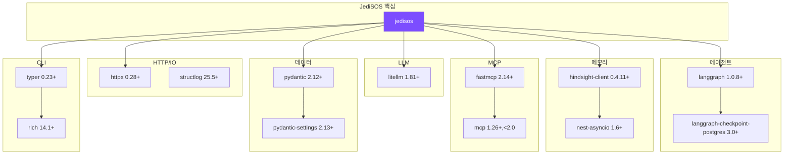

# JediSOS 핵심 라이브러리 레퍼런스

> 2026-02-17 기준 최신 버전과 JediSOS에서의 사용 패턴을 정리합니다.
> 각 라이브러리의 핵심 API만 다루며, 전체 문서는 공식 링크를 참조하세요.

---

## 1. LangGraph (에이전트 프레임워크)

| 항목 | 값 |
|------|-----|
| **패키지명** | `langgraph` |
| **버전** | `>=1.0.8` |
| **PyPI** | https://pypi.org/project/langgraph/ |
| **문서** | https://langchain.com/langgraph |
| **GitHub** | https://github.com/langchain-ai/langgraph |
| **용도** | StateGraph 기반 ReAct 에이전트 루프 |

### 핵심 API

```python
from langgraph.graph import StateGraph, START, END
from langgraph.graph.message import add_messages
from langgraph.prebuilt import ToolNode
from langgraph.checkpoint.memory import MemorySaver
from langgraph.checkpoint.postgres import PostgresSaver
```

### JediSOS 사용 패턴

```python
# [JS-E001] ReAct 에이전트 그래프 구성
from typing import Annotated, TypedDict
from langgraph.graph import StateGraph, START, END
from langgraph.graph.message import add_messages

class AgentState(TypedDict):
    messages: Annotated[list, add_messages]
    memory_context: str
    bank_id: str
    tool_call_count: int

builder = StateGraph(AgentState)
builder.add_node("recall_memory", recall_memory_fn)
builder.add_node("llm_reason", llm_reason_fn)
builder.add_node("execute_tools", execute_tools_fn)
builder.add_node("retain_memory", retain_memory_fn)

builder.add_edge(START, "recall_memory")
builder.add_edge("recall_memory", "llm_reason")
builder.add_conditional_edges("llm_reason", should_continue, {...})
builder.add_edge("execute_tools", "llm_reason")
builder.add_edge("retain_memory", END)

graph = builder.compile()
result = await graph.ainvoke(initial_state)
```

### 관련 패키지

| 패키지 | 버전 | 용도 |
|--------|------|------|
| `langgraph-checkpoint-postgres` | `>=3.0.4` | PostgreSQL 기반 체크포인트 |
| `langgraph-checkpoint-sqlite` | `>=2.0` | SQLite 체크포인트 (개발용) |

### 주의사항

- `MemorySaver`는 인메모리 전용 (개발/테스트용)
- 프로덕션은 반드시 `PostgresSaver` 사용
- `.compile()` 호출 후에만 `.invoke()` / `.ainvoke()` 사용 가능
- `add_messages` 리듀서는 같은 ID의 메시지를 자동 업데이트

---

## 2. LiteLLM (LLM 라우터)

| 항목 | 값 |
|------|-----|
| **패키지명** | `litellm` |
| **버전** | `>=1.81.12` (2026-02-15 릴리즈) |
| **PyPI** | https://pypi.org/project/litellm/ |
| **문서** | https://docs.litellm.ai |
| **GitHub** | https://github.com/BerriAI/litellm |
| **용도** | 100+ LLM 프로바이더 통합 라우터 |

### 핵심 API

```python
import litellm
from litellm import completion, acompletion

# 동기 호출
response = completion(model="claude-sonnet-5-20260203", messages=[...])

# 비동기 호출
response = await acompletion(model="gpt-5.2", messages=[...])

# Gemini 호출
response = await acompletion(model="gemini/gemini-3-flash", messages=[...])

# 도구 호출
response = await acompletion(
    model="claude-sonnet-5-20260203",
    messages=[...],
    tools=[{"type": "function", "function": {...}}],
)
```

### JediSOS 사용 패턴 (설정 기반 폴백)

```python
# [JS-C001] LiteLLM 라우터 - 설정에서 모델 목록 로드
async def complete_with_fallback(messages, tools=None, config=None):
    """설정 파일(llm_config.yaml)에서 모델 폴백 체인을 로드합니다."""
    models = config.models if config else [
        "claude-sonnet-5-20260203",
        "gpt-5.2",
        "gemini/gemini-3-flash",
        "ollama/llama4",
    ]
    for model in models:
        try:
            return await litellm.acompletion(
                model=model,
                messages=messages,
                tools=tools,
                temperature=config.temperature if config else 0.7,
                max_tokens=config.max_tokens if config else 8192,
                timeout=config.timeout if config else 60,
            )
        except Exception:
            continue
    raise LLMError("모든 모델 실패")
```

### 지원 프로바이더 (주요, 2026-02-17 기준)

| 프로바이더 | 모델 접두사 | 최신 모델 예시 |
|-----------|-----------|--------------|
| Anthropic | 없음 | `claude-sonnet-5-20260203`, `claude-opus-4-6`, `claude-sonnet-4-5-20250929`, `claude-haiku-4-5-20251001` |
| OpenAI | 없음 | `gpt-5.3-codex-spark`, `gpt-5.2`, `gpt-5.2-codex`, `o3`, `o4-mini` |
| Google | `gemini/` | `gemini/gemini-3-flash`, `gemini/gemini-3-pro`, `gemini/gemini-3-flash-preview` |
| Groq | `groq/` | `groq/meta-llama/llama-4-scout-17b-16e-instruct` |
| Ollama | `ollama/` | `ollama/llama4`, `ollama/llama4:scout` |
| Meta Llama API | `llama/` | `llama/llama-4-scout`, `llama/llama-4-maverick` |

> **참고:** Gemini 3 Flash/Pro는 2026-02 기준 GA(General Availability) 상태이며, `-preview` 접미사 없이도 사용 가능합니다.
> Claude Sonnet 5 (코드명: Fennec)는 2026-02-03 출시, 1M 토큰 컨텍스트 윈도우 지원.

### 환경변수

```bash
OPENAI_API_KEY=sk-...
ANTHROPIC_API_KEY=sk-ant-...
GOOGLE_API_KEY=...
GROQ_API_KEY=gsk_...
```

---

## 3. Hindsight (메모리 엔진)

| 항목 | 값 |
|------|-----|
| **패키지명** | `hindsight-client` |
| **버전** | `>=0.4.11` |
| **PyPI** | https://pypi.org/project/hindsight-client/ |
| **문서** | https://hindsight.vectorize.io |
| **GitHub** | https://github.com/vectorize-io/hindsight |
| **Docker** | `ghcr.io/vectorize-io/hindsight:latest` |
| **용도** | 4-네트워크 AI 에이전트 메모리 |
| **라이선스** | MIT |
| **벤치마크** | LongMemEval 91.4% (Virginia Tech 검증) |

### 핵심 API

```python
from hindsight_client import Hindsight
import nest_asyncio
nest_asyncio.apply()

client = Hindsight(base_url="http://localhost:8888")

# Retain - 메모리 저장
client.retain(bank_id="my-bank", content="Alice는 Google 엔지니어")

# Recall - 메모리 검색 (reflect 엔드포인트 사용)
results = client.recall(bank_id="my-bank", query="Alice는 뭐하는 사람?")

# Reflect - 메모리 통합
client.reflect(bank_id="my-bank")
```

### REST API (직접 호출)

```python
# JediSOS는 httpx로 직접 REST API를 호출합니다 (더 세밀한 제어)
import httpx

# Retain
resp = await httpx.AsyncClient().post(
    "http://localhost:8888/v1/default/banks/my-bank/memories",
    json={"content": "대화 내용..."}
)

# Recall (Reflect 엔드포인트)
resp = await httpx.AsyncClient().post(
    "http://localhost:8888/v1/default/banks/my-bank/reflect",
    json={"query": "Alice에 대해 아는 것?"}
)

# 엔티티 목록
resp = await httpx.AsyncClient().get(
    "http://localhost:8888/v1/default/banks/my-bank/entities"
)
```

### 4-네트워크 모델

| 네트워크 | 역할 | 예시 |
|----------|------|------|
| **World** | 객관적 사실 | "서울의 인구는 약 950만명" |
| **Bank** | 에이전트 경험 | "나는 Alice와 프로젝트를 논의했다" |
| **Opinion** | 주관적 판단 + 신뢰도 | "Alice는 백엔드에 강하다 (0.85)" |
| **Observation** | 엔티티 요약 | "Alice: Google 시니어 엔지니어, 백엔드 전문" |

### 환경변수

```bash
HINDSIGHT_API_URL=http://localhost:8888
HINDSIGHT_API_LLM_PROVIDER=openai  # openai|anthropic|gemini|groq|ollama|lmstudio
HINDSIGHT_API_LLM_API_KEY=sk-...
```

---

## 4. FastMCP (MCP 프레임워크)

| 항목 | 값 |
|------|-----|
| **패키지명** | `fastmcp` |
| **버전** | `>=2.14.5,<3.0` (v3.0은 브레이킹 체인지) |
| **PyPI** | https://pypi.org/project/fastmcp/ |
| **문서** | https://gofastmcp.com |
| **GitHub** | https://github.com/jlowin/fastmcp |
| **용도** | MCP 도구 서버/클라이언트 |

### 핵심 API - 서버

```python
from fastmcp import FastMCP

mcp = FastMCP("jedisos-tools")

@mcp.tool()
async def memory_recall(query: str, bank_id: str = "default") -> str:
    """메모리에서 관련 정보를 검색합니다."""
    result = await hindsight.recall(query, bank_id=bank_id)
    return str(result)

@mcp.tool()
async def memory_retain(content: str, bank_id: str = "default") -> str:
    """정보를 메모리에 저장합니다."""
    result = await hindsight.retain(content, bank_id=bank_id)
    return f"저장 완료: {result}"

# 서버 실행
mcp.run()
```

### 핵심 API - 클라이언트

```python
from fastmcp import Client

async with Client("path/to/mcp_server.py") as client:
    tools = await client.list_tools()
    result = await client.call_tool("memory_recall", {"query": "Alice"})
```

### 주의사항

- **v3.0 RC1이 2026-01-19 릴리즈됨** — 브레이킹 체인지는 최소화되었으나 안정성을 위해 v2를 유지합니다
- `fastmcp>=2.14.5,<3.0`으로 버전을 고정하세요
- `mcp>=1.26.0,<2.0` (공식 MCP SDK)도 함께 설치 필요 — **MCP SDK v2가 Q1 2026 출시 예정이며 transport 레이어 변경이 있으므로 <2.0 핀 필수**
- **v3.0 마이그레이션 계획:** v3.0 GA 이후 마이그레이션 예정 — 주요 변경: `ui=` → `app=` (AppConfig), 데코레이터가 함수를 보존, sync 도구 자동 threadpool 디스패치, 컴포넌트 버전닝 지원

---

## 5. Pydantic (데이터 검증)

| 항목 | 값 |
|------|-----|
| **패키지명** | `pydantic` |
| **버전** | `>=2.12.5` |
| **용도** | Envelope, Config 등 데이터 모델 |

### JediSOS 사용 패턴

```python
from pydantic import BaseModel, Field
from pydantic_settings import BaseSettings, SettingsConfigDict

# 데이터 모델
class Envelope(BaseModel):
    id: str = Field(default_factory=lambda: str(uuid7()))
    content: str
    metadata: dict[str, Any] = Field(default_factory=dict)

# 환경변수 설정
class Config(BaseSettings):
    model_config = SettingsConfigDict(env_file=".env", env_prefix="JediSOS_")
    debug: bool = False
```

---

## 6. 기타 핵심 라이브러리

### structlog (구조화 로깅)

| 버전 | `>=25.5.0` |
|------|-----------|

```python
import structlog
logger = structlog.get_logger()
logger.info("event_name", key1="value1", key2=42)
```

### httpx (비동기 HTTP)

| 버전 | `>=0.28.1` |
|------|-----------|

```python
import httpx
async with httpx.AsyncClient(base_url="http://localhost:8888", timeout=30.0) as client:
    resp = await client.post("/api/endpoint", json={"key": "value"})
```

### typer (CLI)

| 버전 | `>=0.23.1` |
|------|-----------|

```python
import typer
app = typer.Typer()

@app.command()
def chat(message: str = typer.Argument(..., help="메시지")):
    """에이전트와 대화합니다."""
    ...

if __name__ == "__main__":
    app()
```

### pytest + pytest-asyncio (테스트)

| 패키지 | 버전 |
|--------|------|
| pytest | `>=9.0.2` |
| pytest-asyncio | `>=1.3.0` |

```python
import pytest

@pytest.mark.asyncio
async def test_async_function():
    result = await some_async_function()
    assert result is not None
```

### ruff (린트 + 포맷터)

| 버전 | `>=0.15.1` |
|------|-----------|

```bash
ruff check src/ tests/        # 린트
ruff format src/ tests/        # 포맷팅
ruff check --fix src/ tests/   # 자동 수정
```

### uuid6 (UUIDv7)

| 버전 | `>=2025.0.1` |
|------|-------------|

```python
from uuid6 import uuid7
unique_id = str(uuid7())  # 시간순 정렬 가능한 UUID
```

### cryptography (암호화)

| 버전 | `>=46.0.5` |
|------|-----------|

```python
from cryptography.fernet import Fernet
key = Fernet.generate_key()
f = Fernet(key)
encrypted = f.encrypt(b"sensitive data")
```

---

## 7. 전체 의존성 요약


