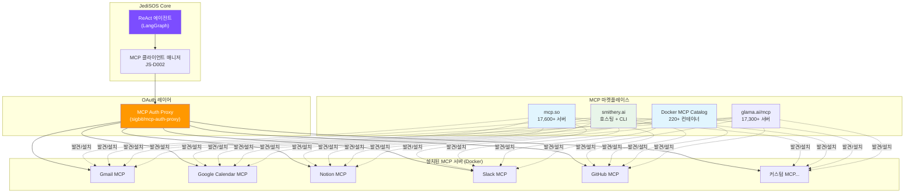
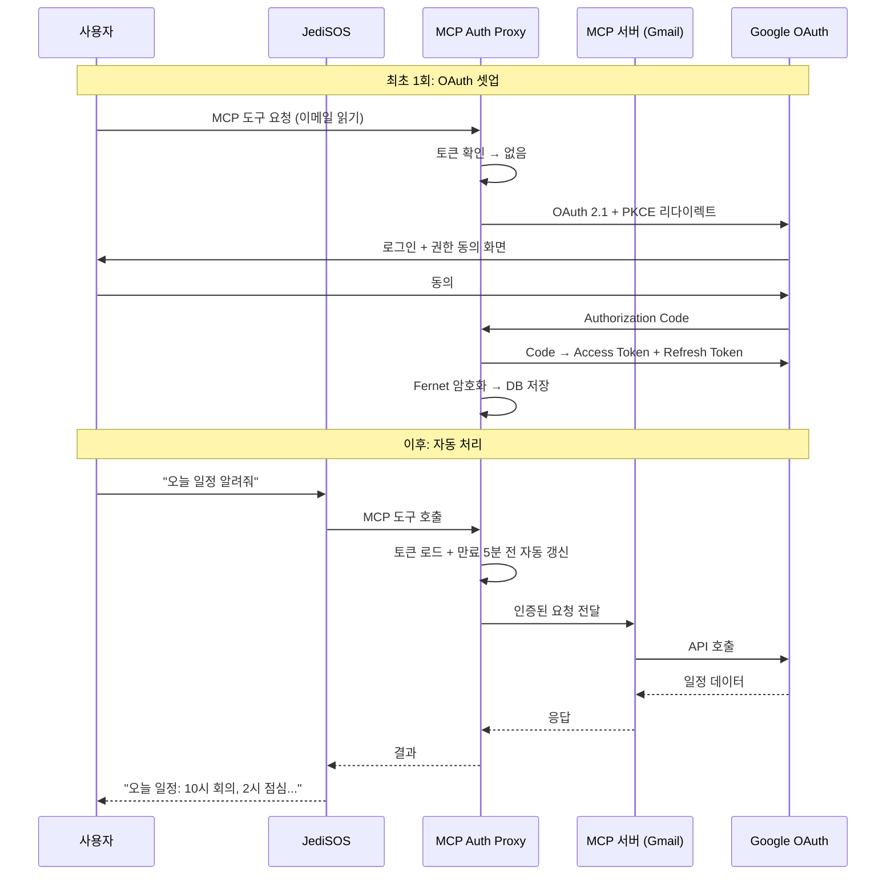
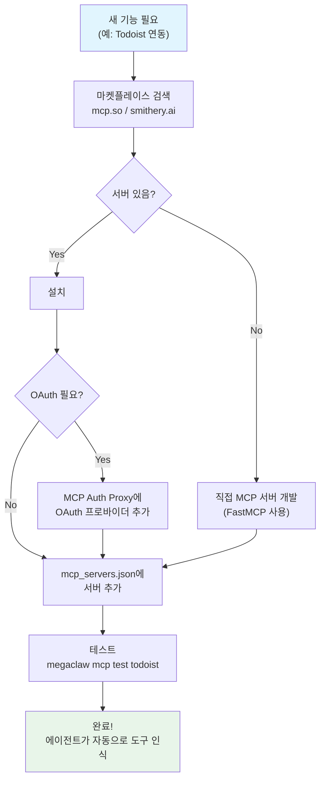

# JediSOS MCP 확장 시스템

> JediSOS의 기능 확장 = MCP 서버 추가.
> 캘린더, 이메일, 노트, 슬랙 등 모든 외부 서비스는 MCP 서버로 연결됩니다.
> 이 문서는 MCP 마켓플레이스에서 기능을 찾고, 설치하고, OAuth를 해결하는 방법을 정의합니다.

---

## 1. 핵심 개념: MCP = JediSOS의 앱스토어



**사용자가 새 기능을 원할 때:**
1. MCP 마켓플레이스(mcp.so, smithery.ai, Docker Catalog)에서 서버를 검색
2. Docker Compose에 컨테이너 추가 (또는 `smithery install`)
3. OAuth가 필요하면 MCP Auth Proxy가 처리
4. JediSOS가 자동으로 새 도구를 인식하고 사용

---

## 2. MCP 마켓플레이스 가이드

### 2-1. 어디서 찾을까?

| 마켓플레이스 | URL | 서버 수 | 특징 |
|-------------|-----|---------|------|
| **mcp.so** | https://mcp.so | 17,600+ | 최대 커뮤니티 레지스트리. 검색 + 카테고리 |
| **smithery.ai** | https://smithery.ai | 수천 | CLI 설치 + 호스팅 옵션 (자체 서버 불필요) |
| **Docker MCP Catalog** | Docker Desktop 내장 | 220+ | 원클릭 설치 + OAuth 내장 |
| **glama.ai/mcp** | https://glama.ai/mcp | 17,300+ | 보안 스캔 + 호환성 랭킹 |
| **PulseMCP** | https://pulsemcp.com | 8,200+ | 생태계 뉴스 + 디렉토리 |
| **공식 레지스트리** | https://registry.modelcontextprotocol.io | 성장 중 | Anthropic/GitHub/MS 공식 |

### 2-2. 설치 방법 3가지

#### 방법 A: Docker Compose에 직접 추가 (권장)

```yaml
# docker-compose.mcp.yml - MCP 서버 확장
services:
  # 기존: Hindsight + PostgreSQL
  # ...

  # Gmail MCP 서버
  mcp-gmail:
    image: ghcr.io/gongrzhe/gmail-mcp-server:latest
    container_name: jedisos-mcp-gmail
    volumes:
      - ./secrets/gmail-oauth.json:/app/credentials.json:ro
      - gmail-tokens:/app/.gmail-mcp
    environment:
      GOOGLE_OAUTH_CREDENTIALS: /app/credentials.json

  # Google Calendar MCP 서버
  mcp-calendar:
    image: ghcr.io/nspady/google-calendar-mcp:latest
    container_name: jedisos-mcp-calendar
    volumes:
      - ./secrets/gcal-oauth.json:/app/credentials.json:ro
      - gcal-tokens:/app/.config

  # Notion MCP 서버 (공식 호스팅판은 설치 불필요)
  mcp-notion:
    image: mcp/notion:latest
    container_name: jedisos-mcp-notion
    environment:
      NOTION_TOKEN: ${NOTION_TOKEN}

  # Slack MCP 서버
  mcp-slack:
    image: ghcr.io/korotovsky/slack-mcp-server:latest
    container_name: jedisos-mcp-slack
    environment:
      SLACK_BOT_TOKEN: ${SLACK_BOT_TOKEN}

  # GitHub MCP 서버 (공식)
  mcp-github:
    image: ghcr.io/github/github-mcp-server:latest
    container_name: jedisos-mcp-github
    environment:
      GITHUB_PERSONAL_ACCESS_TOKEN: ${GITHUB_TOKEN}

volumes:
  gmail-tokens:
  gcal-tokens:
```

#### 방법 B: Smithery CLI (가장 빠름)

```bash
# Smithery CLI로 원커맨드 설치
npx @smithery/cli install mcp-gmail --client jedisos
npx @smithery/cli install mcp-google-calendar --client jedisos
npx @smithery/cli install mcp-notion --client jedisos

# 또는 Smithery 호스팅판 (자체 서버 불필요)
# smithery.ai에서 서버를 호스팅하고, JediSOS는 엔드포인트만 연결
```

#### 방법 C: Docker Desktop MCP Catalog (GUI)

```
Docker Desktop → MCP Catalog → 검색 → Enable → OAuth 자동 처리
```

---

## 3. OAuth 인증 아키텍처

### 3-1. 문제

Google Calendar, Gmail, Slack 등은 OAuth 2.0 인증이 필요합니다.
각 서비스마다 OAuth 플로우를 직접 구현하면 1인 개발자에겐 지옥입니다.

### 3-2. 해결: MCP Auth Proxy



### 3-3. MCP Auth Proxy 선택지

| 프로젝트 | GitHub | 특징 |
|----------|--------|------|
| **sigbit/mcp-auth-proxy** | [링크](https://github.com/sigbit/mcp-auth-proxy) | 가장 성숙. Docker 지원. Google/GitHub/OIDC. 드롭인 |
| **obot-platform/mcp-oauth-proxy** | [링크](https://github.com/obot-platform/mcp-oauth-proxy) | PKCE, SQLite/PostgreSQL 토큰 저장 |
| **Docker MCP Gateway** | [링크](https://github.com/docker/mcp-gateway) | Docker 공식. 시크릿 관리 + 컨테이너 격리 |

### 3-4. 권장 설정: sigbit/mcp-auth-proxy

```yaml
# docker-compose.dev.yml에 추가
services:
  mcp-auth-proxy:
    image: ghcr.io/sigbit/mcp-auth-proxy:latest
    container_name: jedisos-auth-proxy
    ports:
      - "3000:3000"
    environment:
      # Google OAuth
      GOOGLE_CLIENT_ID: ${GOOGLE_CLIENT_ID}
      GOOGLE_CLIENT_SECRET: ${GOOGLE_CLIENT_SECRET}
      # GitHub OAuth
      GITHUB_CLIENT_ID: ${GITHUB_CLIENT_ID}
      GITHUB_CLIENT_SECRET: ${GITHUB_CLIENT_SECRET}
      # 토큰 암호화 키 (자동 생성 가능)
      ENCRYPTION_KEY: ${MCP_ENCRYPTION_KEY}
      # 토큰 저장소
      DATABASE_URL: postgresql://hindsight:${HINDSIGHT_DB_PASSWORD:-hindsight_dev}@postgres:5432/jedisos_auth
    depends_on:
      postgres:
        condition: service_healthy
```

### 3-5. 토큰 관리

| 항목 | 처리 방식 |
|------|----------|
| **암호화** | Fernet (AES-128-CBC + HMAC-SHA256) |
| **저장** | PostgreSQL (Hindsight와 동일 DB 사용 가능) |
| **갱신** | 만료 5분 전 자동 갱신 |
| **최초 인증** | 브라우저 리다이렉트 1회 |
| **재인증** | Refresh Token 만료 시에만 (보통 수개월~1년) |

---

## 4. MCP 서버 설정 파일

JediSOS는 `mcp_servers.json`으로 연결된 MCP 서버를 관리합니다.

### 4-1. 설정 파일 형식

```json
{
  "version": "1.0",
  "servers": {
    "gmail": {
      "type": "docker",
      "image": "ghcr.io/gongrzhe/gmail-mcp-server:latest",
      "auth": "oauth2",
      "oauth_provider": "google",
      "scopes": ["gmail.readonly", "gmail.send"],
      "enabled": true
    },
    "google-calendar": {
      "type": "docker",
      "image": "ghcr.io/nspady/google-calendar-mcp:latest",
      "auth": "oauth2",
      "oauth_provider": "google",
      "scopes": ["calendar.readonly", "calendar.events"],
      "enabled": true
    },
    "notion": {
      "type": "remote",
      "url": "https://mcp.notion.com/mcp",
      "auth": "oauth2",
      "oauth_provider": "notion",
      "enabled": true
    },
    "slack": {
      "type": "docker",
      "image": "ghcr.io/korotovsky/slack-mcp-server:latest",
      "auth": "token",
      "env": {"SLACK_BOT_TOKEN": "${SLACK_BOT_TOKEN}"},
      "enabled": true
    },
    "github": {
      "type": "docker",
      "image": "ghcr.io/github/github-mcp-server:latest",
      "auth": "token",
      "env": {"GITHUB_PERSONAL_ACCESS_TOKEN": "${GITHUB_TOKEN}"},
      "enabled": true
    },
    "filesystem": {
      "type": "local",
      "command": "npx @modelcontextprotocol/server-filesystem ~/Documents",
      "auth": "none",
      "enabled": true
    }
  }
}
```

### 4-2. 서버 타입

| 타입 | 설명 | 예시 |
|------|------|------|
| `docker` | Docker 컨테이너로 실행 | Gmail, Calendar, Slack |
| `remote` | 원격 호스팅 서버 연결 | Notion 공식, Smithery 호스팅 |
| `local` | 로컬 프로세스 (stdio) | 파일시스템, SQLite |
| `smithery` | Smithery 호스팅 | Smithery에서 관리하는 서버 |

---

## 5. 새 MCP 서버 추가하는 개발자 워크플로우



### CLI 명령어 (Phase 8에서 구현)

```bash
# MCP 서버 검색 (mcp.so API 연동)
jedisos mcp search "todoist"

# MCP 서버 설치
jedisos mcp install todoist-mcp --type docker

# 설치된 MCP 서버 목록
jedisos mcp list

# MCP 서버 테스트
jedisos mcp test todoist

# MCP 서버 제거
jedisos mcp remove todoist
```

---

## 6. 개인 AI 비서 기본 MCP 세트

JediSOS를 "개인 AI 비서"로 쓸 때 권장하는 기본 MCP 서버 세트:

| 기능 | MCP 서버 | 인증 | 비용 |
|------|---------|------|------|
| **이메일** | Gmail MCP Server | OAuth 2.0 (Google) | 무료 |
| **캘린더** | Google Calendar MCP | OAuth 2.0 (Google) | 무료 |
| **노트** | Notion MCP (공식) | OAuth 2.0 (Notion) | 무료 |
| **메신저** | Slack MCP Server | Bot Token | 무료 |
| **코드** | GitHub MCP (공식) | OAuth / PAT | 무료 |
| **파일** | Filesystem MCP | 없음 | 무료 |
| **웹 검색** | Brave Search MCP | API Key | 무료 (2,000 req/월) |
| **할 일** | Todoist MCP | API Key | 무료 |
| **메모** | Obsidian MCP | 없음 (로컬) | 무료 |

**총 비용: $0/월** (모든 MCP 서버 + OAuth 프록시가 오픈소스)

---

## 7. 보안 고려사항

### 7-1. 원칙

1. **최소 권한**: OAuth scope를 최소한으로 설정 (예: `gmail.readonly` vs `gmail.modify`)
2. **토큰 격리**: 서비스별 별도 토큰, 한 서비스 침해가 다른 서비스에 영향 안 줌
3. **컨테이너 격리**: 각 MCP 서버는 별도 Docker 컨테이너, 네트워크 격리 가능
4. **시크릿 관리**: `.env`에 평문 저장 대신 Docker Secrets 또는 Keyring 사용

### 7-2. Docker 네트워크 격리

```yaml
# MCP 서버별 네트워크 격리
networks:
  mcp-gmail:
    internal: true  # 외부 접근 차단, Auth Proxy만 접근
  mcp-calendar:
    internal: true
  jedisos-core:
    # JediSOS + Hindsight + Auth Proxy
```

### 7-3. PDP 연동

JediSOS의 PDP(Policy Decision Point, JS-G001)가 MCP 도구 호출도 제어:

```python
# 사용자별 허용 도구 제한
{
  "user_001": {
    "allowed_tools": ["gmail.read", "calendar.read"],  # 읽기만
    "blocked_tools": ["gmail.send", "github.delete"]   # 삭제/발송 차단
  }
}
```

---

## 8. 커스텀 MCP 서버 개발 (FastMCP)

마켓플레이스에 없는 기능은 FastMCP로 직접 만들 수 있습니다.

```python
"""
[JS-D003] jedisos.mcp.custom_example
커스텀 MCP 서버 예시 - 리마인더

version: 1.0.0
"""
from fastmcp import FastMCP

mcp = FastMCP("jedisos-reminders")

@mcp.tool()
async def set_reminder(message: str, time: str) -> str:
    """리마인더를 설정합니다.

    Args:
        message: 리마인더 메시지
        time: 시간 (예: "2026-02-17 09:00")
    """
    # 실제 구현: DB에 저장 + 스케줄러에 등록
    return f"리마인더 설정됨: {time}에 '{message}'"

@mcp.tool()
async def list_reminders() -> str:
    """설정된 리마인더 목록을 반환합니다."""
    # 실제 구현: DB에서 조회
    return "1. 내일 09:00 - 회의 준비\n2. 금요일 18:00 - 운동"

if __name__ == "__main__":
    mcp.run()
```

### Dockerfile로 배포

```dockerfile
FROM python:3.12-slim
WORKDIR /app
COPY requirements.txt .
RUN pip install --no-cache-dir -r requirements.txt
COPY . .
CMD ["python", "reminder_server.py"]
```

---

## 9. 로드맵: MCP 확장 구현 순서

| Phase | 작업 | 의존성 |
|-------|------|--------|
| Phase 5 (MCP) | MCP 클라이언트 매니저 + `mcp_servers.json` 로더 | Phase 4 완료 |
| Phase 5.1 | Docker MCP 서버 자동 시작/중지 | Docker SDK |
| Phase 5.2 | MCP Auth Proxy 연동 | sigbit/mcp-auth-proxy |
| Phase 5.3 | 기본 MCP 세트 (파일시스템, 웹검색) | Auth 불필요 |
| Phase 7 이후 | OAuth 서비스 (Gmail, Calendar, Notion) | Auth Proxy 완성 |
| Phase 8 | `jedisos mcp search/install/remove` CLI | mcp.so API |
