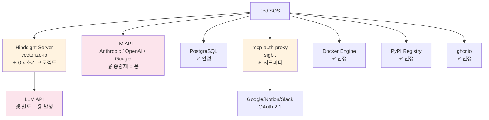

# JediSOS 위험 요소 및 사람 개입 필요 사항

> 2026-02-17 기준. 개발 전/중에 반드시 확인하고 결정해야 할 항목을 정리합니다.
> AI가 자동으로 결정할 수 없는 사항은 **🧑 사람 개입** 으로 표시합니다.

---

## 0. 확정된 결정 사항

아래 항목은 이미 결정 완료되어 더 이상 논의가 필요 없습니다.

| 결정 | 내용 | 근거 | 결정일 |
|------|------|------|--------|
| **DB 엔진** | PostgreSQL 18 + pgvector 단일 구성 | Hindsight가 asyncpg + pgvector에 강결합 (raw SQL `<=>` 연산자, Alembic DDL). SQLite/zvec 교체는 Hindsight 전체 재작성 필요. | 2026-02-17 |
| **그래프 DB** | 별도 그래프 DB 불필요 — Hindsight 내장 그래프 사용 | Hindsight가 `memory_links` 테이블로 7종 typed edge 그래프를 구현하고, BFS spreading activation + link expansion 알고리즘을 내장. Neo4j 추가 시 데이터 동기화 복잡도만 증가. | 2026-02-17 |
| **DB 공존** | Hindsight + LangGraph + JediSOS 동일 PostgreSQL, 스키마 분리 | 3개 스키마(hindsight/langgraph/jedisos) + 독립 커넥션 풀로 격리. `max_connections=200` 설정. | 2026-02-17 |
| **2-Tier 아키텍처** | Tier 1 (JediSOS Skill) 기본 + Tier 2 (MCP Server) OAuth만 | Docker 샌드박스 대신 정적분석, 대부분 도구는 `@tool` 함수로 충분 | 2026-02-16 |
| **라이선스** | MIT | 모든 핵심 의존성 MIT 호환 확인 완료 | 2026-02-16 |

---

## 1. 라이선스 호환성

JediSOS는 **MIT 라이선스**입니다. 모든 핵심 의존성의 라이선스를 검증했습니다.

| 의존성 | 라이선스 | JediSOS MIT와 호환 | 비고 |
|--------|---------|-------------------|------|
| LangGraph 1.0.8 | MIT | ✅ 호환 | |
| langgraph-checkpoint-postgres | MIT | ✅ 호환 | |
| LiteLLM 1.81+ | MIT | ✅ 호환 | Enterprise 에디션은 상용 라이선스 (JediSOS는 사용 안 함) |
| Hindsight 0.4.11 | MIT | ✅ 호환 | |
| FastMCP 2.14+ | MIT | ⚠️ 조건부 | Cyclopts v4의 `docutils` 의존성이 복잡한 라이선스 (PSF + ZPL + BSD). Cyclopts v5 alpha로 해결 가능 |
| MCP SDK 1.26 | MIT | ✅ 호환 | |
| Pydantic 2.12 | MIT | ✅ 호환 | |
| FastAPI | MIT | ✅ 호환 | |
| React | MIT | ✅ 호환 | |

### 🧑 사람 개입 — 라이선스

- **R-LIC-1**: FastMCP의 Cyclopts → docutils 트랜지티브 의존성 라이선스 검토 필요. 배포 전 `pip-licenses` 또는 `liccheck`로 전체 의존성 트리 확인 권장.
  ```bash
  pip install pip-licenses
  pip-licenses --format=table --with-system --with-urls
  ```
- **R-LIC-2**: `hindsight-client` PyPI 패키지의 정확한 라이선스 파일 확인 (GitHub은 MIT이지만 PyPI 메타데이터 일치 확인).

---

## 2. 의존성 버전 위험

### 2-1. FastMCP v3.0 마이그레이션 (중위험)

| 항목 | 상태 |
|------|------|
| 현재 핀 | `>=2.14.5,<3.0` |
| v3.0 상태 | RC1 (2026-01-19 릴리즈) |
| 브레이킹 체인지 | 최소화 — `ui=` → `app=` (AppConfig), 16개 생성자 kwargs 제거, `fastmcp dev` → 서브커맨드 그룹 |
| 영향 범위 | `src/jedisos/mcp/server.py` [JS-D001], Forge 템플릿 |

**위험:** v3.0 GA 이후 v2 지원 중단 가능성. 보안 패치가 v3에만 적용될 수 있음.

### 🧑 사람 개입 — FastMCP v3

- **R-DEP-1**: v3.0 GA 출시 시 마이그레이션 시점 결정. Phase 5 (MCP 통합) 완료 후, v3 GA가 나오면 별도 브랜치에서 마이그레이션 테스트 진행.
- **R-DEP-2**: v3의 컴포넌트 버전닝 (`@tool(version="1.0")`)을 Forge 시스템에 적용할지 결정.

### 2-2. MCP SDK v2 (고위험)

| 항목 | 상태 |
|------|------|
| 현재 핀 | `>=1.26.0,<2.0` |
| v2 예상 | Q1 2026 (transport 레이어 변경) |
| 영향 | FastMCP, MCP 클라이언트, 마켓플레이스 통신 전체 |

**위험:** MCP SDK v2가 FastMCP 2.x와 호환되지 않을 수 있음. Transport 레이어 변경은 서버-클라이언트 통신에 직접 영향.

### 🧑 사람 개입 — MCP SDK v2

- **R-DEP-3**: MCP SDK v2 출시 시 FastMCP v3 + MCP SDK v2 조합이 안정적인지 확인 후 동시 마이그레이션 여부 결정. 이전까지는 `<2.0` 핀 유지.

### 2-3. Hindsight 프로젝트 성숙도 (중위험)

| 항목 | 상태 |
|------|------|
| 릴리즈 | 2025-12-16 (약 2개월 전) |
| 버전 | 0.4.x (아직 1.0 미만) |
| GitHub Stars | ~800 |
| 기여자 | 9명 |

**위험:**
- 아직 1.0 미만 — API 변경 가능성.
- Vectorize가 Hindsight Cloud(유료)로 전환하면서 오픈소스 버전 지원이 줄어들 수 있음.
- 커뮤니티 크기가 작아 버그 수정이 느릴 수 있음.

### 🧑 사람 개입 — Hindsight

- **R-DEP-4**: Hindsight API 변경에 대비하여 `src/jedisos/memory/hindsight.py` [JS-B001]을 **추상 인터페이스 뒤에 래핑** (Adapter 패턴). 나중에 다른 메모리 엔진으로 교체 가능하도록.
- **R-DEP-5**: Hindsight의 LLM 사용 비용 — Hindsight 서버 자체가 내부적으로 LLM을 호출함 (reflect 등). 이 비용이 JediSOS 사용자의 API 키에서 발생. 문서화 및 사용자 고지 필요.

---

## 3. 보안 위험

### 3-1. Tier 1 Skill 정적분석 한계 (고위험)

Tier 1 (JediSOS Skill)은 Docker 격리 없이 호스트 프로세스에서 직접 실행됩니다. 정적분석(Bandit + AST + 금지 패턴)이 유일한 방어선입니다.

**정적분석이 잡지 못하는 것들:**

| 공격 유형 | 예시 | 정적분석 탐지 |
|-----------|------|-------------|
| 난독화된 코드 | `eval(base64.b64decode("..."))` | ⚠️ `eval` 감지 가능하나 변형 우회 가능 |
| 동적 import | `__import__('os').system('rm -rf /')` | ⚠️ `__import__` 패턴 감지 가능하나 변형 우회 가능 |
| 의존성 체인 공격 | Skill이 `pip install` 하는 패키지가 악성 | ❌ 탐지 불가 |
| 시간 지연 공격 | 실행 10분 후 악성 행동 | ❌ 탐지 불가 |
| 데이터 유출 | API 키를 외부 서버로 전송 | ⚠️ 네트워크 패턴으로 부분 탐지 |

### 🧑 사람 개입 — 보안

- **R-SEC-1**: **에이전트 자동 생성 Skill에 대한 실행 승인 정책 결정**. 옵션:
  - (A) 자동 생성 + 자동 실행 (위험하지만 편리)
  - (B) 자동 생성 + 사용자 승인 후 실행 (기본 권장)
  - (C) 자동 생성 + 사용자 승인 + 코드 리뷰 (가장 안전)
- **R-SEC-2**: **마켓플레이스 패키지 서명 및 검증 방식 결정**. GPG 서명? cosign? PyPI 신뢰 모델 참조?
- **R-SEC-3**: **Skill 실행 제한 환경 검토**. 추후 `seccomp`, `AppArmor`, 또는 `nsjail` 같은 경량 샌드박스를 Tier 1에도 선택적 적용할지.
- **R-SEC-4**: **Skill의 네트워크 접근 정책**. 기본적으로 외부 HTTP 요청 허용할지, 화이트리스트 도메인만 허용할지.

### 3-2. OAuth 토큰 관리 (중위험)

Tier 2 MCP 서버는 `sigbit/mcp-auth-proxy`로 OAuth 토큰을 관리합니다.

**위험:**
- `mcp-auth-proxy`는 서드파티 프로젝트 — 업데이트 주기, 보안 패치 보장 없음.
- 토큰 저장소 (keyring) 접근 권한 관리.
- 리프레시 토큰 만료 시 자동 재인증 흐름 필요.

### 🧑 사람 개입 — OAuth

- **R-SEC-5**: `mcp-auth-proxy` 대안 조사 또는 자체 구현 여부 결정. Phase 5에서 결정.
- **R-SEC-6**: 사용자 API 키 저장 방식 최종 결정 — `keyring`, 환경변수, `.env` 파일, 또는 암호화된 설정 파일.

---

## 4. 비용 위험

### 4-1. LLM API 비용

JediSOS는 최소 **3군데**에서 LLM API를 호출합니다:

| 호출 지점 | 빈도 | 비용 영향 |
|-----------|------|----------|
| 에이전트 ReAct 루프 | 매 대화마다 | 높음 — 1회 대화에 3-10회 LLM 호출 |
| Hindsight reflect | 메모리 통합 시 | 중간 — 백그라운드 실행 |
| Forge 코드 생성 | 새 도구 생성 시 | 중간 — 1회 생성에 2-5회 LLM 호출 |

**대략적 비용 추정 (Claude Sonnet 5 기준):**
- 일반 대화 1회: ~$0.02-0.10
- Forge 도구 생성 1회: ~$0.05-0.20
- 월간 활발 사용자 (하루 20회 대화): ~$15-60/월

### 🧑 사람 개입 — 비용

- **R-COST-1**: **기본 비용 제한(budget cap) 정책 결정**. LiteLLM `max_budget` 설정으로 일/월 상한 설정 가능. 기본값을 얼마로 할지.
- **R-COST-2**: **로컬 모델(ollama/llama4) 폴백 전략**. 비용 한도 도달 시 자동으로 로컬 모델로 전환할지.
- **R-COST-3**: **Hindsight 내부 LLM 비용 고지**. Hindsight 서버가 별도 API 키로 LLM을 호출. 사용자에게 이 비용이 별도 발생함을 Setup Wizard에서 안내해야 함.

### 4-2. 인프라 비용

| 컴포넌트 | 최소 사양 | 예상 비용 (VPS) |
|-----------|----------|----------------|
| JediSOS + Hindsight + PostgreSQL | 4GB RAM, 2vCPU, 40GB SSD | ~$20-40/월 |
| + MCP Docker 서버 (3-5개) | +2GB RAM | +$10-20/월 |
| + 로컬 LLM (ollama) | +8GB RAM, GPU 권장 | +$50-100/월 (GPU VPS) |

### 🧑 사람 개입 — 인프라

- **R-COST-4**: 최소/권장 시스템 요구사항을 README와 Setup Wizard에 명시. 로컬 실행 vs VPS 배포 가이드 작성.

---

## 5. 기술적 위험

### 5-1. LangGraph 단일 스레드 제한 (중위험)

LangGraph는 기본적으로 단일 스레드 루프에서 에이전트를 실행합니다. 다중 사용자 동시 접속 시 병목이 될 수 있습니다.

**해결 옵션:**
- (A) asyncio 기반 동시성 (JediSOS 기본 접근)
- (B) LangGraph Server (별도 큐 + DB + API 레이어 추가. 고급 기능은 유료 클라우드 플랜)
- (C) 에이전트 인스턴스 다중화 (메모리 비용 증가)

### 🧑 사람 개입 — 동시성

- **R-TECH-1**: **동시 사용자 수 목표 설정**. 1명 (개인용) vs 5-10명 (소규모 팀) vs 100+ (서비스형). Phase 4 (에이전트) 구현 전에 결정.
- **R-TECH-2**: LangGraph Server 도입 여부는 v1.0 이후 검토.

### 5-2. Hindsight 메모리 증가 (저위험)

Hindsight는 모든 대화를 메모리에 저장합니다. 장기 사용 시:
- 메모리 뱅크 크기 증가 → recall 속도 저하
- PostgreSQL 스토리지 증가

### 🧑 사람 개입 — 메모리 관리

- **R-TECH-3**: 메모리 가지치기(pruning) 정책. Hindsight의 `reflect()` 가 자동 통합하지만, 명시적 삭제 정책도 필요할 수 있음.

### 5-3. React 프론트엔드 기술 선택 (저위험)

현재 계획은 vanilla React이나, 실제 구현 시 추가 결정 필요:
- 상태 관리: Context API vs Zustand vs Redux
- UI 프레임워크: Tailwind vs MUI vs shadcn/ui
- 빌드 도구: Vite vs Next.js (SSR 불필요하면 Vite 권장)

### 🧑 사람 개입 — 프론트엔드

- **R-TECH-4**: React 프론트엔드 기술 스택 상세 결정. Phase 9 (Web UI) 시작 전에 결정.

---

## 6. 운영 위험

### 6-1. Docker 의존성

JediSOS는 `docker compose up`으로 배포됩니다. Docker가 없는 환경에서는:
- Hindsight 서버를 직접 실행해야 함 (Python 프로세스)
- PostgreSQL을 직접 설치해야 함
- MCP 서버(Tier 2)는 Docker 없이 실행 불가

### 🧑 사람 개입 — 배포

- **R-OPS-1**: Docker 없는 배포 지원 범위 결정. PyPI 패키지로 Hindsight + JediSOS를 순수 Python으로 실행 가능하게 할지. Phase 8 (CLI+Release)에서 결정.

### 6-2. Hindsight 서버 가용성

Hindsight 서버가 다운되면 JediSOS의 메모리 기능 전체가 중단됩니다.

### 🧑 사람 개입 — 가용성

- **R-OPS-2**: Hindsight 다운 시 graceful degradation 정책 — 메모리 없이 대화만 가능하게 할지, 완전 중단할지. Phase 2 (Memory)에서 결정.
- **R-OPS-3**: Health check 자동 복구 (자동 재시작) 수준 결정.

### 6-3. 업데이트/마이그레이션

| 시나리오 | 영향 | 대응 |
|----------|------|------|
| Hindsight 메이저 업데이트 | 메모리 데이터 포맷 변경 가능 | 마이그레이션 스크립트 필요 |
| FastMCP v3 마이그레이션 | MCP 서버 코드 변경 | 테스트 필수 |
| MCP SDK v2 마이그레이션 | transport 레이어 변경 | FastMCP 호환성 확인 필요 |
| Python 3.13+ | typing, asyncio 변경 | CI에서 다중 버전 테스트 |

### 🧑 사람 개입 — 업데이트

- **R-OPS-4**: `dependabot` 또는 `renovate` 설정하여 의존성 업데이트 PR 자동 생성. CI 통과 시 자동 머지할지, 수동 리뷰할지.

---

## 7. Phase별 사람 개입 체크리스트

각 Phase에서 AI가 진행하기 전에 사람이 확인/결정해야 할 사항입니다.

### Phase 1 — Foundation

| ID | 결정 사항 | 긴급도 |
|----|----------|--------|
| **D-1.1** | GitHub 리포지토리 생성 및 초기 push | 🔴 필수 |
| **D-1.2** | `.env.example`의 기본 API 키 목록 확정 | 🟡 권장 |

### Phase 2 — Memory

| ID | 결정 사항 | 긴급도 |
|----|----------|--------|
| **D-2.1** | Hindsight 서버 다운 시 동작 정책 (R-OPS-2) | 🟡 권장 |
| **D-2.2** | Hindsight용 별도 LLM API 키 사용 여부 | 🟡 권장 |
| **D-2.3** | 기본 bank_id 네이밍 전략 | 🟢 선택 |

### Phase 3 — LLM

| ID | 결정 사항 | 긴급도 |
|----|----------|--------|
| **D-3.1** | 기본 비용 상한(budget cap) 설정값 (R-COST-1) | 🟡 권장 |
| **D-3.2** | 로컬 모델(Ollama) 폴백 자동 전환 정책 (R-COST-2) | 🟢 선택 |

### Phase 4 — Agent

| ID | 결정 사항 | 긴급도 |
|----|----------|--------|
| **D-4.1** | 동시 사용자 수 목표 (R-TECH-1) | 🟡 권장 |
| **D-4.2** | ReAct 루프 최대 반복 횟수 기본값 | 🟢 선택 |

### Phase 5 — MCP

| ID | 결정 사항 | 긴급도 |
|----|----------|--------|
| **D-5.1** | 기본 제공 MCP 서버 목록 (Google Calendar, Gmail 등) | 🟡 권장 |
| **D-5.2** | `mcp-auth-proxy` 사용 vs 자체 구현 (R-SEC-5) | 🔴 필수 |
| **D-5.3** | OAuth 토큰 저장 방식 (R-SEC-6) | 🔴 필수 |

### Phase 6 — Security

| ID | 결정 사항 | 긴급도 |
|----|----------|--------|
| **D-6.1** | Skill 실행 승인 정책 (R-SEC-1) | 🔴 필수 |
| **D-6.2** | Skill 네트워크 접근 정책 (R-SEC-4) | 🔴 필수 |
| **D-6.3** | Rate limiting 기본값 (분당 요청 수) | 🟡 권장 |

### Phase 7 — Channels

| ID | 결정 사항 | 긴급도 |
|----|----------|--------|
| **D-7.1** | 초기 지원 채널 선택 (Telegram/Discord/Slack 중) | 🟡 권장 |
| **D-7.2** | 각 채널의 봇 토큰/API 키 발급 (사람이 직접) | 🔴 필수 |

### Phase 8 — CLI + Release

| ID | 결정 사항 | 긴급도 |
|----|----------|--------|
| **D-8.1** | Docker 없는 배포 지원 범위 (R-OPS-1) | 🟡 권장 |
| **D-8.2** | PyPI 패키지 이름 (`jedisos`) 선점 확인 | 🔴 필수 |
| **D-8.3** | ghcr.io 이미지 이름 확정 | 🔴 필수 |
| **D-8.4** | `get.jedisos.com` 도메인 설정 | 🔴 필수 |
| **D-8.5** | GitHub Actions CI/CD 시크릿 설정 (PYPI_TOKEN, GHCR_TOKEN 등) | 🔴 필수 |

### Phase 9 — Web UI

| ID | 결정 사항 | 긴급도 |
|----|----------|--------|
| **D-9.1** | React 프론트엔드 기술 스택 (R-TECH-4) | 🟡 권장 |
| **D-9.2** | UI/UX 디자인 방향 (미니멀 vs 풍부한 대시보드) | 🟡 권장 |
| **D-9.3** | 인증/인가 방식 (로컬 전용이면 불필요, 원격이면 필요) | 🟡 권장 |

### Phase 10 — Forge

| ID | 결정 사항 | 긴급도 |
|----|----------|--------|
| **D-10.1** | 자동 생성 Skill 실행 승인 흐름 최종 확인 (D-6.1 재확인) | 🔴 필수 |
| **D-10.2** | Forge가 `pip install`을 자동으로 할 수 있게 할지 | 🔴 필수 |

### Phase 11 — Marketplace

| ID | 결정 사항 | 긴급도 |
|----|----------|--------|
| **D-11.1** | 마켓플레이스 패키지 서명 방식 (R-SEC-2) | 🔴 필수 |
| **D-11.2** | 마켓플레이스 호스팅 방식 — GitHub Packages? 자체 레지스트리? | 🔴 필수 |
| **D-11.3** | 패키지 심사 정책 — 무심사 vs 자동 심사 vs 수동 심사 | 🔴 필수 |
| **D-11.4** | 커뮤니티 기여 가이드라인 작성 | 🟡 권장 |

---

## 8. 위험 우선순위 요약

### 🔴 즉시 결정 필요 (해당 Phase 시작 전)

| ID | 내용 | 관련 Phase |
|----|------|-----------|
| R-SEC-1 | Skill 실행 승인 정책 | Phase 6 |
| R-SEC-2 | 마켓플레이스 패키지 서명 방식 | Phase 11 |
| R-SEC-4 | Skill 네트워크 접근 정책 | Phase 6 |
| R-SEC-5 | OAuth 토큰 관리 방식 | Phase 5 |
| R-SEC-6 | API 키 저장 방식 | Phase 5 |
| D-8.2 | PyPI 이름 선점 확인 | Phase 8 |
| D-8.4 | `get.jedisos.com` 도메인 설정 | Phase 8 |

### 🟡 Phase 진행 중 결정 가능

| ID | 내용 | 관련 Phase |
|----|------|-----------|
| R-LIC-1 | FastMCP Cyclopts/docutils 라이선스 검토 | Phase 5 |
| R-LIC-2 | hindsight-client PyPI 라이선스 메타데이터 확인 | Phase 2 |
| R-DEP-2 | FastMCP v3 컴포넌트 버전닝 Forge 적용 여부 | Phase 10 |
| R-DEP-4 | Hindsight Adapter 패턴 적용 | Phase 2 |
| R-DEP-5 | Hindsight 내부 LLM 비용 사용자 고지 | Phase 2 |
| R-COST-1 | 비용 상한 기본값 | Phase 3 |
| R-COST-2 | 로컬 모델 자동 폴백 전략 | Phase 3 |
| R-COST-3 | Hindsight LLM 비용 Setup Wizard 안내 | Phase 9 |
| R-COST-4 | 최소/권장 시스템 요구사항 명시 | Phase 8 |
| R-TECH-1 | 동시 사용자 목표 설정 | Phase 4 |
| R-TECH-3 | 메모리 가지치기(pruning) 정책 | Phase 2 |
| R-TECH-4 | React 프론트엔드 기술 스택 | Phase 9 |
| R-OPS-1 | Docker 없는 배포 지원 범위 | Phase 8 |
| R-OPS-2 | Hindsight 다운 시 graceful degradation | Phase 2 |
| R-OPS-3 | Health check 자동 복구 수준 | Phase 8 |
| R-OPS-4 | 의존성 자동 업데이트 정책 (dependabot/renovate) | Phase 1 |

### 🟢 나중에 결정 가능 (v1.0 이후)

| ID | 내용 | 시기 |
|----|------|------|
| R-DEP-1 | FastMCP v3 마이그레이션 시점 | v3 GA 이후 |
| R-DEP-3 | MCP SDK v2 마이그레이션 | v2 출시 이후 |
| R-TECH-2 | LangGraph Server 도입 | v1.0 이후 |
| R-SEC-3 | 경량 샌드박스 (seccomp/nsjail) 도입 | v1.0 이후 |

---

## 9. 외부 서비스 의존성 맵



---

## 10. 모니터링 필요 사항

개발 진행 중 아래 항목을 주기적으로 확인하세요:

| 항목 | 확인 주기 | 확인 방법 |
|------|----------|----------|
| Hindsight 새 릴리즈 | 2주 | `pip index versions hindsight-client` |
| FastMCP v3 GA 출시 | 2주 | https://github.com/jlowin/fastmcp/releases |
| MCP SDK v2 출시 | 2주 | https://pypi.org/project/mcp/ |
| LangGraph 버전 | 월 1회 | https://pypi.org/project/langgraph/ |
| mcp-auth-proxy 업데이트 | 월 1회 | GitHub sigbit/mcp-auth-proxy |
| LLM 모델 신규 출시 | 월 1회 | Anthropic/OpenAI/Google 블로그 |
| 의존성 보안 취약점 | CI 자동 | `pip audit` 또는 GitHub Dependabot |
