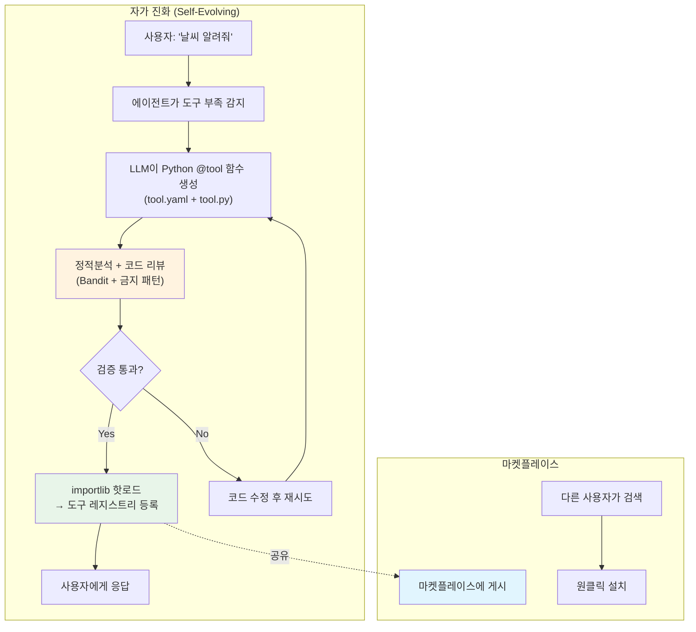
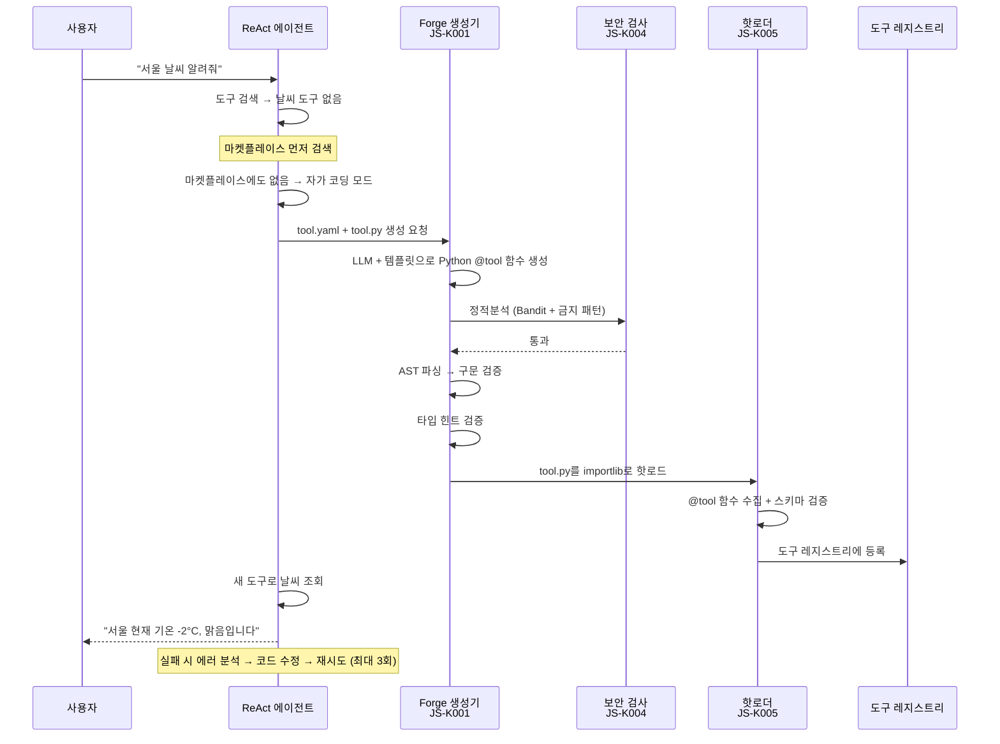
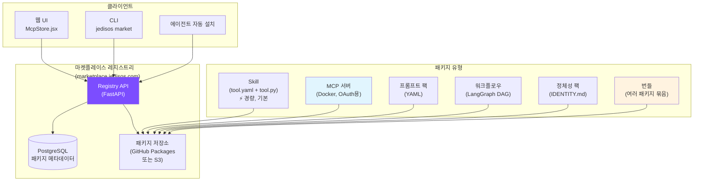
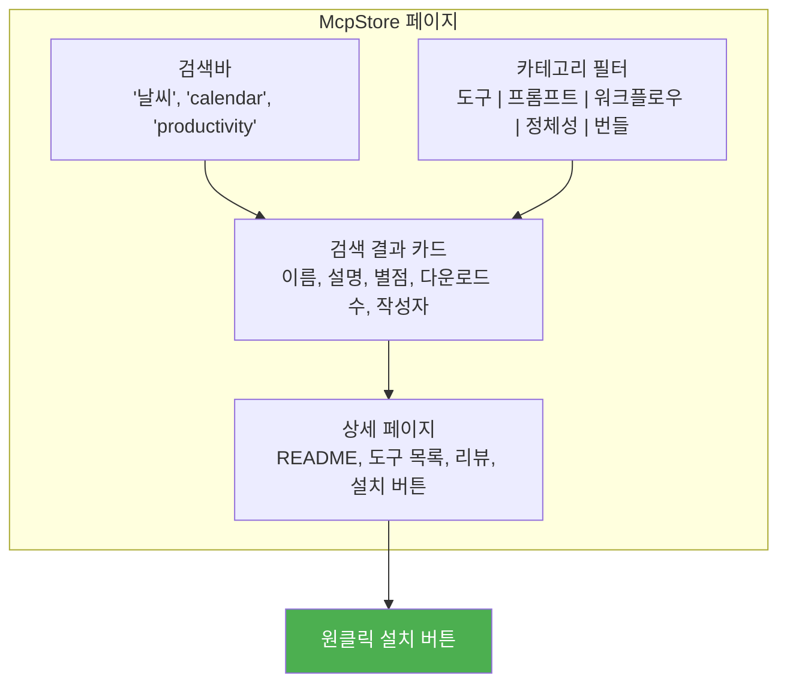
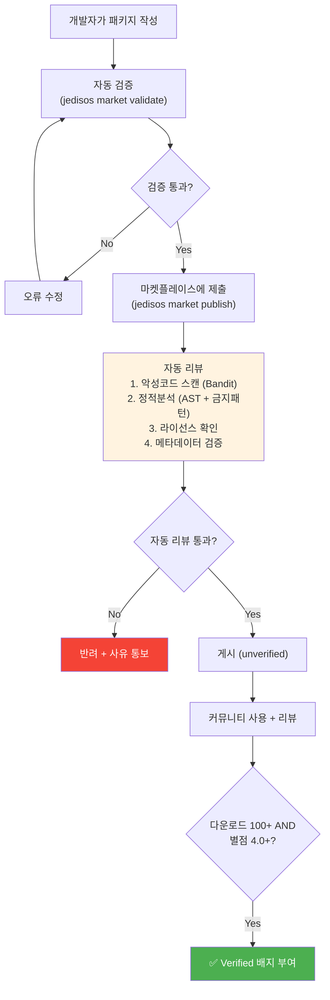
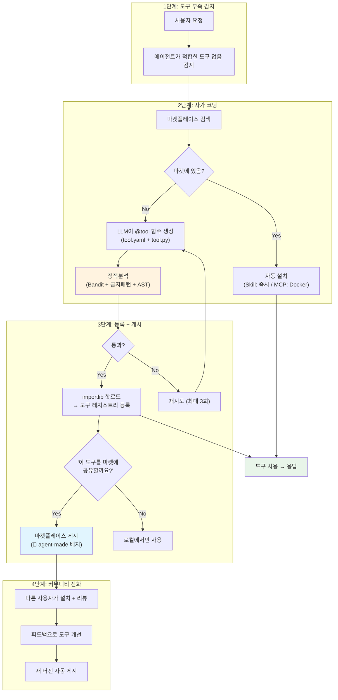

# JediSOS 자가 진화 시스템 + 마켓플레이스

> JediSOS가 스스로 코드를 작성하고, 정적분석으로 검증하고, 기능을 확장하는 메커니즘과
> 커뮤니티 기반 마켓플레이스 구조를 정의합니다.

## 1. 개요

JediSOS는 **2-Tier 확장 아키텍처**를 채택합니다:

- **Tier 1 (기본): JediSOS Skill** — Python `@tool` 데코레이터 함수 + `tool.yaml` 메타데이터. Docker 불필요. `importlib`로 핫로드.
- **Tier 2 (복잡한 경우만): MCP Server** — OAuth가 필요한 외부 서비스 (Google Calendar, Gmail, Notion 등)만 Docker MCP 서버로 연결.

에이전트가 직접 도구를 만들고 테스트하고 배포할 수 있는 자가 진화 시스템을 지원합니다. 동시에, 커뮤니티가 만든 확장 기능을 공유하고 설치할 수 있는 **자체 마켓플레이스**를 제공합니다.



### 2-Tier 선택 기준

| 기준 | Tier 1: JediSOS Skill | Tier 2: MCP Server |
|------|----------------------|-------------------|
| **사용 조건** | 대부분의 도구 (기본) | OAuth 필요 외부 서비스만 |
| **구현 방식** | `@tool` 데코레이터 + `tool.yaml` | FastMCP Docker 컨테이너 |
| **보안** | Bandit 정적분석 + 금지 패턴 + 코드 리뷰 | Docker 네트워크 격리 |
| **로딩** | `importlib` 핫로드 (즉시) | Docker 컨테이너 시작 (~수초) |
| **의존성** | `pip install` (필요 시) | Docker 이미지 빌드 |
| **예시** | 날씨 조회, 계산기, 웹 스크래핑, 파일 처리 | Google Calendar, Gmail, Notion, Slack |
| **에이전트 자동 생성** | 가능 (기본 모드) | 불가 (수동 또는 마켓플레이스) |

## 2. 자가 코딩 아키텍처

### 2-1. 핵심 컨셉

에이전트가 "이 기능이 없네" → "코드를 짜서 만들자" → "정적분석으로 검증" → "통과하면 핫로드"의 루프를 자동으로 수행합니다.

**경량 접근 방식 — Docker 없이 Python 함수만으로:**

Claude Code Skill, LangChain Tools, CrewAI Tools 등 최신 프레임워크를 분석한 결과, 대부분의 도구는 **Python `@tool` 데코레이터 함수 하나**로 충분합니다. Docker 컨테이너, MCP 프로토콜, 별도 서버 없이 `importlib`로 즉시 로드합니다.

**참고 프로젝트:**

| 프로젝트 | 패턴 | 적용 |
|----------|------|------|
| [Claude Code Skills](https://docs.claude.com) | SKILL.md + scripts/ (마크다운 + Python) | Skill 구조 참고 |
| [LangChain Tools](https://python.langchain.com) | `@tool` 데코레이터 + Pydantic 스키마 | `@tool` 패턴 채택 |
| [CrewAI Tools](https://crewai.com) | `BaseTool` 상속 + `_run()` 메서드 | 도구 인터페이스 참고 |
| [Composio](https://composio.dev) | 코드 없이 도구 연결 (SaaS) | OAuth 통합 참고 |
| [EvoAgentX](https://github.com/EvoAgentX/EvoAgentX) | 자가 진화 에이전트 프레임워크 (MIT) | 진화 알고리즘 참고 |

### 2-2. Tier 1: JediSOS Skill (경량 도구)

**기본 도구 포맷** — Docker 없이 Python 파일 + YAML 메타데이터:

```
tools/
├── weather/
│   ├── tool.yaml          # 메타데이터 (이름, 설명, 버전, 작성자)
│   ├── tool.py            # @tool 데코레이터 함수
│   └── requirements.txt   # 추가 의존성 (선택)
├── calculator/
│   ├── tool.yaml
│   └── tool.py
└── generated/             # 에이전트 자동 생성 도구
    └── stock_price/
        ├── tool.yaml
        └── tool.py
```

**tool.yaml 형식:**

```yaml
# tool.yaml
name: weather
version: "1.0.0"
description: "OpenWeatherMap API로 날씨 조회"
author: jedisos-agent
license: MIT
tags: ["weather", "api", "utility"]
env_required:
  - OPENWEATHERMAP_API_KEY
tools:
  - name: get_weather
    description: "도시의 현재 날씨 조회"
    parameters:
      city: { type: string, required: true }
  - name: get_forecast
    description: "5일 예보 조회"
    parameters:
      city: { type: string, required: true }
      days: { type: integer, default: 5 }
```

**tool.py 형식:**

```python
"""weather - JediSOS Skill (자동 생성)"""
from jedisos.forge.decorator import tool


@tool(name="get_weather", description="도시의 현재 날씨 조회")
async def get_weather(city: str) -> dict:
    """OpenWeatherMap API로 현재 날씨를 조회합니다."""
    import httpx
    import os

    api_key = os.environ["OPENWEATHERMAP_API_KEY"]
    async with httpx.AsyncClient() as client:
        resp = await client.get(
            "https://api.openweathermap.org/data/2.5/weather",
            params={"q": city, "appid": api_key, "units": "metric", "lang": "kr"},
        )
        resp.raise_for_status()
        data = resp.json()

    return {
        "city": city,
        "temp": data["main"]["temp"],
        "description": data["weather"][0]["description"],
        "humidity": data["main"]["humidity"],
    }


@tool(name="get_forecast", description="5일 예보 조회")
async def get_forecast(city: str, days: int = 5) -> dict:
    """5일간 날씨 예보를 조회합니다."""
    ...
```

**핫로드 메커니즘:**

```python
# [JS-K005] jedisos.forge.loader
import importlib.util
from pathlib import Path

class ToolLoader:
    """도구 디렉토리에서 @tool 함수를 동적 로드."""

    def load_tool(self, tool_dir: Path) -> list[callable]:
        """tool.py에서 @tool 데코레이터 함수들을 로드."""
        spec = importlib.util.spec_from_file_location(
            f"jedisos_tool_{tool_dir.name}",
            tool_dir / "tool.py",
        )
        module = importlib.util.module_from_spec(spec)
        spec.loader.exec_module(module)

        # @tool 데코레이터가 등록한 함수들을 수집
        return [
            getattr(module, name)
            for name in dir(module)
            if hasattr(getattr(module, name), "_is_jedisos_tool")
        ]
```

### 2-3. Tier 2: MCP Server (복잡한 외부 서비스)

OAuth 인증이 필요한 외부 서비스만 Docker MCP 서버로 운영합니다:

| 서비스 | OAuth 필요 | Tier |
|--------|-----------|------|
| 날씨 조회 (API Key) | No | **Tier 1** (Skill) |
| 계산기 | No | **Tier 1** (Skill) |
| 웹 스크래핑 | No | **Tier 1** (Skill) |
| Google Calendar | Yes (OAuth 2.0) | **Tier 2** (MCP) |
| Gmail | Yes (OAuth 2.0) | **Tier 2** (MCP) |
| Notion | Yes (OAuth 2.0) | **Tier 2** (MCP) |
| Slack (외부 워크스페이스) | Yes (OAuth 2.0) | **Tier 2** (MCP) |

Tier 2 MCP 서버는 기존 `mcp_servers.json` + `mcp-auth-proxy` (OAuth 토큰 관리)로 관리합니다. 자세한 내용은 `docs/MCP_EXTENSIONS.md` 참조.

### 2-4. 자가 코딩 플로우



### 2-5. 코드 생성 템플릿

에이전트가 Skill을 생성할 때 사용하는 표준 템플릿:

```python
# [JS-K001] jedisos.forge.generator
# 자동 생성 Skill 템플릿 (Jinja2)

# === tool.yaml 템플릿 ===
TOOL_YAML_TEMPLATE = """
name: {{ tool_name }}
version: "1.0.0"
description: "{{ description }}"
author: jedisos-agent
auto_generated: true
created: {{ timestamp }}
license: MIT
tags: {{ tags }}

env_required:

  - {{ env }}


tools:

  - name: {{ tool.name }}
    description: "{{ tool.description }}"
    parameters:

      {{ param_name }}: { type: {{ param_info.type }}, required: true, default: {{ param_info.default }} }


"""

# === tool.py 템플릿 ===
TOOL_PY_TEMPLATE = """
\"\"\"{{ tool_name }} - JediSOS 자동 생성 Skill

version: 1.0.0
created: {{ timestamp }}
author: jedisos-agent (auto-generated)
verified: {{ verified }}
\"\"\"
from jedisos.forge.decorator import tool


@tool(name="{{ func.name }}", description="{{ func.description }}")
async def {{ func.name }}({{ func.parameters }}) -> {{ func.return_type }}:
    \"\"\"{{ func.docstring }}\"\"\"
    {{ func.implementation }}


"""
```

### 2-6. 보안: 정적분석 기반 검증

Docker 샌드박스 대신 **정적분석 + 코드 리뷰**로 보안을 확보합니다. 모든 코드가 오픈소스이므로 코드 리뷰가 가능합니다.

```python
# [JS-K004] jedisos.forge.security
class CodeSecurityChecker:
    """생성된 도구 코드의 보안을 정적분석으로 검증."""

    async def check(self, code: str, tool_name: str) -> SecurityResult:
        """생성된 코드의 안전성을 검증.

        검증 항목:
        1. 구문 검사 (ast.parse)
        2. 금지 패턴 검사 (FORBIDDEN_PATTERNS)
        3. Bandit 정적분석 (보안 취약점)
        4. import 화이트리스트 검사
        5. 타입 힌트 존재 확인
        6. @tool 데코레이터 사용 확인
        7. 비동기 함수 여부 확인
        """
        ...
```

**금지 패턴:**

```python
FORBIDDEN_PATTERNS = [
    r"os\.system",
    r"subprocess\.",
    r"eval\(",
    r"exec\(",
    r"__import__\(",
    r"open\(.*/etc/",
    r"shutil\.rmtree",
    r"requests\.get\(.*localhost",  # 내부 네트워크 접근 차단
    r"socket\.",                     # 소켓 직접 사용 차단
    r"ctypes\.",                     # C 바인딩 차단
]

# 허용 import 화이트리스트 (에이전트 생성 코드용)
ALLOWED_IMPORTS = [
    "httpx", "aiohttp",             # HTTP 클라이언트
    "json", "re", "datetime",       # 표준 라이브러리
    "pathlib", "typing",            # 유틸리티
    "pydantic",                     # 데이터 검증
    "jedisos.forge.decorator",      # @tool 데코레이터
]
```

### 2-7. 해시 추적 영역

자가 코딩 시스템은 새로운 영역코드 **K (forge/자가코딩)**을 사용합니다:

| 코드 | 영역 | 디렉토리 | 범위 |
|------|------|----------|------|
| **K** | forge (자가코딩) | `src/jedisos/forge/` | K001-K099 |

| 해시 | 모듈 | 설명 |
|------|------|------|
| JS-K001 | forge.generator | Skill 코드 생성기 (LLM + Jinja2 템플릿) |
| JS-K002 | forge.tester | 자동 테스트 실행기 (구문/보안/기능) |
| JS-K003 | forge.decorator | `@tool` 데코레이터 정의 |
| JS-K004 | forge.security | 코드 보안 정적분석 (Bandit + 금지 패턴) |
| JS-K005 | forge.loader | `importlib` 기반 도구 핫로더 |

## 3. JediSOS 마켓플레이스

### 3-1. 마켓플레이스 철학

JediSOS 마켓플레이스는 **npm + GitHub Marketplace + mcp.so**를 합친 형태입니다.
누구나 도구를 만들어 게시하고, 누구나 원클릭으로 설치할 수 있습니다.

기존 MCP 마켓플레이스(mcp.so, smithery.ai)와의 차이점:

| 기존 MCP 마켓플레이스 | JediSOS 마켓플레이스 |
|----------------------|---------------------|
| MCP 서버만 검색/설치 | **Skill + MCP 서버** + 프롬프트 + 워크플로우 + 정체성(IDENTITY) 팩 |
| 별도 사이트에서 검색 | 웹 UI + CLI에서 바로 검색/설치 |
| 수동 설정 필요 | 원클릭 설치 (Skill은 즉시, MCP는 Docker 자동) |
| 커뮤니티 리뷰 없음 | 별점 + 리뷰 + 검증 배지 |
| 에이전트 자동 생성 불가능 | **에이전트가 만든 Skill도 게시 가능** |

### 3-2. 마켓플레이스 구조



### 3-3. 패키지 유형

#### 1) Skill (경량 도구) — 기본

대부분의 도구에 사용. Docker 불필요. `tool.yaml` + `tool.py`로 배포.

```yaml
# jedisos-package.yaml
type: skill
name: "@jedisos/weather"
version: "1.0.0"
description: "OpenWeatherMap 날씨 조회 도구"
author: "jedikim"
license: "MIT"
tags: ["weather", "api", "utility"]
env_required:
  - OPENWEATHERMAP_API_KEY
tools:
  - name: get_weather
    description: "도시의 현재 날씨 조회"
    parameters:
      city: { type: string, required: true }
  - name: get_forecast
    description: "5일 예보 조회"
    parameters:
      city: { type: string, required: true }
      days: { type: integer, default: 5 }
```

#### 2) MCP 서버 (OAuth 외부 서비스)

OAuth가 필요한 외부 서비스만 Docker MCP 서버로 배포.

```yaml
# jedisos-package.yaml
type: mcp-server
name: "@jedisos/google-calendar"
version: "1.0.0"
description: "Google Calendar 연동 (OAuth 2.0)"
author: "jedikim"
license: "MIT"
tags: ["calendar", "google", "oauth"]
docker:
  image: "ghcr.io/jedikim/jedisos-google-calendar:1.0.0"
  ports: ["3100:3100"]
  env_required:
    - GOOGLE_CLIENT_ID
    - GOOGLE_CLIENT_SECRET
oauth: true
oauth_provider: google
tools:
  - name: get_events
    description: "일정 조회"
  - name: create_event
    description: "일정 생성"
```

#### 3) 프롬프트 팩

에이전트의 행동을 커스터마이즈하는 프롬프트 세트.

```yaml
type: prompt-pack
name: "@jedisos/korean-assistant"
version: "1.0.0"
description: "한국어 비서 최적화 프롬프트 세트"
author: "jedikim"
prompts:
  system: |
    당신은 친근한 한국어 AI 비서입니다.
    존댓말을 사용하되 딱딱하지 않게 대화합니다.
    날짜/시간은 한국 시간(KST) 기준으로 답합니다.
  tool_selection: |
    도구를 선택할 때 사용자의 맥락을 고려합니다.
    한국 서비스(네이버, 카카오)를 우선합니다.
```

#### 4) 워크플로우

미리 정의된 LangGraph 워크플로우.

```yaml
type: workflow
name: "@jedisos/morning-briefing"
version: "1.0.0"
description: "아침 브리핑 자동화 (날씨 + 일정 + 뉴스)"
requires:
  - "@jedisos/weather"
  - "@jedisos/calendar"
  - "@jedisos/news"
schedule: "0 7 * * *"  # 매일 아침 7시
graph:
  - step: get_weather
    tool: "@jedisos/weather.get_weather"
    params: { city: "Seoul" }
  - step: get_schedule
    tool: "@jedisos/calendar.get_today"
  - step: get_news
    tool: "@jedisos/news.get_headlines"
    params: { country: "kr", count: 5 }
  - step: summarize
    llm: true
    prompt: "위 정보를 간결한 아침 브리핑으로 요약해줘"
```

#### 5) 정체성 팩

에이전트의 성격/역할을 정의하는 IDENTITY.md 세트.

```yaml
type: identity-pack
name: "@jedisos/developer-assistant"
version: "1.0.0"
description: "소프트웨어 개발자 전문 비서 정체성"
identity:
  name: "DevBot"
  role: "시니어 소프트웨어 엔지니어 비서"
  traits:
    - "코드 리뷰에 정확하고 직설적"
    - "Git 컨벤션을 잘 알고 있음"
    - "한국어와 영어 기술 용어를 자연스럽게 혼용"
  recommended_tools:
    - "@jedisos/github"
    - "@jedisos/jira"
    - "@jedisos/slack"
```

#### 6) 번들

여러 패키지를 하나로 묶은 것. "스타터 킷" 용도.

```yaml
type: bundle
name: "@jedisos/personal-assistant-starter"
version: "1.0.0"
description: "개인 비서 스타터 킷 (캘린더+이메일+날씨+메모)"
includes:
  - "@jedisos/google-calendar@1.0.0"
  - "@jedisos/gmail@1.0.0"
  - "@jedisos/weather@1.0.0"
  - "@jedisos/notion@1.0.0"
  - "@jedisos/korean-assistant@1.0.0"
  - "@jedisos/morning-briefing@1.0.0"
```

### 3-4. CLI 명령어

```bash
# 마켓플레이스 검색
jedisos market search weather
jedisos market search --type=workflow --tag=productivity

# 패키지 상세 정보
jedisos market info @jedisos/weather

# 설치 (원클릭)
jedisos market install @jedisos/weather
jedisos market install @jedisos/personal-assistant-starter  # 번들

# 내 도구 게시
jedisos market publish ./my-weather-tool/

# 리뷰/별점
jedisos market review @jedisos/weather --stars=5 --comment="잘 작동합니다"

# 설치된 패키지 목록
jedisos market list

# 업데이트
jedisos market update          # 전체
jedisos market update @jedisos/weather  # 특정 패키지

# 제거
jedisos market remove @jedisos/weather
```

### 3-5. 마켓플레이스 웹 UI

웹 UI의 `McpStore.jsx` 페이지에서 마켓플레이스를 시각적으로 탐색합니다.



### 3-6. 게시 프로세스 + 검증



**자동 검증 항목:**

```python
# jedisos market validate 실행 시 검증 항목
VALIDATION_CHECKS = {
    "metadata": "jedisos-package.yaml 필수 필드 확인",
    "license": "MIT/Apache-2.0/BSD 중 하나",
    "security": "Bandit 정적분석 (금지 패턴 없음)",
    "import_check": "import 화이트리스트 검사 (Skill)",
    "syntax": "AST 파싱 + 타입 힌트 확인",
    "docker_size": "Docker 이미지 500MB 이하 (MCP 서버 패키지만)",
    "docs": "README.md 존재 + 최소 100자",
}
```

### 3-7. 검증 배지 시스템

| 배지 | 조건 | 의미 |
|------|------|------|
| 없음 | 방금 게시됨 | 미검증, 주의 필요 |
| 🤖 `agent-made` | 에이전트가 자동 생성 | JediSOS 에이전트가 만듦 |
| ✅ `verified` | 다운로드 100+ & 별점 4.0+ | 커뮤니티 검증 완료 |
| ⭐ `official` | JediSOS 팀 유지보수 | 공식 패키지 |

### 3-8. 마켓플레이스 레지스트리 API

```yaml
# Registry API 엔드포인트
GET    /api/v1/packages                    # 패키지 목록 (검색, 필터, 정렬)
GET    /api/v1/packages/{name}             # 패키지 상세
GET    /api/v1/packages/{name}/versions    # 버전 목록
GET    /api/v1/packages/{name}/reviews     # 리뷰 목록
POST   /api/v1/packages                    # 패키지 게시
PUT    /api/v1/packages/{name}/versions    # 새 버전 게시
POST   /api/v1/packages/{name}/reviews     # 리뷰 작성
GET    /api/v1/categories                  # 카테고리 목록
GET    /api/v1/bundles                     # 번들 목록
GET    /api/v1/featured                    # 추천 패키지
```

### 3-9. 비즈니스 모델 (오픈소스 지속가능성)

JediSOS 마켓플레이스 자체는 무료이지만, 지속가능한 오픈소스를 위한 수익 모델:

| 티어 | 가격 | 내용 |
|------|------|------|
| **Community** | $0 | 마켓플레이스 이용, 패키지 게시, 커뮤니티 지원 |
| **Pro** | $9/월 | 프라이빗 패키지 게시, 우선 지원, 고급 워크플로우 |
| **Team** | $29/월/인 | 팀 공유 레지스트리, RBAC, 감사 로그 |
| **Enterprise** | 문의 | 온프레미스 레지스트리, SLA, 전용 지원 |

추가 수익원:
- **Verified Publisher** 배지: 개발자 인증 ($0, 대신 GitHub 인증 필요)
- **Promoted Listing**: 마켓플레이스 상단 노출 (월 $50~)
- **JediSOS Cloud**: 관리형 호스팅 (추후)

## 4. 자가 진화 + 마켓플레이스 통합

에이전트가 자동 생성한 도구가 마켓플레이스까지 흘러가는 전체 플로우:



## 5. 프로젝트 구조 (추가)

```
src/jedisos/
├── forge/                  # [JS-K] 자가 코딩 엔진
│   ├── __init__.py
│   ├── generator.py        # [JS-K001] Skill 코드 생성기 (LLM + Jinja2)
│   ├── tester.py           # [JS-K002] 자동 테스트 실행기
│   ├── decorator.py        # [JS-K003] @tool 데코레이터 정의
│   ├── security.py         # [JS-K004] 코드 보안 정적분석
│   ├── loader.py           # [JS-K005] importlib 핫로더
│   └── templates/          # Skill 생성 템플릿 (Jinja2)
│       ├── basic_tool.py.j2
│       ├── api_wrapper.py.j2
│       └── data_processor.py.j2
├── marketplace/            # [JS-M] 마켓플레이스 클라이언트
│   ├── __init__.py
│   ├── client.py           # [JS-M001] Registry API 클라이언트
│   ├── publisher.py        # [JS-M002] 패키지 게시기
│   ├── validator.py        # [JS-M003] 패키지 검증기
│   └── models.py           # [JS-M004] 패키지 메타데이터 모델
tools/                      # 도구 디렉토리 (Tier 1 Skills)
├── weather/
│   ├── tool.yaml
│   ├── tool.py
│   └── requirements.txt
├── generated/              # 에이전트 자동 생성 도구
│   └── (auto-generated skills)
└── README.md
```

## 6. Phase 추가

| Phase | 이름 | 내용 | 버전 |
|-------|------|------|------|
| Phase 10 | Forge (자가 코딩) | 2-Tier Skill 생성 + 정적분석 + 핫로드 | v0.10.0 |
| Phase 11 | Marketplace | 레지스트리 API + 게시/검색/설치 + 웹 UI | v0.11.0 |

## 7. 기술 스택 (추가)

| 패키지 | 용도 |
|--------|------|
| `jinja2` | Skill 코드 템플릿 렌더링 |
| `bandit` | 생성 코드 보안 정적분석 |
| `pyyaml` | tool.yaml 파싱 |
| `importlib` (표준) | 도구 핫로드 |
| `ast` (표준) | 코드 구문 분석 + 검증 |

> **Docker SDK는 Tier 2 MCP 서버 관리에만 사용** (Phase 5의 MCP 클라이언트에서 이미 포함)

## 8. 보안 고려사항

자가 코딩은 **LLM이 생성한 코드를 실행**하므로 보안이 중요합니다.
단, 모든 코드가 오픈소스이므로 **정적분석 + 코드 리뷰**로 충분히 대응 가능합니다.

### Tier 1 (Skill) 보안 — 정적분석 기반

1. **코드 검사**: Bandit 정적분석 + 커스텀 금지 패턴 (eval, exec, subprocess, socket 등)
2. **import 화이트리스트**: 허용된 패키지만 import 가능 (에이전트 생성 코드)
3. **AST 검증**: `ast.parse()`로 구문 안전성 확인 + 타입 힌트 존재 확인
4. **서명 검증**: 마켓플레이스 패키지는 SHA256 해시 검증
5. **사용자 승인**: 에이전트가 도구를 만들기 전 사용자에게 확인 요청 (설정으로 자동 허용 가능)
6. **오픈소스 코드 리뷰**: 커뮤니티가 코드를 직접 확인 가능

### Tier 2 (MCP 서버) 보안 — Docker 격리

1. **네트워크 격리**: 필요한 외부 API만 화이트리스트
2. **파일시스템 격리**: 호스트 마운트 없음 (읽기 전용 설정만)
3. **리소스 제한**: Docker CPU/메모리 제한
4. **OAuth 토큰 관리**: `mcp-auth-proxy`가 안전하게 관리
