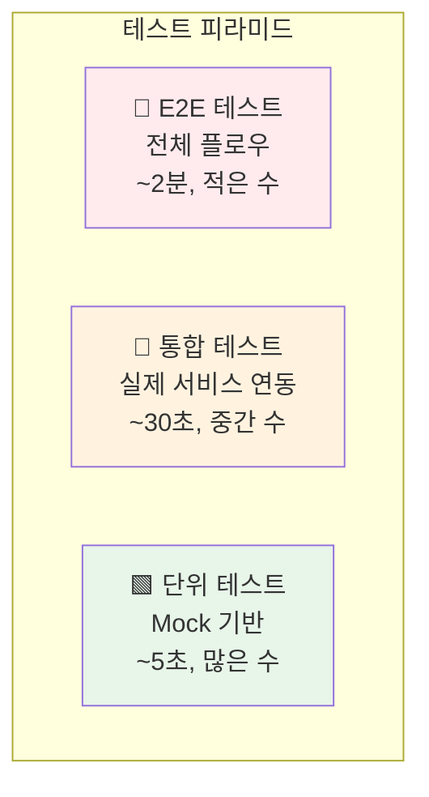
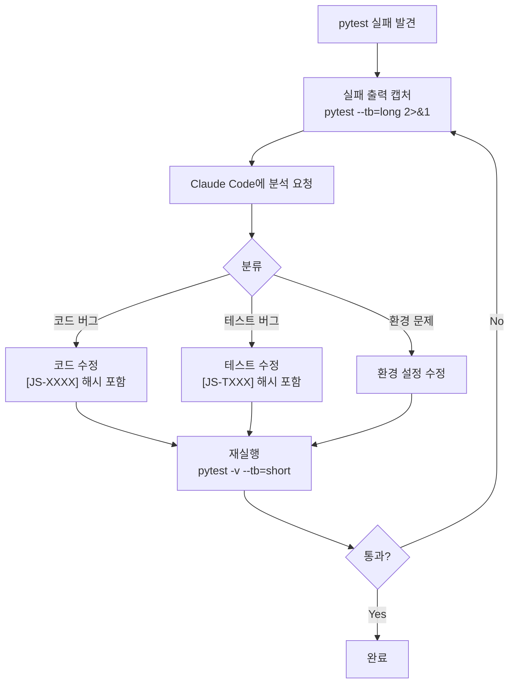

# JediSOS 테스트 전략

> 3단계 테스트 피라미드 + AI 디버깅 워크플로우를 정의합니다.

## 1. 테스트 피라미드



| 단계 | 디렉토리 | 마커 | 타임아웃 | 외부 서비스 | 목표 |
|------|----------|------|----------|-------------|------|
| 단위 | `tests/unit/` | 없음 | 30초 | 불필요 (mock) | 로직 정확성 |
| 통합 | `tests/integration/` | `@pytest.mark.integration` | 120초 | Hindsight 필요 | 연동 정확성 |
| E2E | `tests/e2e/` | `@pytest.mark.e2e` | 300초 | 전체 스택 | 시나리오 검증 |

## 2. 테스트 실행 명령어

```bash
# 단위 테스트만 (CI에서 항상 실행)
pytest tests/unit/ -v --timeout=30

# 통합 테스트 (Hindsight 실행 상태)
pytest tests/integration/ -v --timeout=120 -m integration

# E2E 테스트 (전체 스택 + LLM API 키 필요)
pytest tests/e2e/ -v --timeout=300 -m e2e

# 전체 테스트
pytest tests/ -v --timeout=300

# 커버리지 포함
pytest tests/ --cov=jedisos --cov-report=html --cov-report=term

# 병렬 실행 (단위 테스트)
pytest tests/unit/ -v -n auto
```

## 3. 공통 픽스처

### `tests/conftest.py`

```python
"""
[JS-T000] tests.conftest
공통 테스트 픽스처

version: 1.0.0
created: 2026-02-16
"""
from __future__ import annotations

from unittest.mock import AsyncMock, MagicMock

import pytest

from jedisos.core.config import HindsightConfig, LLMConfig, JedisosConfig
from jedisos.core.envelope import Envelope
from jedisos.core.types import ChannelType


# ─── 설정 픽스처 ───

@pytest.fixture
def config() -> JedisosConfig:
    """테스트용 메인 설정."""
    return JedisosConfig(debug=True, log_level="DEBUG")


@pytest.fixture
def hindsight_config() -> HindsightConfig:
    """테스트용 Hindsight 설정."""
    return HindsightConfig(
        api_url="http://localhost:8888",
        bank_id="test-bank",
    )


@pytest.fixture
def llm_config() -> LLMConfig:
    """테스트용 LLM 설정."""
    return LLMConfig(
        models=["gpt-5.2"],  # 테스트는 단일 모델로 폴백 없이
        temperature=0.0,
    )


# ─── 데이터 픽스처 ───

@pytest.fixture
def sample_envelope() -> Envelope:
    """테스트용 Envelope."""
    return Envelope(
        channel=ChannelType.CLI,
        user_id="test_user_001",
        user_name="테스터",
        content="안녕하세요, 테스트 메시지입니다.",
    )


@pytest.fixture
def sample_messages() -> list[dict]:
    """테스트용 LLM 메시지."""
    return [
        {"role": "system", "content": "당신은 테스트 도우미입니다."},
        {"role": "user", "content": "안녕하세요"},
    ]


# ─── Mock 픽스처 ───

@pytest.fixture
def mock_memory() -> AsyncMock:
    """Mock HindsightMemory."""
    memory = AsyncMock()
    memory.retain.return_value = {"id": "mem_test_001"}
    memory.recall.return_value = {"context": "이전 대화 기억"}
    memory.reflect.return_value = {"status": "ok"}
    memory.health_check.return_value = True
    return memory


@pytest.fixture
def mock_llm() -> AsyncMock:
    """Mock LLMRouter."""
    llm = AsyncMock()
    llm.complete.return_value = {
        "choices": [
            {
                "message": {
                    "role": "assistant",
                    "content": "테스트 응답입니다.",
                    "tool_calls": None,
                }
            }
        ]
    }
    llm.complete_text.return_value = "테스트 응답입니다."
    return llm


# ─── 통합 테스트 픽스처 ───

@pytest.fixture
async def live_memory():
    """실제 Hindsight 연결 (통합 테스트용).

    docker compose -f docker-compose.dev.yml up -d 상태에서만 사용.
    """
    from jedisos.memory.hindsight import HindsightMemory

    config = HindsightConfig()
    mem = HindsightMemory(config=config)

    # Hindsight가 살아있는지 확인
    if not await mem.health_check():
        pytest.skip("Hindsight 서버가 실행 중이 아닙니다")

    yield mem
    await mem.close()
```

## 4. 단위 테스트 패턴

### 4-1. 기본 패턴

```python
"""
[JS-T001] tests.unit.test_envelope
Envelope 단위 테스트
"""
import pytest
from jedisos.core.envelope import Envelope
from jedisos.core.types import ChannelType, EnvelopeState


class TestEnvelopeCreation:
    """생성 테스트 그룹."""

    def test_default_state_is_created(self):
        env = Envelope(channel=ChannelType.CLI, user_id="u1", content="hi")
        assert env.state == EnvelopeState.CREATED

    def test_uuid7_is_unique(self):
        e1 = Envelope(channel=ChannelType.CLI, user_id="u", content="a")
        e2 = Envelope(channel=ChannelType.CLI, user_id="u", content="b")
        assert e1.id != e2.id


class TestEnvelopeStateMachine:
    """상태 전환 테스트 그룹."""

    def test_valid_transitions(self, sample_envelope):
        sample_envelope.transition(EnvelopeState.AUTHORIZED)
        sample_envelope.transition(EnvelopeState.PROCESSING)
        assert sample_envelope.state == EnvelopeState.PROCESSING

    def test_invalid_transition_raises(self, sample_envelope):
        with pytest.raises(ValueError, match="잘못된 상태 전환"):
            sample_envelope.transition(EnvelopeState.COMPLETED)
```

### 4-2. 비동기 테스트 패턴

```python
"""
[JS-T002] tests.unit.test_memory_mock
HindsightMemory 단위 테스트 (mock 기반)
"""
import pytest
from unittest.mock import AsyncMock, patch
from jedisos.memory.hindsight import HindsightMemory
from jedisos.core.config import HindsightConfig


@pytest.fixture
def memory():
    config = HindsightConfig(api_url="http://fake:8888", bank_id="test")
    return HindsightMemory(config=config)


class TestRetain:
    @pytest.mark.asyncio
    async def test_retain_success(self, memory):
        mock_resp = AsyncMock()
        mock_resp.status_code = 200
        mock_resp.json.return_value = {"id": "m1"}
        mock_resp.raise_for_status = AsyncMock()

        with patch.object(memory._client, "post", return_value=mock_resp):
            result = await memory.retain("test content")
            assert result["id"] == "m1"

    @pytest.mark.asyncio
    async def test_retain_empty_content(self, memory):
        """빈 문자열도 저장 가능해야 함 (Hindsight가 처리)."""
        mock_resp = AsyncMock()
        mock_resp.status_code = 200
        mock_resp.json.return_value = {"id": "m2"}
        mock_resp.raise_for_status = AsyncMock()

        with patch.object(memory._client, "post", return_value=mock_resp):
            result = await memory.retain("")
            assert "id" in result
```

### 4-3. 에이전트 테스트 패턴

```python
"""
[JS-T005] tests.unit.test_react_agent
ReAct 에이전트 단위 테스트 (mock LLM + mock Memory)
"""
import pytest
from jedisos.agents.react import ReActAgent


class TestReActAgent:
    @pytest.mark.asyncio
    async def test_simple_response(self, mock_memory, mock_llm):
        """도구 호출 없이 바로 응답하는 경우."""
        agent = ReActAgent(memory=mock_memory, llm=mock_llm)
        result = await agent.run("안녕하세요")
        assert result  # 응답이 비어있지 않아야 함
        mock_memory.recall.assert_called_once()
        mock_memory.retain.assert_called_once()

    @pytest.mark.asyncio
    async def test_memory_failure_graceful(self, mock_memory, mock_llm):
        """메모리 실패 시 에이전트가 계속 동작해야 함."""
        mock_memory.recall.side_effect = Exception("Connection refused")
        agent = ReActAgent(memory=mock_memory, llm=mock_llm)
        result = await agent.run("안녕하세요")
        assert result  # 메모리 없이도 응답
```

## 5. 통합 테스트 패턴

```python
"""
[JS-T003] tests.integration.test_hindsight_live
Hindsight 실제 연동 테스트
"""
import pytest


@pytest.mark.integration
class TestHindsightLive:

    @pytest.mark.asyncio
    async def test_health_check(self, live_memory):
        assert await live_memory.health_check() is True

    @pytest.mark.asyncio
    async def test_retain_and_recall_cycle(self, live_memory):
        """저장 → 검색 사이클."""
        await live_memory.retain(
            "JediSOS 통합 테스트: Bob은 디자이너입니다.",
            bank_id="integration-test",
        )
        result = await live_memory.recall(
            "Bob은 무슨 일을 하나요?",
            bank_id="integration-test",
        )
        assert result is not None

    @pytest.mark.asyncio
    async def test_entity_extraction(self, live_memory):
        """엔티티가 자동 추출되는지 확인."""
        await live_memory.retain(
            "Charlie는 서울에 사는 의사입니다.",
            bank_id="integration-test",
        )
        entities = await live_memory.get_entities(bank_id="integration-test")
        # 엔티티 목록에 Charlie가 포함되어야 함
        assert isinstance(entities, list)
```

## 6. E2E 테스트 패턴

```python
"""
[JS-T010] tests.e2e.test_full_flow
전체 플로우 E2E 테스트
채널 → Envelope → PDP → 에이전트 → 메모리 → 응답
"""
import pytest


@pytest.mark.e2e
class TestFullFlow:

    @pytest.mark.asyncio
    async def test_cli_chat_flow(self):
        """CLI에서 대화가 작동하는지 E2E 확인."""
        from jedisos.core.config import JedisosConfig
        from jedisos.core.envelope import Envelope
        from jedisos.core.types import ChannelType, EnvelopeState
        from jedisos.memory.hindsight import HindsightMemory
        from jedisos.llm.router import LLMRouter
        from jedisos.agents.react import ReActAgent

        config = JedisosConfig()
        memory = HindsightMemory(config=config.hindsight)
        llm = LLMRouter(config=config.llm)

        # 1. Envelope 생성
        env = Envelope(
            channel=ChannelType.CLI,
            user_id="e2e_test",
            content="JediSOS E2E 테스트입니다. 오늘 날씨가 어때?",
        )
        assert env.state == EnvelopeState.CREATED

        # 2. PDP 검사 (기본 정책은 모두 허용)
        env.transition(EnvelopeState.AUTHORIZED)

        # 3. 에이전트 실행
        env.transition(EnvelopeState.PROCESSING)
        agent = ReActAgent(memory=memory, llm=llm)
        response = await agent.run(env.content, bank_id="e2e-test")

        # 4. 응답 확인
        assert response
        assert len(response) > 0

        env.response = response
        env.transition(EnvelopeState.COMPLETED)
        assert env.state == EnvelopeState.COMPLETED

        # 정리
        await memory.close()

    @pytest.mark.asyncio
    async def test_memory_persistence(self):
        """저장한 기억이 다음 대화에서 검색되는지."""
        from jedisos.core.config import HindsightConfig
        from jedisos.memory.hindsight import HindsightMemory

        config = HindsightConfig()
        mem = HindsightMemory(config=config)

        if not await mem.health_check():
            pytest.skip("Hindsight 미실행")

        # 1차 대화: 정보 저장
        await mem.retain(
            "E2E 테스트: David는 2026년 2월에 한국으로 이사했습니다.",
            bank_id="e2e-persist",
        )

        # 2차 대화: 정보 검색
        result = await mem.recall(
            "David는 언제 한국에 왔나요?",
            bank_id="e2e-persist",
        )
        assert result is not None

        await mem.close()
```

## 7. 속성 기반 테스트 (Hypothesis)

```python
"""
[JS-T011] tests.unit.test_envelope_property
Envelope 속성 기반 테스트
"""
import pytest
from hypothesis import given, strategies as st

from jedisos.core.envelope import Envelope
from jedisos.core.types import ChannelType


class TestEnvelopeProperty:

    @given(
        content=st.text(min_size=1, max_size=10000),
        user_id=st.text(min_size=1, max_size=100),
    )
    def test_envelope_always_has_id(self, content, user_id):
        """어떤 입력이든 Envelope은 항상 유효한 ID를 가진다."""
        env = Envelope(
            channel=ChannelType.CLI,
            user_id=user_id,
            content=content,
        )
        assert env.id
        assert len(env.id) > 0

    @given(content=st.text(min_size=0, max_size=50000))
    def test_envelope_preserves_content(self, content):
        """저장한 content가 변형되지 않는다."""
        env = Envelope(
            channel=ChannelType.CLI,
            user_id="prop_test",
            content=content,
        )
        assert env.content == content
```

## 8. AI 디버깅 워크플로우

### 8-1. 실패 시 분석 흐름



### 8-2. AI 디버깅 스크립트

```bash
#!/bin/bash
# scripts/ai_debug.sh
# 사용법: ./scripts/ai_debug.sh tests/unit/test_envelope.py

set -euo pipefail

TEST_PATH="${1:-tests/}"
OUTPUT="/tmp/jedisos_test_output.txt"

echo "🧪 테스트 실행 중: $TEST_PATH"
pytest "$TEST_PATH" -v --tb=long 2>&1 | tee "$OUTPUT"

EXIT_CODE=${PIPESTATUS[0]}

if [ $EXIT_CODE -ne 0 ]; then
    echo ""
    echo "❌ 테스트 실패. 출력이 $OUTPUT에 저장되었습니다."
    echo ""
    echo "Claude Code에게 다음과 같이 요청하세요:"
    echo ""
    echo "  $OUTPUT 파일을 읽고 실패한 테스트를 분석해줘."
    echo "  각 실패에 대해:"
    echo "  1) 어떤 assertion이 실패했는지"
    echo "  2) 원인이 코드 버그인지 테스트 버그인지"
    echo "  3) 관련 해시 코드 [JS-XXXX]를 찾아서"
    echo "  4) 수정 방안을 제시해줘"
else
    echo ""
    echo "✅ 모든 테스트 통과!"
fi
```

### 8-3. Claude Code 지시 템플릿

```
테스트를 실행해줘:
pytest tests/unit/ -v --tb=long

실패한 테스트가 있으면:
1. 실패 원인을 분석해
2. 관련 코드의 [JS-XXXX] 해시를 찾아
3. 코드를 수정해 (modified 날짜 갱신)
4. 테스트를 다시 실행해서 통과 확인해
5. make tracking 으로 레지스트리 갱신해
```

## 9. 테스트 커버리지 목표

| Phase | 최소 커버리지 | 목표 |
|-------|------------|------|
| Phase 1 (Foundation) | 90% | core/ 모듈 완전 커버 |
| Phase 2 (Memory) | 80% | mock 기반 완전, 통합은 핵심 경로만 |
| Phase 3 (LLM) | 70% | 폴백 체인 완전 테스트 |
| Phase 4 (Agent) | 70% | ReAct 루프 핵심 경로 |
| Phase 5+ | 70% | 전체 프로젝트 기준 |

### 커버리지 실행

```bash
# HTML 리포트 생성
pytest tests/ --cov=jedisos --cov-report=html

# 터미널 출력 + 미달 라인 표시
pytest tests/ --cov=jedisos --cov-report=term-missing

# CI에서 70% 미만이면 실패
pytest tests/ --cov=jedisos --cov-fail-under=70
```

## 10. 테스트 파일 명명 규칙

```
tests/
├── conftest.py                          # 공통 픽스처
├── unit/
│   ├── test_envelope.py                 # [JS-T001]
│   ├── test_memory_mock.py              # [JS-T002]
│   ├── test_llm_router.py              # [JS-T004]
│   ├── test_react_agent.py             # [JS-T005]
│   ├── test_mcp_tools.py              # [JS-T007]
│   ├── test_pdp.py                    # [JS-T008]
│   ├── test_channels.py              # [JS-T009]
│   └── test_envelope_property.py      # [JS-T011] Hypothesis
├── integration/
│   ├── test_hindsight_live.py          # [JS-T003]
│   └── test_agent_memory.py           # [JS-T006]
└── e2e/
    └── test_full_flow.py               # [JS-T010]
```

**규칙:**
- 단위: `test_{모듈명}.py`
- 통합: `test_{기능}_live.py`
- E2E: `test_{시나리오}_flow.py`
- 속성: `test_{모듈명}_property.py`
