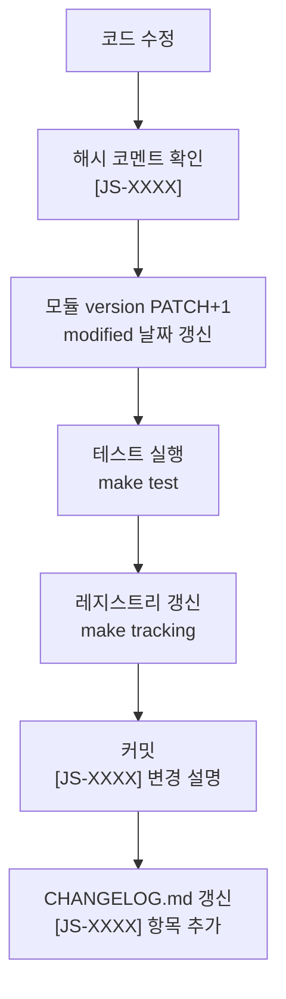

# JediSOS 해시 추적 시스템

> 모든 코드 단위(모듈, 클래스, 함수)에 고유 해시를 부여하여 추적하고,
> 코드 변경 시 문서와 자동으로 동기화되는 시스템입니다.

## 1. 해시 형식

```
[JS-{영역코드}{3자리숫자}]        # 모듈/클래스 레벨
[JS-{영역코드}{3자리숫자}.{서브}]  # 함수/메서드 레벨
```

### 영역 코드표

| 코드 | 영역 | 디렉토리 | 범위 |
|------|------|----------|------|
| **A** | core (핵심) | `src/jedisos/core/` | A001-A099 |
| **B** | memory (메모리) | `src/jedisos/memory/` | B001-B099 |
| **C** | llm (LLM 통합) | `src/jedisos/llm/` | C001-C099 |
| **D** | mcp (MCP 도구) | `src/jedisos/mcp/` | D001-D099 |
| **E** | agents (에이전트) | `src/jedisos/agents/` | E001-E099 |
| **F** | channels (채널) | `src/jedisos/channels/` | F001-F099 |
| **G** | security (보안) | `src/jedisos/security/` | G001-G099 |
| **H** | cli (CLI) | `src/jedisos/cli/` | H001-H099 |
| **W** | web (웹 UI) | `src/jedisos/web/` | W001-W099 |
| **K** | forge (자가코딩) | `src/jedisos/forge/` | K001-K099 |
| **M** | marketplace (마켓플레이스) | `src/jedisos/marketplace/` | M001-M099 |
| **T** | tests (테스트) | `tests/` | T001-T099 |
| **X** | scripts/infra | `scripts/`, `docker/` | X001-X099 |

### 예시

```python
# 모듈 레벨 해시
"""
[JS-B001] jedisos.memory.hindsight
Hindsight 메모리 클라이언트 래퍼

version: 1.0.0
created: 2026-02-16
modified: 2026-02-16
dependencies: hindsight-client>=0.4.11, httpx>=0.28
"""

class HindsightMemory:  # [JS-B001]

    async def retain(self, content: str) -> dict:  # [JS-B001.2]
        """대화 내용 저장."""
        ...

    async def recall(self, query: str) -> dict:  # [JS-B001.3]
        """메모리 검색."""
        ...
```

## 2. 모듈 헤더 규칙

모든 `.py` 파일의 최상단 docstring에 포함:

```python
"""
[JS-{코드}] {전체 모듈 경로}
{한 줄 설명}

version: {MAJOR.MINOR.PATCH}
created: {YYYY-MM-DD}
modified: {YYYY-MM-DD}
dependencies: {핵심 의존성}
"""
```

| 필드 | 규칙 |
|------|------|
| version | 모듈 자체 버전 (프로젝트 버전과 별도) |
| created | 최초 생성일 (변경 불가) |
| modified | 마지막 수정일 (수정 시 갱신) |
| dependencies | 이 모듈이 직접 사용하는 외부 패키지 |

### 버전 규칙

- **코드 수정 시:** `modified` 날짜 갱신 + version PATCH 증가
- **인터페이스 변경 시:** version MINOR 증가
- **브레이킹 체인지:** version MAJOR 증가

## 3. 추적 레지스트리

`scripts/generate_tracking.py`가 소스 코드를 스캔하여 자동 생성합니다.

### 레지스트리 형식 (자동 생성)

```markdown
# JediSOS 추적 레지스트리

> 자동 생성됨: 2026-02-16 12:00:00
> 총 추적 항목: 42

## Core (A)

| 해시 | 모듈 | 버전 | 수정일 | 설명 |
|------|------|------|--------|------|
| JS-A001 | core.envelope | 1.0.0 | 2026-02-16 | Envelope 메시지 계약 |
| JS-A001.1 | core.envelope.Envelope | 1.0.0 | 2026-02-16 | Envelope 클래스 |
| JS-A001.2 | core.envelope.Envelope.transition | 1.0.0 | 2026-02-16 | 상태 전환 |
| JS-A002 | core.config | 1.0.0 | 2026-02-16 | 설정 관리 |
| JS-A003 | core.exceptions | 1.0.0 | 2026-02-16 | 예외 계층 |
| JS-A004 | core.types | 1.0.0 | 2026-02-16 | 공통 타입 |

## Memory (B)

| 해시 | 모듈 | 버전 | 수정일 | 설명 |
|------|------|------|--------|------|
| JS-B001 | memory.hindsight | 1.0.0 | 2026-02-16 | Hindsight 래퍼 |
| JS-B001.2 | memory.hindsight.retain | 1.0.0 | 2026-02-16 | 메모리 저장 |
| JS-B001.3 | memory.hindsight.recall | 1.0.0 | 2026-02-16 | 메모리 검색 |
| ...  | ... | ... | ... | ... |
```

## 4. 자동 생성 스크립트

### `scripts/generate_tracking.py`

```python
#!/usr/bin/env python3
"""
[JS-X001] scripts.generate_tracking
소스 코드에서 추적 해시를 스캔하여 레지스트리를 생성합니다.

version: 1.0.0
created: 2026-02-16
"""
from __future__ import annotations

import re
import sys
from datetime import datetime, timezone
from pathlib import Path

HASH_PATTERN = re.compile(r"\[JS-([A-Z])(\d{3})(?:\.(\d+))?\]")
VERSION_PATTERN = re.compile(r"version:\s*([\d.]+)")
MODIFIED_PATTERN = re.compile(r"modified:\s*([\d-]+)")
SRC_DIR = Path("src/jedisos")
TEST_DIR = Path("tests")

AREA_NAMES = {
    "A": "Core",
    "B": "Memory",
    "C": "LLM",
    "D": "MCP",
    "E": "Agents",
    "F": "Channels",
    "G": "Security",
    "H": "CLI",
    "W": "Web UI",
    "K": "Forge",
    "M": "Marketplace",
    "T": "Tests",
    "X": "Scripts/Infra",
}


def scan_file(path: Path) -> list[dict]:
    """파일에서 추적 해시를 추출합니다."""
    entries = []
    content = path.read_text(encoding="utf-8")

    # 모듈 레벨 정보 추출
    version_match = VERSION_PATTERN.search(content[:500])
    modified_match = MODIFIED_PATTERN.search(content[:500])
    version = version_match.group(1) if version_match else "?"
    modified = modified_match.group(1) if modified_match else "?"

    for match in HASH_PATTERN.finditer(content):
        area, num, sub = match.groups()
        hash_id = f"JS-{area}{num}"
        if sub:
            hash_id += f".{sub}"

        # 해시 주변 컨텍스트에서 설명 추출
        start = max(0, match.start() - 5)
        end = min(len(content), match.end() + 200)
        context = content[start:end]

        # 클래스/함수명 추출 시도
        name_match = re.search(r"(?:class|def|async def)\s+(\w+)", context)
        name = name_match.group(1) if name_match else ""

        # 상대 경로
        rel_path = str(path).replace("src/jedisos/", "").replace(".py", "").replace("/", ".")

        entries.append({
            "hash": hash_id,
            "module": rel_path + (f".{name}" if name else ""),
            "version": version,
            "modified": modified,
            "area": area,
        })

    return entries


def main():
    """메인 실행."""
    all_entries: list[dict] = []

    for py_file in sorted(SRC_DIR.rglob("*.py")):
        all_entries.extend(scan_file(py_file))

    for py_file in sorted(TEST_DIR.rglob("*.py")):
        all_entries.extend(scan_file(py_file))

    # 중복 제거
    seen = set()
    unique = []
    for entry in all_entries:
        if entry["hash"] not in seen:
            seen.add(entry["hash"])
            unique.append(entry)
    all_entries = unique

    # 출력
    now = datetime.now(timezone.utc).strftime("%Y-%m-%d %H:%M:%S")
    print(f"# JediSOS 추적 레지스트리\n")
    print(f"> 자동 생성됨: {now} UTC")
    print(f"> 총 추적 항목: {len(all_entries)}\n")

    # 영역별 그룹
    by_area: dict[str, list] = {}
    for entry in all_entries:
        by_area.setdefault(entry["area"], []).append(entry)

    for area_code in sorted(by_area.keys()):
        area_name = AREA_NAMES.get(area_code, "Unknown")
        entries = sorted(by_area[area_code], key=lambda x: x["hash"])
        print(f"\n## {area_name} ({area_code})\n")
        print("| 해시 | 모듈 | 버전 | 수정일 |")
        print("|------|------|------|--------|")
        for e in entries:
            print(f"| {e['hash']} | {e['module']} | {e['version']} | {e['modified']} |")

    return 0


if __name__ == "__main__":
    sys.exit(main())
```

### 실행 방법

```bash
# 레지스트리 생성
python scripts/generate_tracking.py > docs/TRACKING_REGISTRY.md

# Makefile 통합
make tracking
```

## 5. 코드 변경 시 워크플로우



### Claude Code 지시 템플릿

코드를 수정할 때 Claude Code에게:

```
[JS-B001] HindsightMemory.retain() 메서드를 수정해줘.
- 타임아웃 파라미터를 추가해야 해
- modified 날짜를 오늘로 갱신
- version을 1.0.0 → 1.0.1로 올려
- 관련 테스트 [JS-T002]도 업데이트
- 완료 후 make tracking 실행해서 레지스트리 갱신
```

## 6. 추적 해시와 Git 연동

### 커밋 메시지에 해시 포함

```bash
git commit -m "fix(memory): retain 타임아웃 추가

[JS-B001.2] retain() 메서드에 timeout 파라미터 추가
- 기본값 30초
- 타임아웃 시 MemoryError 발생
[JS-T002] 관련 테스트 업데이트"
```

### GitHub Issue에 해시 참조

```markdown
## Bug Report

**관련 코드:** [JS-B001.2] `jedisos.memory.hindsight.HindsightMemory.retain`
**증상:** 대용량 메모리 저장 시 타임아웃 없이 무한 대기
**해결:** [JS-B001.2] version 1.0.1에서 timeout 파라미터 추가
```

## 7. 해시 검증 도구

### 중복 해시 검사

```bash
# 중복 해시가 있으면 에러
grep -rn "\[JS-" src/ tests/ | grep -oP 'JS-[A-Z]\d{3}' | sort | uniq -d
# 출력이 있으면 중복됨 → 수정 필요
```

### 미등록 모듈 검사

```bash
# 해시가 없는 .py 파일 찾기 (conftest, __init__ 제외)
for f in $(find src/jedisos -name "*.py" ! -name "__init__.py" ! -name "conftest.py"); do
    if ! grep -q "\[JS-" "$f"; then
        echo "MISSING HASH: $f"
    fi
done
```
